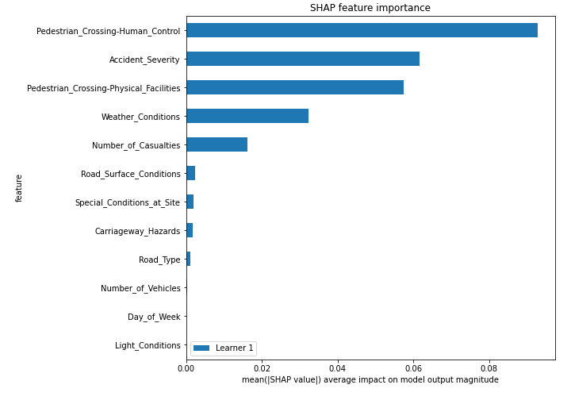

# Summary of 5_Default_RandomForest

[<< Go back](../README.md)

## Random Forest
- **n_jobs**: -1
- **criterion**: gini
- **max_features**: 0.9
- **min_samples_split**: 30
- **max_depth**: 4
- **eval_metric_name**: logloss
- **num_class**: 3
- **explain_level**: 2

## Validation
 - **validation_type**: split
 - **train_ratio**: 0.75
 - **shuffle**: True
 - **stratify**: True

## Optimized metric
logloss

## Training time

10.1 seconds

### Metric details
|           |            1 |            2 |           3 |   accuracy |    macro avg |   weighted avg |   logloss |
|:----------|-------------:|-------------:|------------:|-----------:|-------------:|---------------:|----------:|
| precision |     0.72955  |    0.621154  |    0.968109 |   0.736399 |     0.772938 |       0.726897 |  0.680462 |
| recall    |     0.989578 |    0.0656771 |    0.427996 |   0.736399 |     0.494417 |       0.736399 |  0.680462 |
| f1-score  |     0.839899 |    0.118794  |    0.593575 |   0.736399 |     0.517423 |       0.659352 |  0.680462 |
| support   | 15448        | 4918         | 1986        |   0.736399 | 22352        |   22352        |  0.680462 |

## Confusion matrix
|              |   Predicted as 1 |   Predicted as 2 |   Predicted as 3 |
|:-------------|-----------------:|-----------------:|-----------------:|
| Labeled as 1 |            15287 |              161 |                0 |
| Labeled as 2 |             4567 |              323 |               28 |
| Labeled as 3 |             1100 |               36 |              850 |

## Learning curves

## Permutation-based Importance

## SHAP Importance

## SHAP Dependence plots

### Dependence 1 (Fold 1)

### Dependence 2 (Fold 1)

### Dependence 3 (Fold 1)

## SHAP Decision plots

### Worst decisions for selected sample 1 (Fold 1)

### Worst decisions for selected sample 2 (Fold 1)

### Worst decisions for selected sample 3 (Fold 1)

### Worst decisions for selected sample 4 (Fold 1)

### Best decisions for selected sample 1 (Fold 1)

### Best decisions for selected sample 2 (Fold 1)

### Best decisions for selected sample 3 (Fold 1)

### Best decisions for selected sample 4 (Fold 1)

[<< Go back](../README.md)
