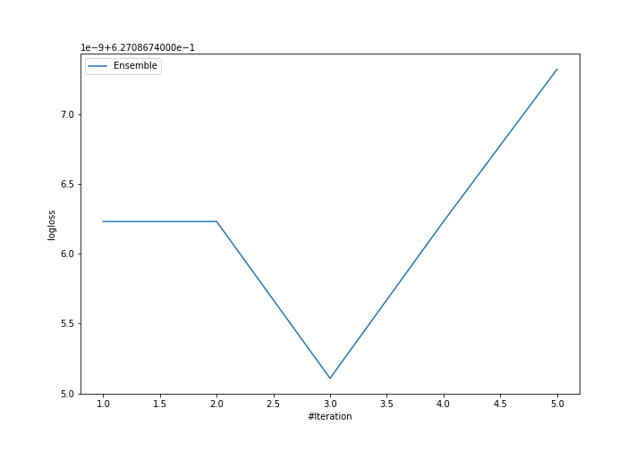

# Summary of Ensemble

[<< Go back](../README.md)

## Ensemble structure
| Model             |   Weight |
|:------------------|---------:|
| 3_Default_Xgboost |        3 |

### Metric details
|           |            1 |            2 |           3 |   accuracy |    macro avg |   weighted avg |   logloss |
|:----------|-------------:|-------------:|------------:|-----------:|-------------:|---------------:|----------:|
| precision |     0.740834 |    0.612094  |    0.91787  |   0.745705 |     0.756933 |       0.728238 |  0.627087 |
| recall    |     0.986277 |    0.0843839 |    0.512085 |   0.745705 |     0.527582 |       0.745705 |  0.627087 |
| f1-score  |     0.846115 |    0.14832   |    0.657401 |   0.745705 |     0.550612 |       0.675816 |  0.627087 |
| support   | 15448        | 4918         | 1986        |   0.745705 | 22352        |   22352        |  0.627087 |

## Confusion matrix
|              |   Predicted as 1 |   Predicted as 2 |   Predicted as 3 |
|:-------------|-----------------:|-----------------:|-----------------:|
| Labeled as 1 |            15236 |              186 |               26 |
| Labeled as 2 |             4438 |              415 |               65 |
| Labeled as 3 |              892 |               77 |             1017 |

## Learning curves

[<< Go back](../README.md)
