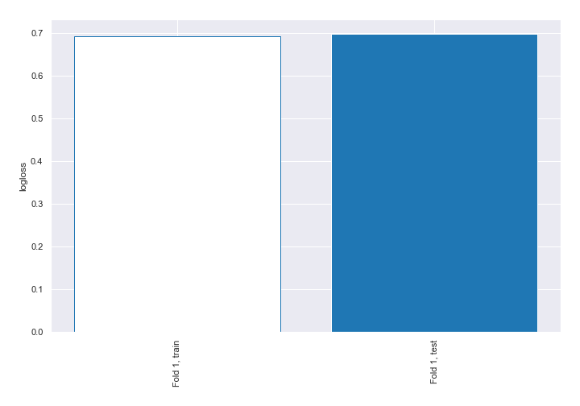
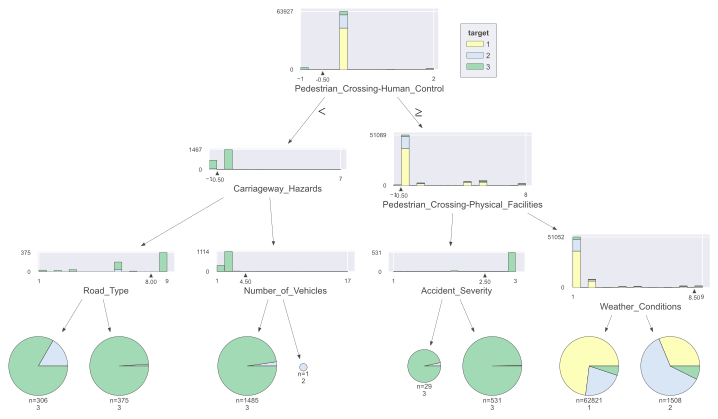
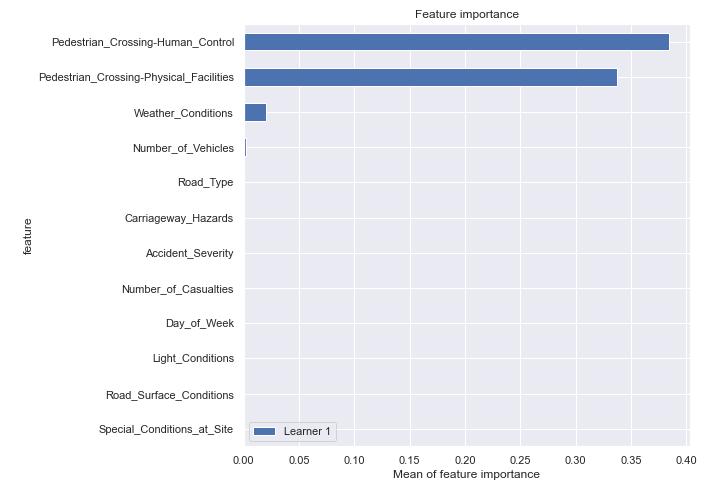
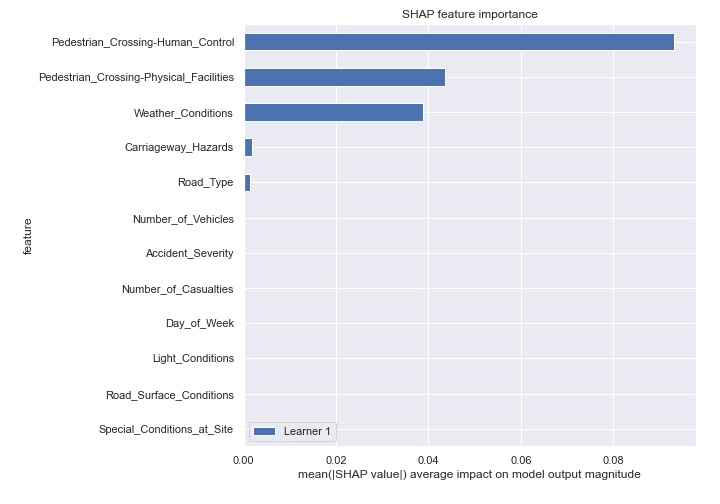
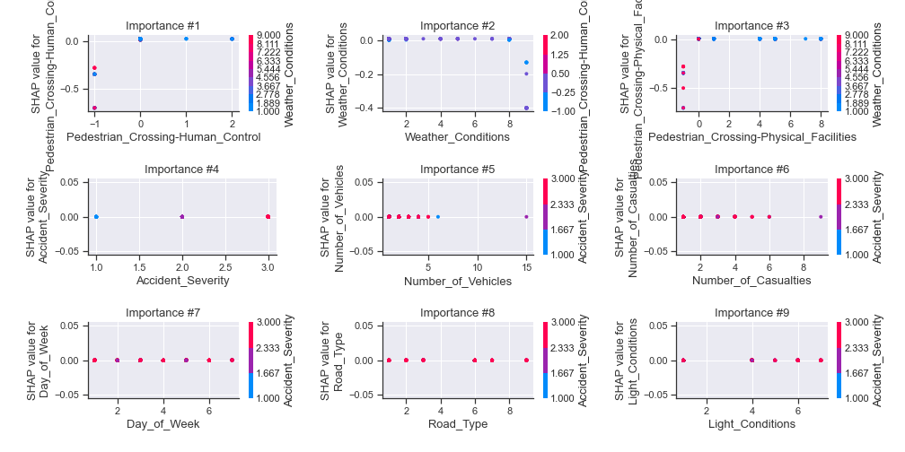
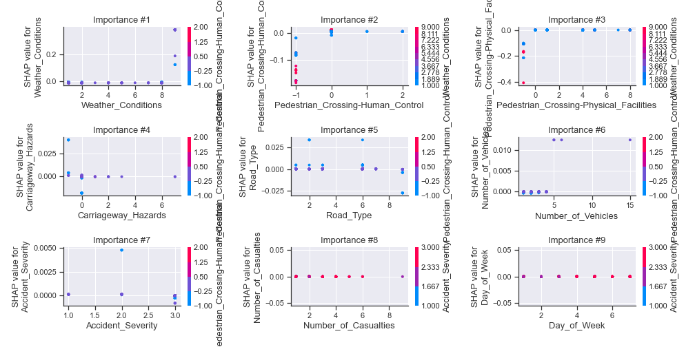
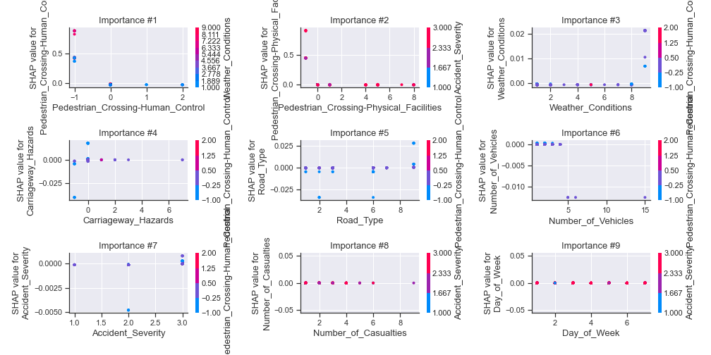
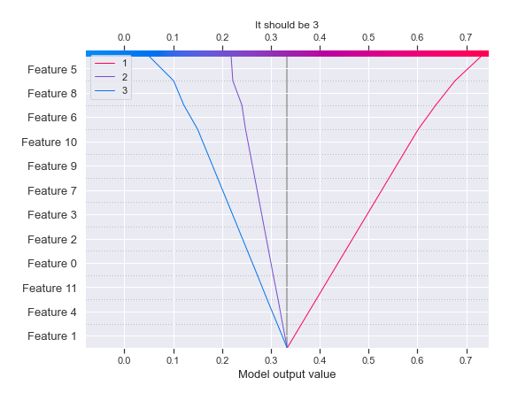
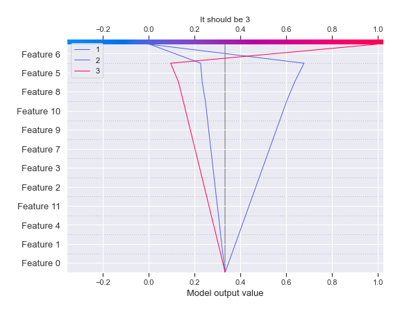
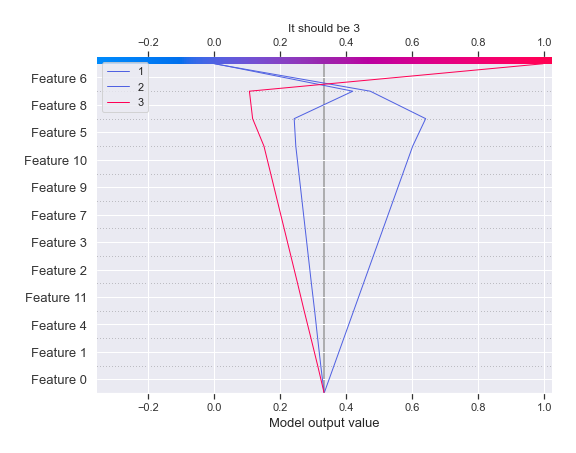

# Summary of 2_DecisionTree

[<< Go back](../README.md)

## Decision Tree
- **n_jobs**: -1
- **criterion**: gini
- **max_depth**: 3
- **num_class**: 3
- **explain_level**: 2

## Validation
 - **validation_type**: split
 - **train_ratio**: 0.75
 - **shuffle**: True
 - **stratify**: True

## Optimized metric
logloss

## Training time

26.0 seconds

### Metric details
|           |            1 |            2 |           3 |   accuracy |    macro avg |   weighted avg |   logloss |
|:----------|-------------:|-------------:|------------:|-----------:|-------------:|---------------:|----------:|
| precision |     0.72955  |    0.615094  |    0.971198 |    0.73622 |     0.771948 |       0.725838 |  0.697166 |
| recall    |     0.989578 |    0.0662871 |    0.424471 |    0.73622 |     0.493445 |       0.73622  |  0.697166 |
| f1-score  |     0.839899 |    0.119677  |    0.59075  |    0.73622 |     0.516775 |       0.659295 |  0.697166 |
| support   | 15448        | 4918         | 1986        |    0.73622 | 22352        |   22352        |  0.697166 |

## Confusion matrix
|              |   Predicted as 1 |   Predicted as 2 |   Predicted as 3 |
|:-------------|-----------------:|-----------------:|-----------------:|
| Labeled as 1 |            15287 |              161 |                0 |
| Labeled as 2 |             4567 |              326 |               25 |
| Labeled as 3 |             1100 |               43 |              843 |

## Learning curves

## Decision Tree 

### Tree #1

### Rules

if (Pedestrian_Crossing-Human_Control > -0.5) and (Pedestrian_Crossing-Physical_Facilities > -0.5) and (Weather_Conditions <= 8.5) then class: 1 (proba: 73.02%) | based on 62,821 samples

if (Pedestrian_Crossing-Human_Control > -0.5) and (Pedestrian_Crossing-Physical_Facilities > -0.5) and (Weather_Conditions > 8.5) then class: 2 (proba: 61.34%) | based on 1,508 samples

if (Pedestrian_Crossing-Human_Control <= -0.5) and (Carriageway_Hazards > -0.5) and (Number_of_Vehicles <= 4.5) then class: 3 (proba: 97.64%) | based on 1,485 samples

if (Pedestrian_Crossing-Human_Control > -0.5) and (Pedestrian_Crossing-Physical_Facilities <= -0.5) and (Accident_Severity > 2.5) then class: 3 (proba: 99.62%) | based on 531 samples

if (Pedestrian_Crossing-Human_Control <= -0.5) and (Carriageway_Hazards <= -0.5) and (Road_Type > 8.0) then class: 3 (proba: 98.93%) | based on 375 samples

if (Pedestrian_Crossing-Human_Control <= -0.5) and (Carriageway_Hazards <= -0.5) and (Road_Type <= 8.0) then class: 3 (proba: 83.33%) | based on 306 samples

if (Pedestrian_Crossing-Human_Control > -0.5) and (Pedestrian_Crossing-Physical_Facilities <= -0.5) and (Accident_Severity <= 2.5) then class: 3 (proba: 96.55%) | based on 29 samples

if (Pedestrian_Crossing-Human_Control <= -0.5) and (Carriageway_Hazards > -0.5) and (Number_of_Vehicles > 4.5) then class: 2 (proba: 100.0%) | based on 1 samples

## Permutation-based Importance

## SHAP Importance

## SHAP Dependence plots

### Dependence 1 (Fold 1)

### Dependence 2 (Fold 1)

### Dependence 3 (Fold 1)

## SHAP Decision plots

### Worst decisions for selected sample 1 (Fold 1)

### Worst decisions for selected sample 2 (Fold 1)

### Worst decisions for selected sample 3 (Fold 1)

### Worst decisions for selected sample 4 (Fold 1)

### Best decisions for selected sample 1 (Fold 1)

### Best decisions for selected sample 2 (Fold 1)

### Best decisions for selected sample 3 (Fold 1)

### Best decisions for selected sample 4 (Fold 1)

[<< Go back](../README.md)
