# Summary of 3_Default_Xgboost

[<< Go back](../README.md)

## Extreme Gradient Boosting (Xgboost)
- **n_jobs**: -1
- **objective**: multi:softprob
- **eta**: 0.075
- **max_depth**: 6
- **min_child_weight**: 1
- **subsample**: 1.0
- **colsample_bytree**: 1.0
- **eval_metric**: mlogloss
- **num_class**: 3
- **explain_level**: 2

## Validation
 - **validation_type**: split
 - **train_ratio**: 0.75
 - **shuffle**: True
 - **stratify**: True

## Optimized metric
logloss

## Training time

32.5 seconds

### Metric details
|           |            1 |            2 |           3 |   accuracy |    macro avg |   weighted avg |   logloss |
|:----------|-------------:|-------------:|------------:|-----------:|-------------:|---------------:|----------:|
| precision |     0.740834 |    0.612094  |    0.91787  |   0.745705 |     0.756933 |       0.728238 |  0.627087 |
| recall    |     0.986277 |    0.0843839 |    0.512085 |   0.745705 |     0.527582 |       0.745705 |  0.627087 |
| f1-score  |     0.846115 |    0.14832   |    0.657401 |   0.745705 |     0.550612 |       0.675816 |  0.627087 |
| support   | 15448        | 4918         | 1986        |   0.745705 | 22352        |   22352        |  0.627087 |

## Confusion matrix
|              |   Predicted as 1 |   Predicted as 2 |   Predicted as 3 |
|:-------------|-----------------:|-----------------:|-----------------:|
| Labeled as 1 |            15236 |              186 |               26 |
| Labeled as 2 |             4438 |              415 |               65 |
| Labeled as 3 |              892 |               77 |             1017 |

## Learning curves
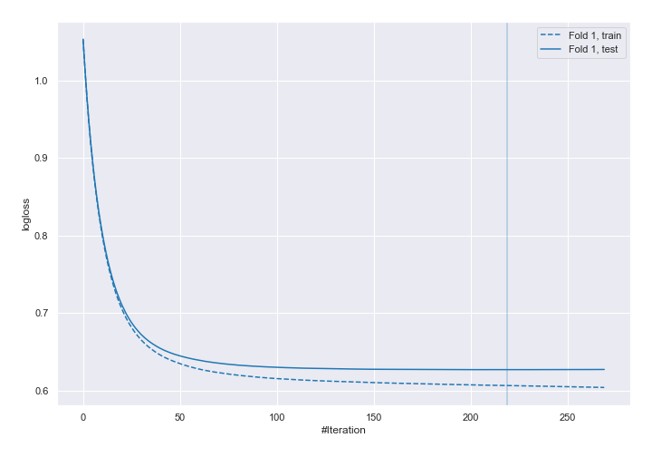

## Permutation-based Importance
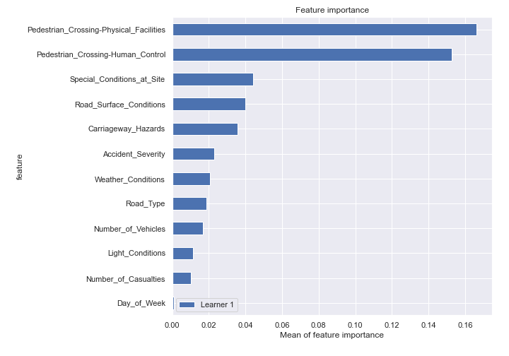

## SHAP Importance
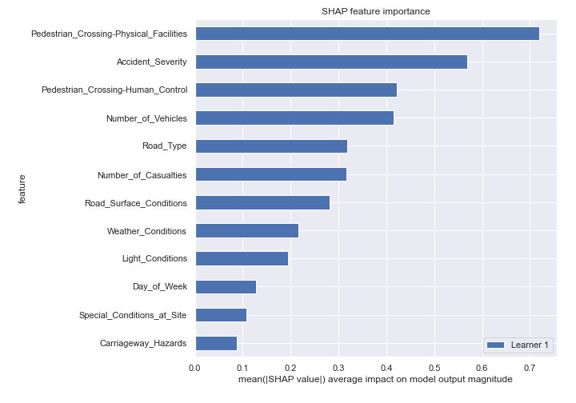

## SHAP Dependence plots

### Dependence 1 (Fold 1)
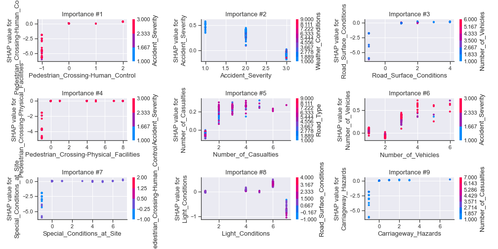
### Dependence 2 (Fold 1)
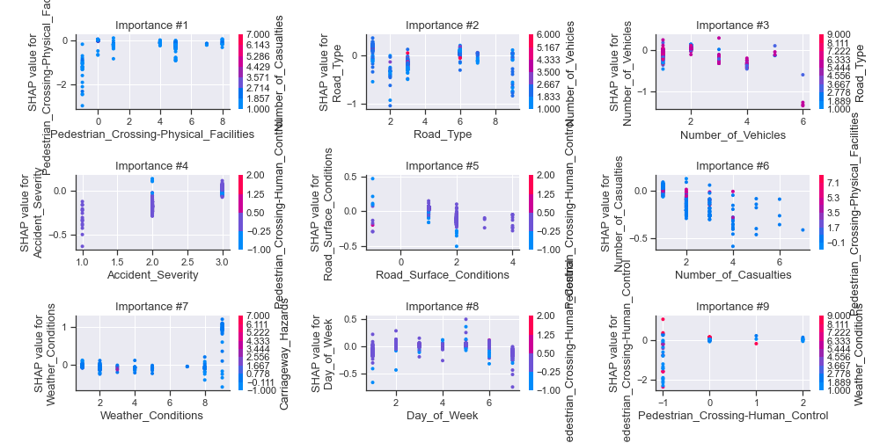
### Dependence 3 (Fold 1)
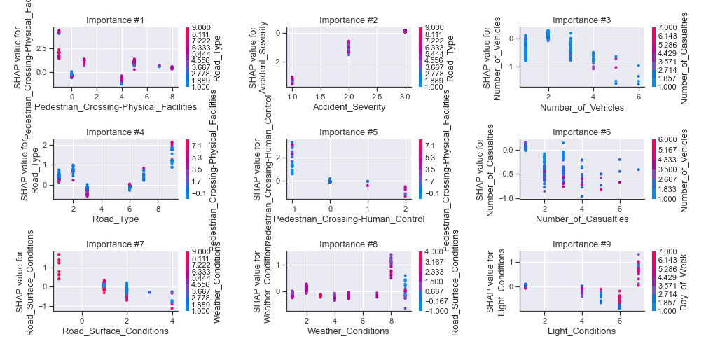

## SHAP Decision plots

### Worst decisions for selected sample 1 (Fold 1)

### Worst decisions for selected sample 2 (Fold 1)
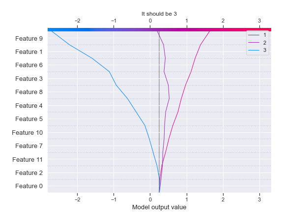
### Worst decisions for selected sample 3 (Fold 1)

### Worst decisions for selected sample 4 (Fold 1)
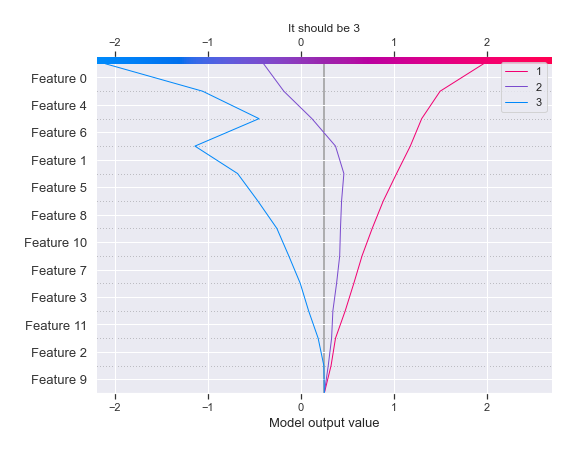
### Best decisions for selected sample 1 (Fold 1)
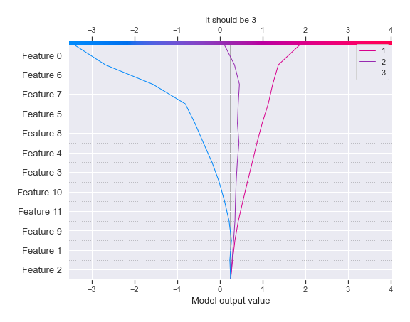
### Best decisions for selected sample 2 (Fold 1)
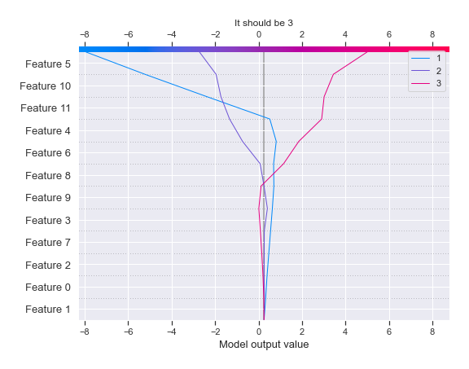
### Best decisions for selected sample 3 (Fold 1)
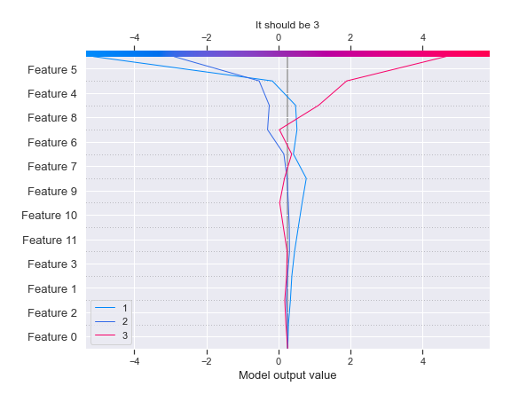
### Best decisions for selected sample 4 (Fold 1)
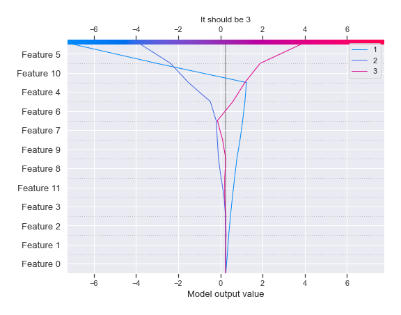

[<< Go back](../README.md)
