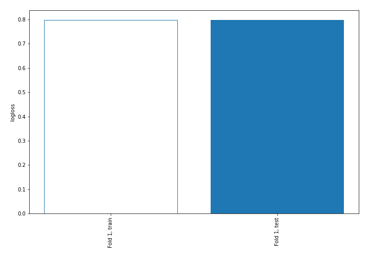

# Summary of 1_Baseline

[<< Go back](../README.md)

## Baseline Classifier (Baseline)
- **n_jobs**: -1
- **num_class**: 3
- **explain_level**: 2

## Validation
 - **validation_type**: split
 - **train_ratio**: 0.75
 - **shuffle**: True
 - **stratify**: True

## Optimized metric
logloss

## Training time

18.7 seconds

### Metric details
|           |            1 |    2 |    3 |   accuracy |    macro avg |   weighted avg |   logloss |
|:----------|-------------:|-----:|-----:|-----------:|-------------:|---------------:|----------:|
| precision |     0.692486 |    0 |    0 |   0.692486 |     0.230829 |       0.479536 |  0.797673 |
| recall    |     1        |    0 |    0 |   0.692486 |     0.333333 |       0.692486 |  0.797673 |
| f1-score  |     0.818306 |    0 |    0 |   0.692486 |     0.272769 |       0.566665 |  0.797673 |
| support   | 15261        | 4920 | 1857 |   0.692486 | 22038        |   22038        |  0.797673 |

## Confusion matrix
|              |   Predicted as 1 |   Predicted as 2 |   Predicted as 3 |
|:-------------|-----------------:|-----------------:|-----------------:|
| Labeled as 1 |            15261 |                0 |                0 |
| Labeled as 2 |             4920 |                0 |                0 |
| Labeled as 3 |             1857 |                0 |                0 |

## Learning curves

[<< Go back](../README.md)
