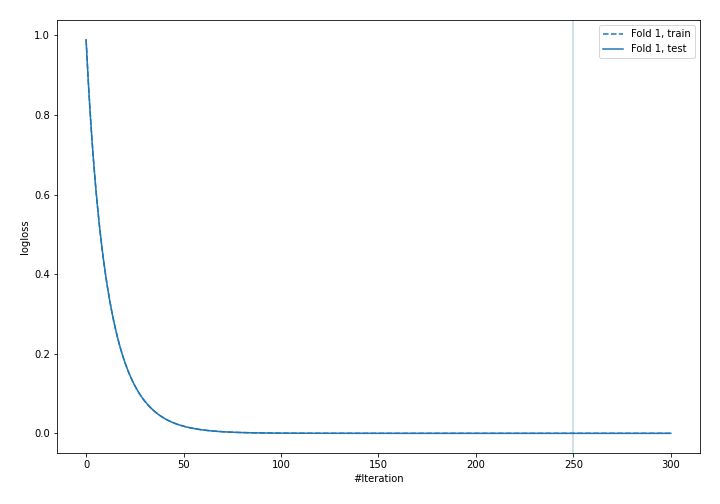
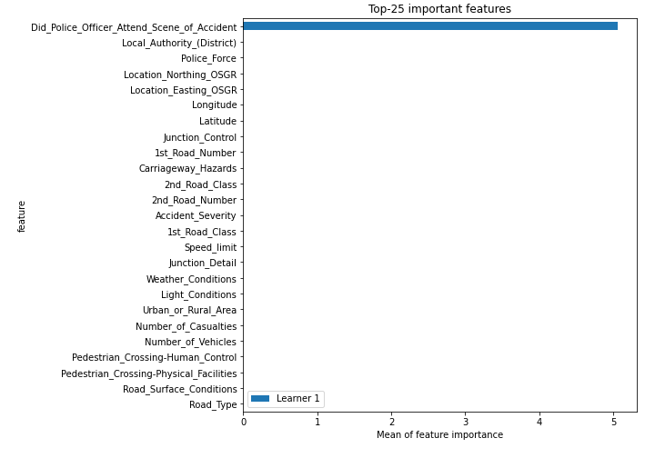
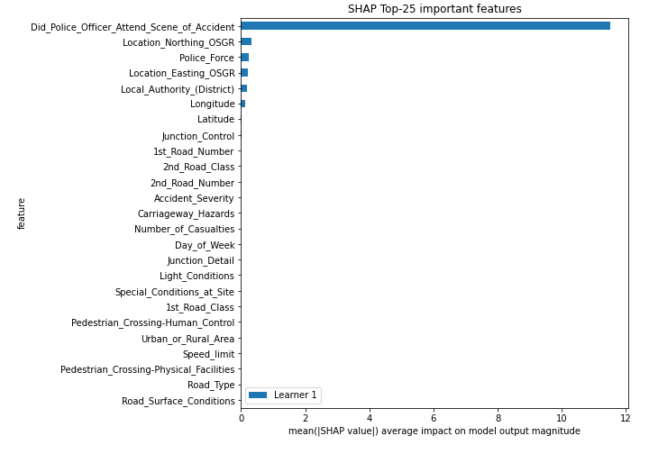
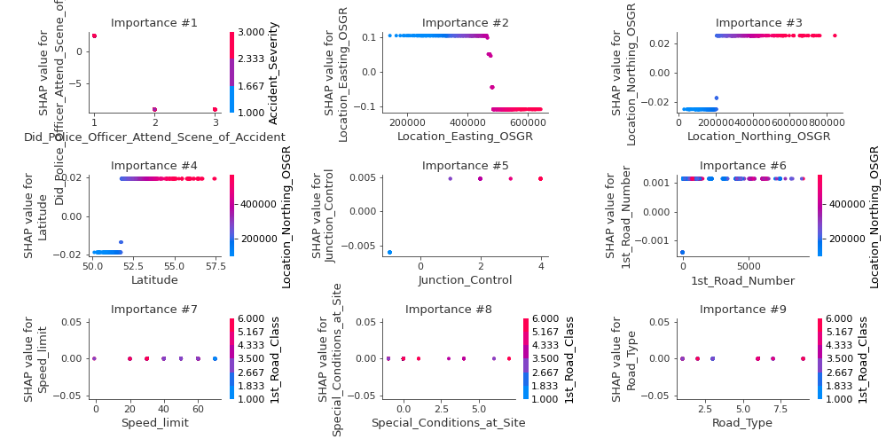
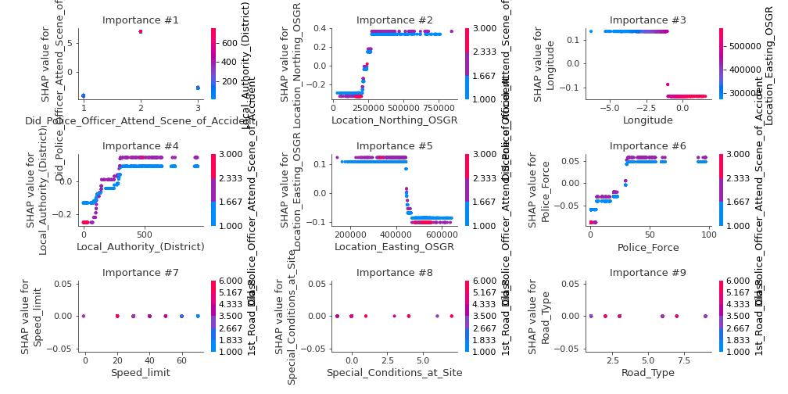
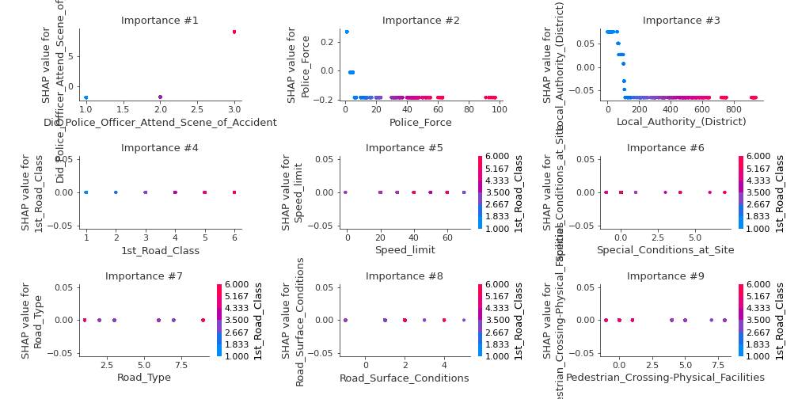
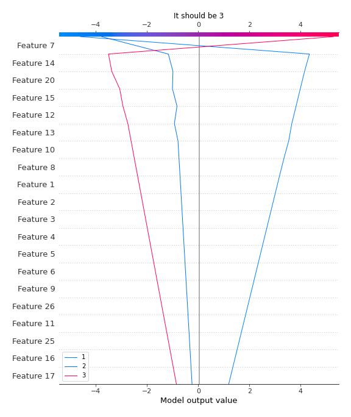
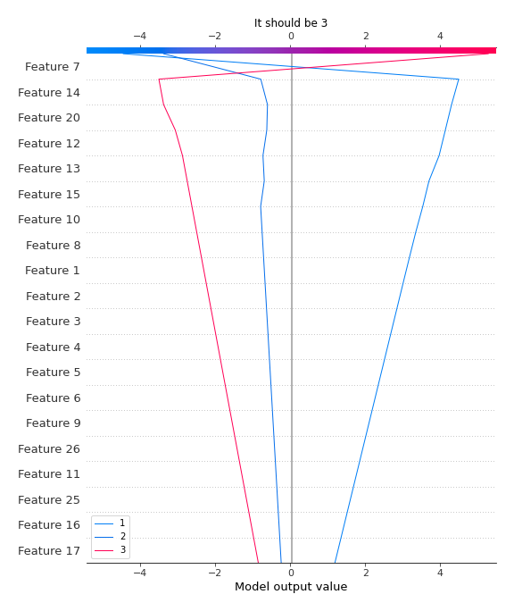
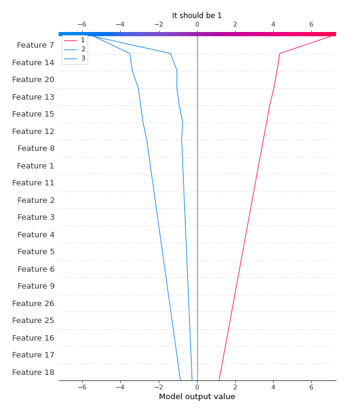
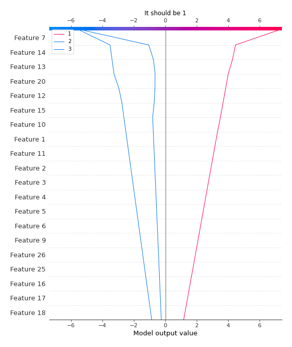

# Summary of 3_Default_Xgboost

[<< Go back](../README.md)

## Extreme Gradient Boosting (Xgboost)
- **n_jobs**: -1
- **objective**: multi:softprob
- **eta**: 0.075
- **max_depth**: 6
- **min_child_weight**: 1
- **subsample**: 1.0
- **colsample_bytree**: 1.0
- **eval_metric**: mlogloss
- **num_class**: 3
- **explain_level**: 2

## Validation
 - **validation_type**: split
 - **train_ratio**: 0.75
 - **shuffle**: True
 - **stratify**: True

## Optimized metric
logloss

## Training time

23.3 seconds

### Metric details
|           |     1 |    2 |    3 |   accuracy |   macro avg |   weighted avg |    logloss |
|:----------|------:|-----:|-----:|-----------:|------------:|---------------:|-----------:|
| precision |     1 |    1 |    1 |          1 |           1 |              1 | 2.1492e-05 |
| recall    |     1 |    1 |    1 |          1 |           1 |              1 | 2.1492e-05 |
| f1-score  |     1 |    1 |    1 |          1 |           1 |              1 | 2.1492e-05 |
| support   | 15261 | 4920 | 1857 |          1 |       22038 |          22038 | 2.1492e-05 |

## Confusion matrix
|              |   Predicted as 1 |   Predicted as 2 |   Predicted as 3 |
|:-------------|-----------------:|-----------------:|-----------------:|
| Labeled as 1 |            15261 |                0 |                0 |
| Labeled as 2 |                0 |             4920 |                0 |
| Labeled as 3 |                0 |                0 |             1857 |

## Learning curves

## Permutation-based Importance

## SHAP Importance

## SHAP Dependence plots

### Dependence 1 (Fold 1)

### Dependence 2 (Fold 1)

### Dependence 3 (Fold 1)

## SHAP Decision plots

### Worst decisions for selected sample 1 (Fold 1)

### Worst decisions for selected sample 2 (Fold 1)

### Worst decisions for selected sample 3 (Fold 1)

### Worst decisions for selected sample 4 (Fold 1)

### Best decisions for selected sample 1 (Fold 1)

### Best decisions for selected sample 2 (Fold 1)

### Best decisions for selected sample 3 (Fold 1)

### Best decisions for selected sample 4 (Fold 1)

[<< Go back](../README.md)
