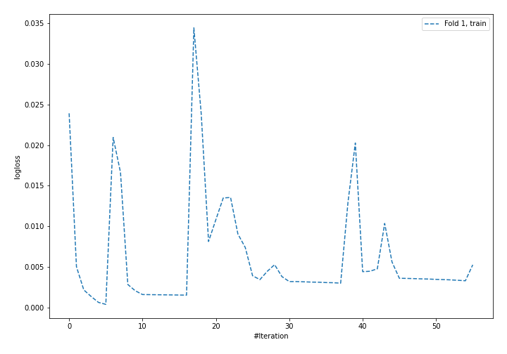
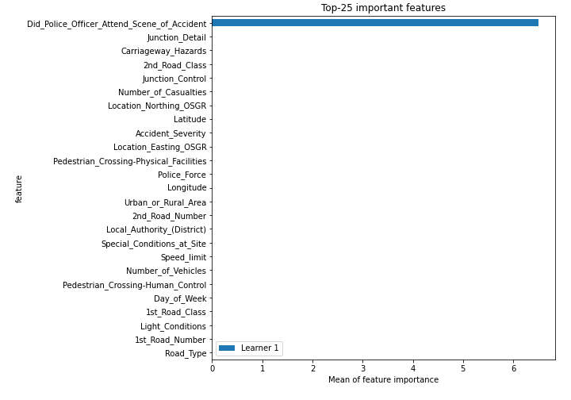

# Summary of 4_Default_NeuralNetwork

[<< Go back](../README.md)

## Neural Network
- **n_jobs**: -1
- **dense_1_size**: 32
- **dense_2_size**: 16
- **learning_rate**: 0.05
- **num_class**: 3
- **explain_level**: 2

## Validation
 - **validation_type**: split
 - **train_ratio**: 0.75
 - **shuffle**: True
 - **stratify**: True

## Optimized metric
logloss

## Training time

15.4 seconds

### Metric details
|           |     1 |    2 |    3 |   accuracy |   macro avg |   weighted avg |     logloss |
|:----------|------:|-----:|-----:|-----------:|------------:|---------------:|------------:|
| precision |     1 |    1 |    1 |          1 |           1 |              1 | 6.73791e-05 |
| recall    |     1 |    1 |    1 |          1 |           1 |              1 | 6.73791e-05 |
| f1-score  |     1 |    1 |    1 |          1 |           1 |              1 | 6.73791e-05 |
| support   | 15261 | 4920 | 1857 |          1 |       22038 |          22038 | 6.73791e-05 |

## Confusion matrix
|              |   Predicted as 1 |   Predicted as 2 |   Predicted as 3 |
|:-------------|-----------------:|-----------------:|-----------------:|
| Labeled as 1 |            15261 |                0 |                0 |
| Labeled as 2 |                0 |             4920 |                0 |
| Labeled as 3 |                0 |                0 |             1857 |

## Learning curves

## Permutation-based Importance

[<< Go back](../README.md)
