# Summary of 2_DecisionTree

[<< Go back](../README.md)

## Decision Tree
- **n_jobs**: -1
- **criterion**: gini
- **max_depth**: 3
- **num_class**: 3
- **explain_level**: 2

## Validation
 - **validation_type**: split
 - **train_ratio**: 0.75
 - **shuffle**: True
 - **stratify**: True

## Optimized metric
logloss

## Training time

24.6 seconds

### Metric details
|           |            1 |            2 |           3 |   accuracy |    macro avg |   weighted avg |   logloss |
|:----------|-------------:|-------------:|------------:|-----------:|-------------:|---------------:|----------:|
| precision |     0.726346 |    0.744409  |    0.997622 |   0.736954 |     0.822792 |       0.753391 |  0.648645 |
| recall    |     0.995276 |    0.0472808 |    0.448903 |   0.736954 |     0.497153 |       0.736954 |  0.648645 |
| f1-score  |     0.839806 |    0.0889143 |    0.619188 |   0.736954 |     0.51597  |       0.653186 |  0.648645 |
| support   | 15241        | 4928         | 1869        |   0.736954 | 22038        |   22038        |  0.648645 |

## Confusion matrix
|              |   Predicted as 1 |   Predicted as 2 |   Predicted as 3 |
|:-------------|-----------------:|-----------------:|-----------------:|
| Labeled as 1 |            15169 |               72 |                0 |
| Labeled as 2 |             4693 |              233 |                2 |
| Labeled as 3 |             1022 |                8 |              839 |

## Learning curves
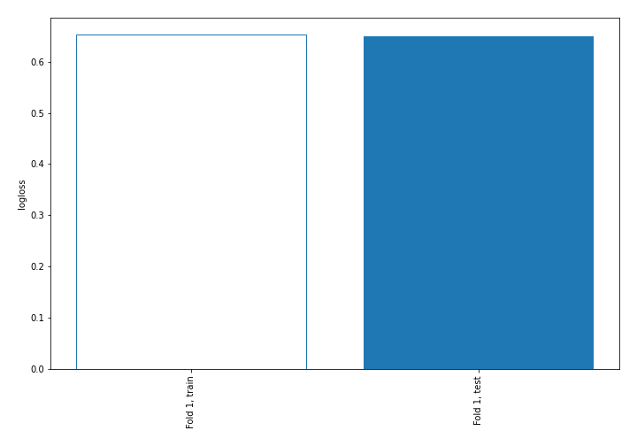

## Decision Tree 

### Tree #1
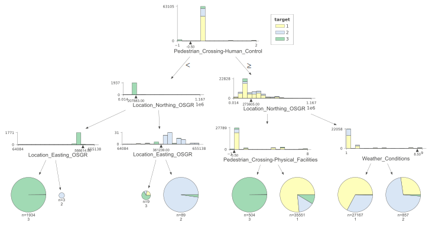

### Rules

if (Pedestrian_Crossing-Human_Control > -0.5) and (Location_Northing_OSGR <= 273605.0) and (Pedestrian_Crossing-Physical_Facilities > -0.5) then class: 1 (proba: 76.6%) | based on 35,551 samples

if (Pedestrian_Crossing-Human_Control > -0.5) and (Location_Northing_OSGR > 273605.0) and (Weather_Conditions <= 8.5) then class: 1 (proba: 67.2%) | based on 27,167 samples

if (Pedestrian_Crossing-Human_Control <= -0.5) and (Location_Northing_OSGR <= 207883.0) and (Location_Easting_OSGR <= 566614.0) then class: 3 (proba: 99.84%) | based on 1,934 samples

if (Pedestrian_Crossing-Human_Control > -0.5) and (Location_Northing_OSGR > 273605.0) and (Weather_Conditions > 8.5) then class: 2 (proba: 71.41%) | based on 857 samples

if (Pedestrian_Crossing-Human_Control > -0.5) and (Location_Northing_OSGR <= 273605.0) and (Pedestrian_Crossing-Physical_Facilities <= -0.5) then class: 3 (proba: 99.8%) | based on 504 samples

if (Pedestrian_Crossing-Human_Control <= -0.5) and (Location_Northing_OSGR > 207883.0) and (Location_Easting_OSGR > 361239.0) then class: 2 (proba: 97.75%) | based on 89 samples

if (Pedestrian_Crossing-Human_Control <= -0.5) and (Location_Northing_OSGR > 207883.0) and (Location_Easting_OSGR <= 361239.0) then class: 3 (proba: 66.67%) | based on 9 samples

if (Pedestrian_Crossing-Human_Control <= -0.5) and (Location_Northing_OSGR <= 207883.0) and (Location_Easting_OSGR > 566614.0) then class: 2 (proba: 100.0%) | based on 3 samples

## Permutation-based Importance
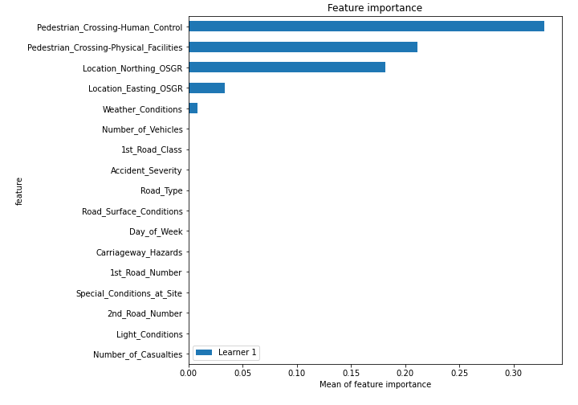

## SHAP Importance
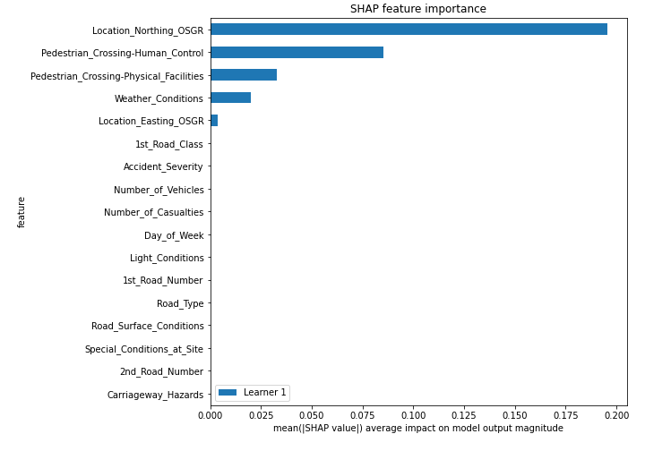

## SHAP Dependence plots

### Dependence 1 (Fold 1)
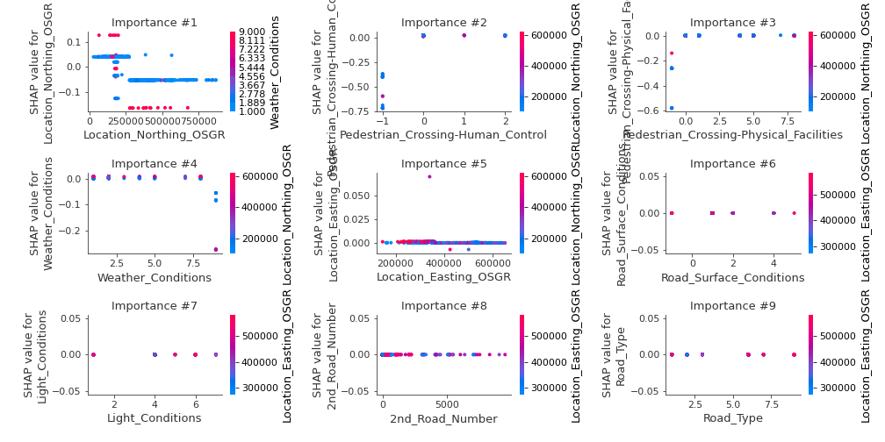
### Dependence 2 (Fold 1)
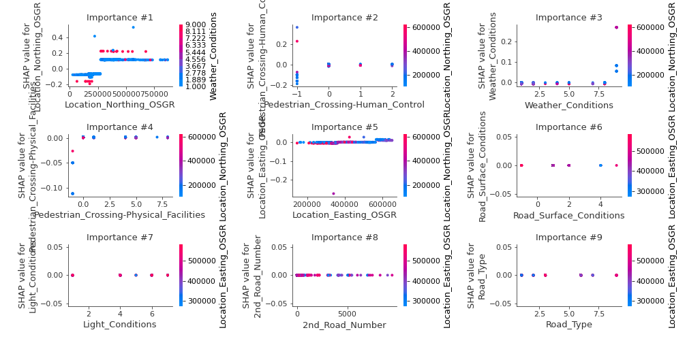
### Dependence 3 (Fold 1)
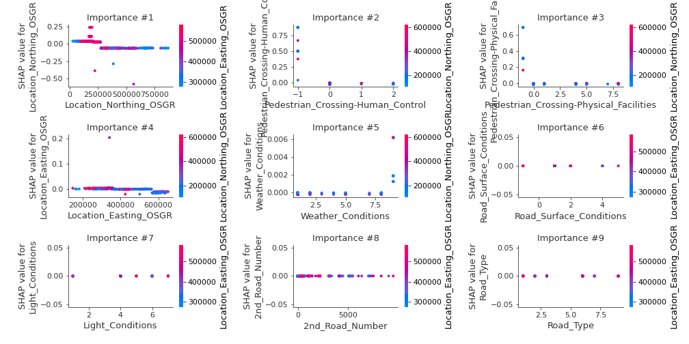

## SHAP Decision plots

### Worst decisions for selected sample 1 (Fold 1)

### Worst decisions for selected sample 2 (Fold 1)
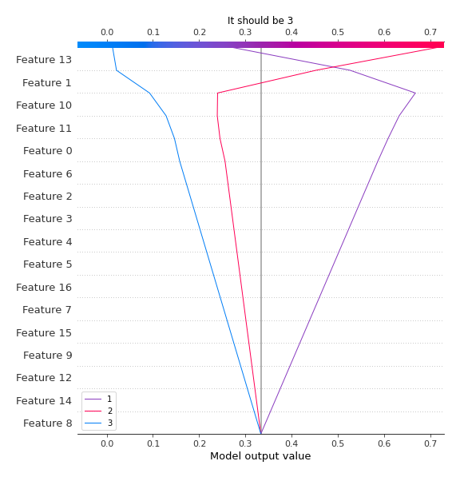
### Worst decisions for selected sample 3 (Fold 1)
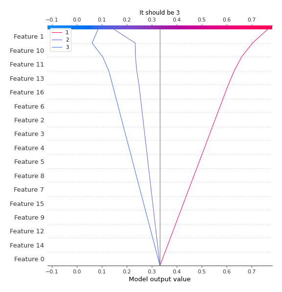
### Worst decisions for selected sample 4 (Fold 1)

### Best decisions for selected sample 1 (Fold 1)
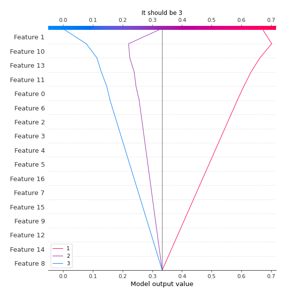
### Best decisions for selected sample 2 (Fold 1)

### Best decisions for selected sample 3 (Fold 1)
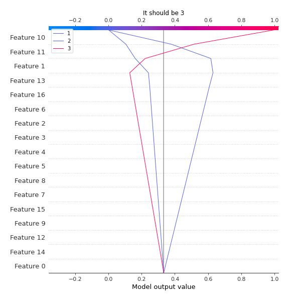
### Best decisions for selected sample 4 (Fold 1)

[<< Go back](../README.md)
