# Summary of 3_Default_Xgboost

[<< Go back](../README.md)

## Extreme Gradient Boosting (Xgboost)
- **n_jobs**: -1
- **objective**: multi:softprob
- **eta**: 0.075
- **max_depth**: 6
- **min_child_weight**: 1
- **subsample**: 1.0
- **colsample_bytree**: 1.0
- **eval_metric**: mlogloss
- **num_class**: 3
- **explain_level**: 2

## Validation
 - **validation_type**: split
 - **train_ratio**: 0.75
 - **shuffle**: True
 - **stratify**: True

## Optimized metric
logloss

## Training time

56.9 seconds

### Metric details
|           |            1 |           2 |           3 |   accuracy |    macro avg |   weighted avg |   logloss |
|:----------|-------------:|------------:|------------:|-----------:|-------------:|---------------:|----------:|
| precision |     0.782281 |    0.660222 |    0.911498 |   0.776568 |     0.784667 |       0.765945 |  0.478772 |
| recall    |     0.938521 |    0.32569  |    0.64473  |   0.776568 |     0.636314 |       0.776568 |  0.478772 |
| f1-score  |     0.853308 |    0.436201 |    0.755249 |   0.776568 |     0.681586 |       0.751721 |  0.478772 |
| support   | 15241        | 4928        | 1869        |   0.776568 | 22038        |   22038        |  0.478772 |

## Confusion matrix
|              |   Predicted as 1 |   Predicted as 2 |   Predicted as 3 |
|:-------------|-----------------:|-----------------:|-----------------:|
| Labeled as 1 |            14304 |              825 |              112 |
| Labeled as 2 |             3318 |             1605 |                5 |
| Labeled as 3 |              663 |                1 |             1205 |

## Learning curves
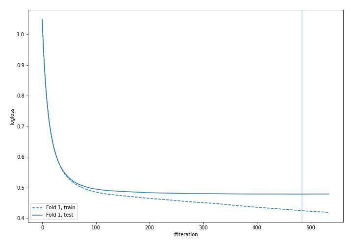

## Permutation-based Importance
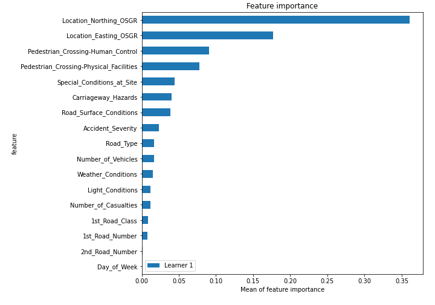

## SHAP Importance
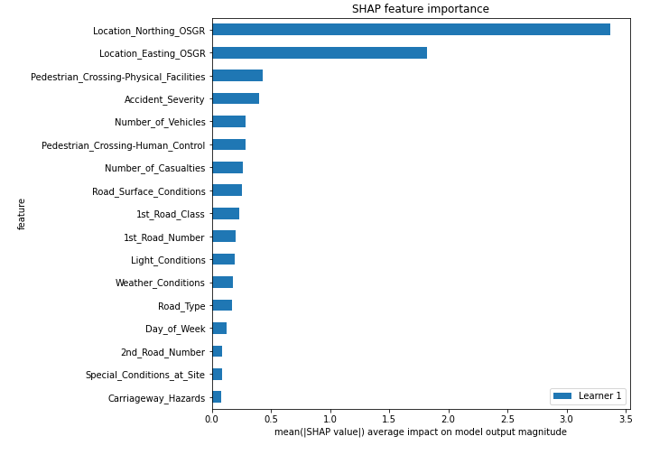

## SHAP Dependence plots

### Dependence 1 (Fold 1)
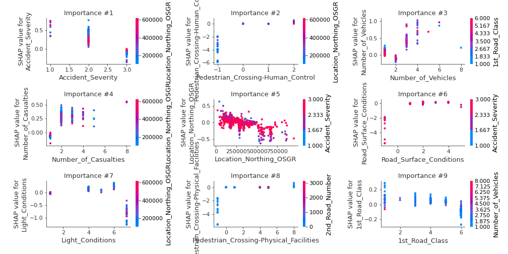
### Dependence 2 (Fold 1)
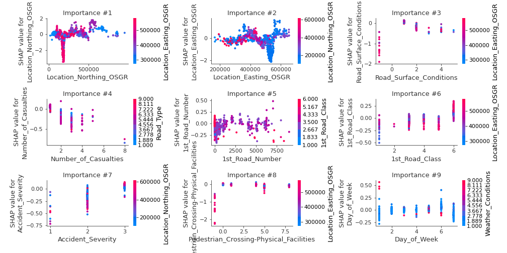
### Dependence 3 (Fold 1)
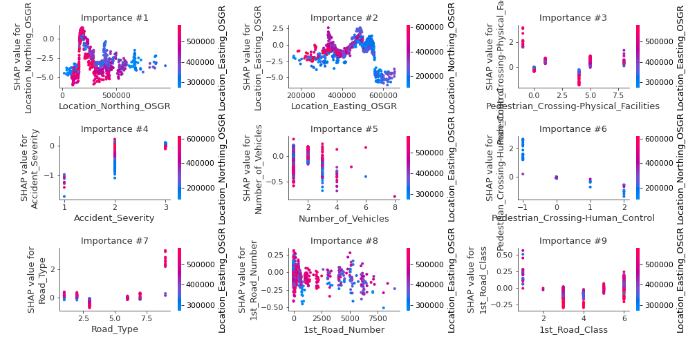

## SHAP Decision plots

### Worst decisions for selected sample 1 (Fold 1)
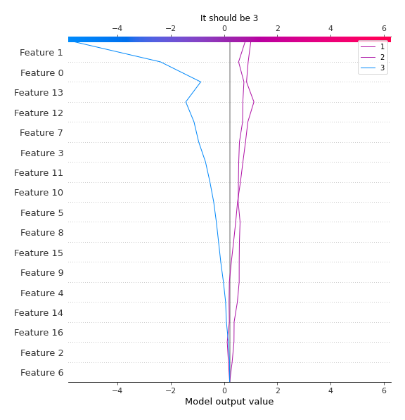
### Worst decisions for selected sample 2 (Fold 1)
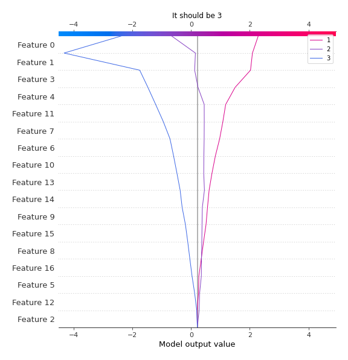
### Worst decisions for selected sample 3 (Fold 1)

### Worst decisions for selected sample 4 (Fold 1)
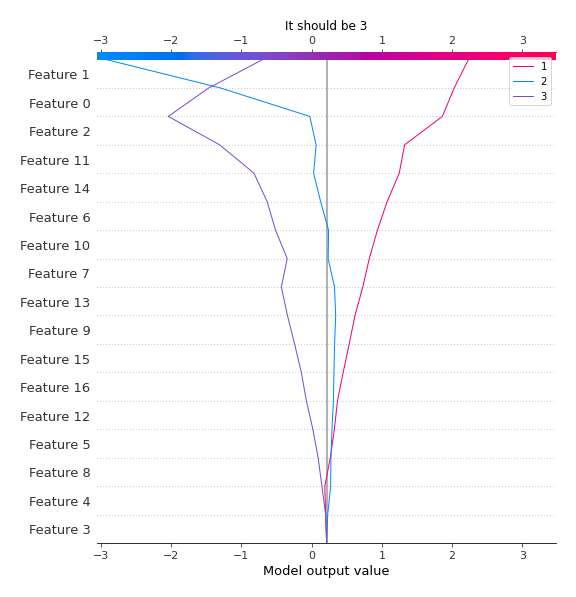
### Best decisions for selected sample 1 (Fold 1)

### Best decisions for selected sample 2 (Fold 1)
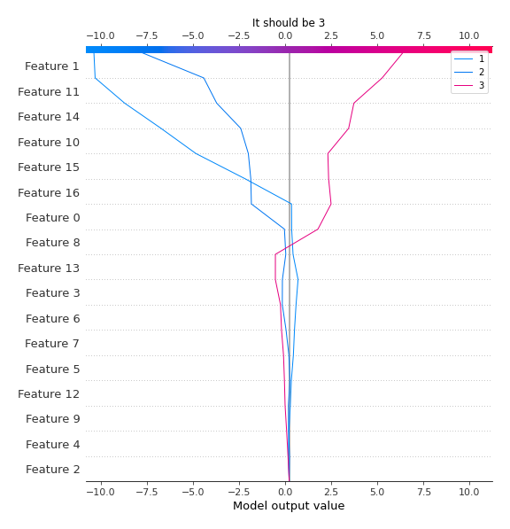
### Best decisions for selected sample 3 (Fold 1)
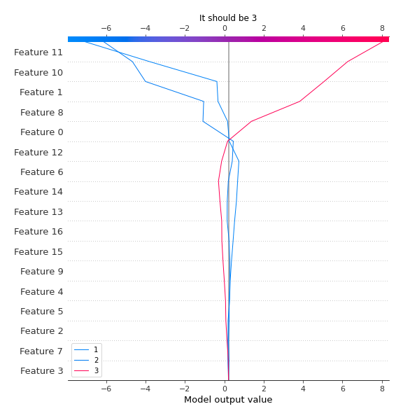
### Best decisions for selected sample 4 (Fold 1)
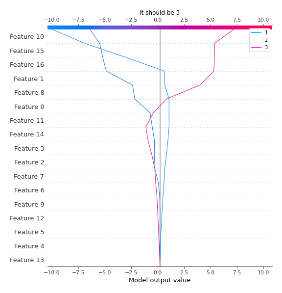

[<< Go back](../README.md)
