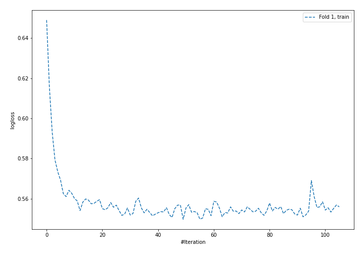
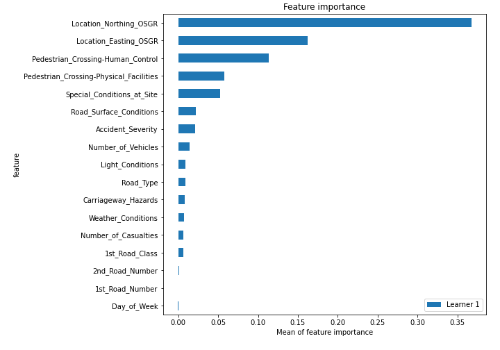

# Summary of 4_Default_NeuralNetwork

[<< Go back](../README.md)

## Neural Network
- **n_jobs**: -1
- **dense_1_size**: 32
- **dense_2_size**: 16
- **learning_rate**: 0.05
- **num_class**: 3
- **explain_level**: 2

## Validation
 - **validation_type**: split
 - **train_ratio**: 0.75
 - **shuffle**: True
 - **stratify**: True

## Optimized metric
logloss

## Training time

23.5 seconds

### Metric details
|           |            1 |           2 |           3 |   accuracy |    macro avg |   weighted avg |   logloss |
|:----------|-------------:|------------:|------------:|-----------:|-------------:|---------------:|----------:|
| precision |     0.75419  |    0.674655 |    0.94674  |   0.758735 |     0.791862 |       0.752734 |  0.551211 |
| recall    |     0.968506 |    0.188515 |    0.551632 |   0.758735 |     0.569551 |       0.758735 |  0.551211 |
| f1-score  |     0.848017 |    0.294687 |    0.697093 |   0.758735 |     0.613265 |       0.711485 |  0.551211 |
| support   | 15241        | 4928        | 1869        |   0.758735 | 22038        |   22038        |  0.551211 |

## Confusion matrix
|              |   Predicted as 1 |   Predicted as 2 |   Predicted as 3 |
|:-------------|-----------------:|-----------------:|-----------------:|
| Labeled as 1 |            14761 |              439 |               41 |
| Labeled as 2 |             3982 |              929 |               17 |
| Labeled as 3 |              829 |                9 |             1031 |

## Learning curves

## Permutation-based Importance

[<< Go back](../README.md)
