# Exploratory Data Analysis

[<< Go back](../README.md)
## Feature : target
- **Feature type** : discrete
- **Missing** : 0.0%
- **Unique** : 3
- **Count** :88152.0
- **Mean** :1.3935928850167891
- **Std** :0.6393371896587271
- **Min** :1.0
- **25%th Percentile** : 1.0
- **50%th Percentile** : 1.0
- **75%th Percentile** : 2.0
- **Max** :3.0

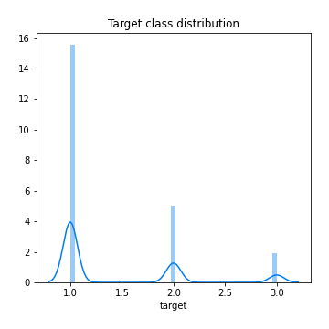
## Feature : Accident_Severity
- **Feature type** : discrete
- **Missing** : 0.0%
- **Unique** : 3
- **Count** :88152.0
- **Mean** :2.77217760232326
- **Std** :0.4517745773221083
- **Min** :1.0
- **25%th Percentile** : 3.0
- **50%th Percentile** : 3.0
- **75%th Percentile** : 3.0
- **Max** :3.0

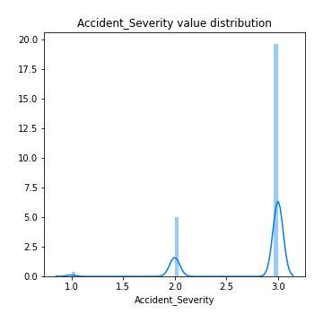
## Feature : Number_of_Vehicles
- **Feature type** : discrete
- **Missing** : 0.0%
- **Unique** : 16
- **Count** :88152.0
- **Mean** :1.8426014157364552
- **Std** :0.7093939909620277
- **Min** :1.0
- **25%th Percentile** : 1.0
- **50%th Percentile** : 2.0
- **75%th Percentile** : 2.0
- **Max** :17.0

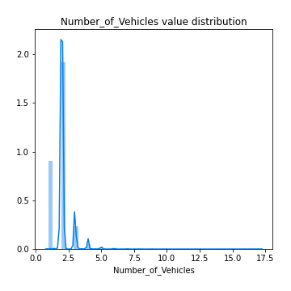
## Feature : Number_of_Casualties
- **Feature type** : discrete
- **Missing** : 0.0%
- **Unique** : 17
- **Count** :88152.0
- **Mean** :1.3033737181232417
- **Std** :0.7603571011755583
- **Min** :1.0
- **25%th Percentile** : 1.0
- **50%th Percentile** : 1.0
- **75%th Percentile** : 1.0
- **Max** :52.0

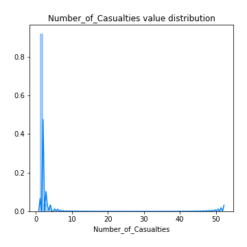
## Feature : Day_of_Week
- **Feature type** : discrete
- **Missing** : 0.0%
- **Unique** : 7
- **Count** :88152.0
- **Mean** :4.110706506942554
- **Std** :1.9203331139449895
- **Min** :1.0
- **25%th Percentile** : 2.0
- **50%th Percentile** : 4.0
- **75%th Percentile** : 6.0
- **Max** :7.0

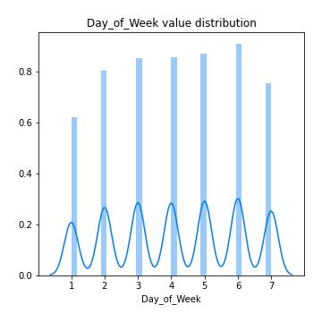
## Feature : 1st_Road_Class
- **Feature type** : discrete
- **Missing** : 0.0%
- **Unique** : 6
- **Count** :88152.0
- **Mean** :4.190568563390507
- **Std** :1.4626974483884725
- **Min** :1.0
- **25%th Percentile** : 3.0
- **50%th Percentile** : 4.0
- **75%th Percentile** : 6.0
- **Max** :6.0

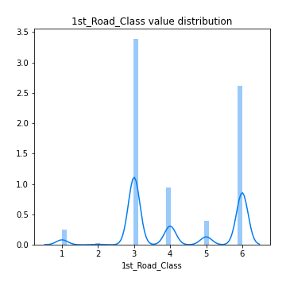
## Feature : 1st_Road_Number
- **Feature type** : discrete
- **Missing** : 0.0%
- **Unique** : 3433
- **Count** :88152.0
- **Mean** :858.9267515201017
- **Std** :1682.323874826679
- **Min** :0.0
- **25%th Percentile** : 0.0
- **50%th Percentile** : 45.0
- **75%th Percentile** : 602.0
- **Max** :9786.0

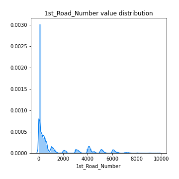
## Feature : Road_Type
- **Feature type** : discrete
- **Missing** : 0.0%
- **Unique** : 6
- **Count** :88152.0
- **Mean** :5.208957255649333
- **Std** :1.680964062146356
- **Min** :1.0
- **25%th Percentile** : 6.0
- **50%th Percentile** : 6.0
- **75%th Percentile** : 6.0
- **Max** :9.0

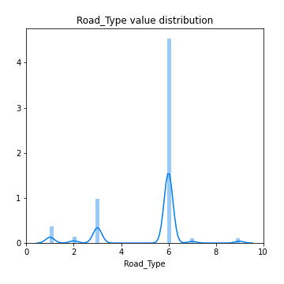
## Feature : 2nd_Road_Number
- **Feature type** : discrete
- **Missing** : 0.0%
- **Unique** : 2849
- **Count** :88152.0
- **Mean** :305.60334422361376
- **Std** :1158.1209466854164
- **Min** :-1.0
- **25%th Percentile** : 0.0
- **50%th Percentile** : 0.0
- **75%th Percentile** : 0.0
- **Max** :9822.0

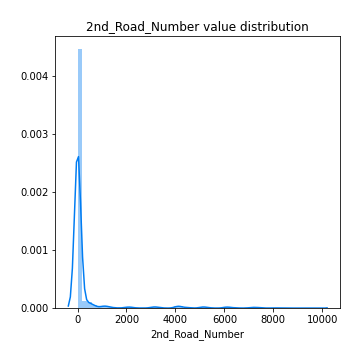
## Feature : Pedestrian_Crossing-Human_Control
- **Feature type** : discrete
- **Missing** : 0.0%
- **Unique** : 4
- **Count** :88152.0
- **Mean** :-0.006080406570469189
- **Std** :0.2765697099082382
- **Min** :-1.0
- **25%th Percentile** : 0.0
- **50%th Percentile** : 0.0
- **75%th Percentile** : 0.0
- **Max** :2.0

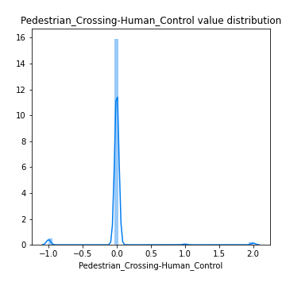
## Feature : Pedestrian_Crossing-Physical_Facilities
- **Feature type** : discrete
- **Missing** : 0.0%
- **Unique** : 7
- **Count** :88152.0
- **Mean** :0.8617501588165896
- **Std** :1.9992572419868166
- **Min** :-1.0
- **25%th Percentile** : 0.0
- **50%th Percentile** : 0.0
- **75%th Percentile** : 0.0
- **Max** :8.0

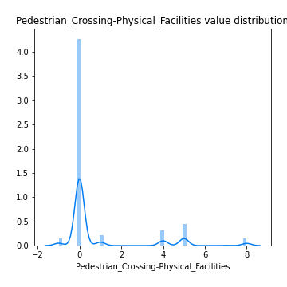
## Feature : Light_Conditions
- **Feature type** : discrete
- **Missing** : 0.0%
- **Unique** : 6
- **Count** :88152.0
- **Mean** :2.0469529902895
- **Std** :1.7316632318884466
- **Min** :-1.0
- **25%th Percentile** : 1.0
- **50%th Percentile** : 1.0
- **75%th Percentile** : 4.0
- **Max** :7.0

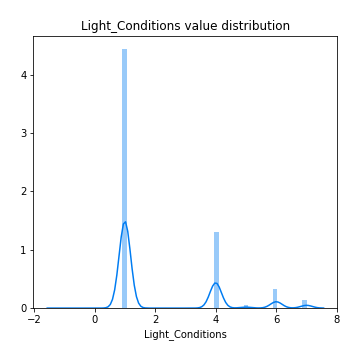
## Feature : Weather_Conditions
- **Feature type** : discrete
- **Missing** : 0.0%
- **Unique** : 9
- **Count** :88152.0
- **Mean** :1.6532126327252927
- **Std** :1.810204368686078
- **Min** :1.0
- **25%th Percentile** : 1.0
- **50%th Percentile** : 1.0
- **75%th Percentile** : 1.0
- **Max** :9.0

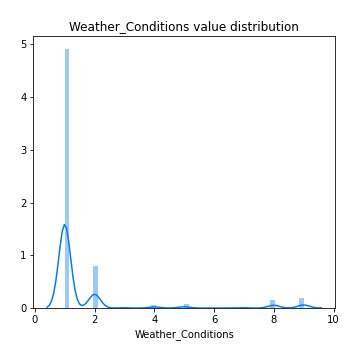
## Feature : Road_Surface_Conditions
- **Feature type** : discrete
- **Missing** : 0.0%
- **Unique** : 6
- **Count** :88152.0
- **Mean** :1.2900898448135039
- **Std** :0.6001839599596863
- **Min** :-1.0
- **25%th Percentile** : 1.0
- **50%th Percentile** : 1.0
- **75%th Percentile** : 2.0
- **Max** :5.0

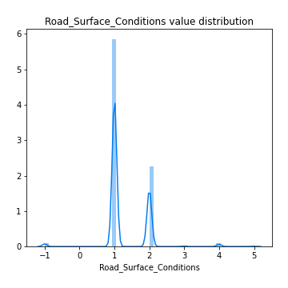
## Feature : Special_Conditions_at_Site
- **Feature type** : discrete
- **Missing** : 0.0%
- **Unique** : 9
- **Count** :88152.0
- **Mean** :0.07404256284599328
- **Std** :0.6597176123313289
- **Min** :-1.0
- **25%th Percentile** : 0.0
- **50%th Percentile** : 0.0
- **75%th Percentile** : 0.0
- **Max** :7.0

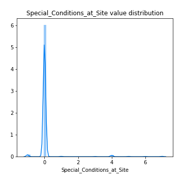
## Feature : Carriageway_Hazards
- **Feature type** : discrete
- **Missing** : 0.0%
- **Unique** : 7
- **Count** :88152.0
- **Mean** :0.045285416099464564
- **Std** :0.5352989005418949
- **Min** :-1.0
- **25%th Percentile** : 0.0
- **50%th Percentile** : 0.0
- **75%th Percentile** : 0.0
- **Max** :7.0

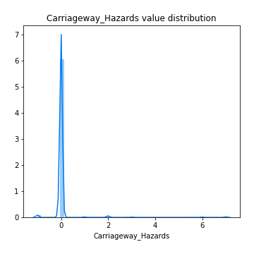

[<< Go back](../README.md)
