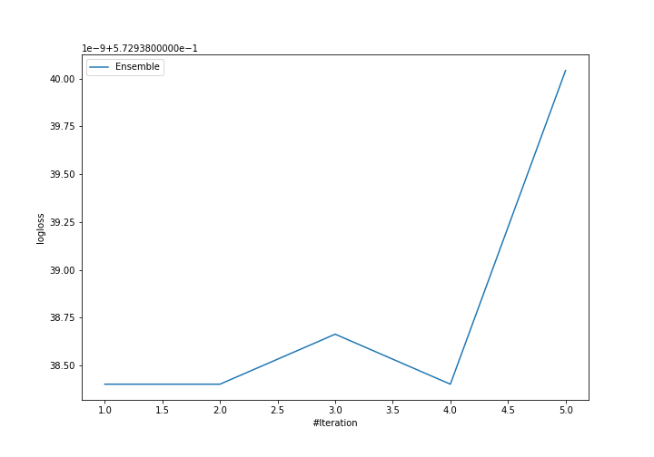

# Summary of Ensemble

[<< Go back](../README.md)

## Ensemble structure
| Model             |   Weight |
|:------------------|---------:|
| 3_Default_Xgboost |        1 |

### Metric details
|           |            1 |           2 |           3 |   accuracy |    macro avg |   weighted avg |   logloss |
|:----------|-------------:|------------:|------------:|-----------:|-------------:|---------------:|----------:|
| precision |     0.747827 |    0.607532 |    0.892482 |   0.749524 |     0.74928  |       0.728769 |  0.572938 |
| recall    |     0.971322 |    0.124442 |    0.589114 |   0.749524 |     0.561626 |       0.749524 |  0.572938 |
| f1-score  |     0.845047 |    0.206571 |    0.70974  |   0.749524 |     0.587119 |       0.690827 |  0.572938 |
| support   | 15238        | 4926        | 1874        |   0.749524 | 22038        |   22038        |  0.572938 |

## Confusion matrix
|              |   Predicted as 1 |   Predicted as 2 |   Predicted as 3 |
|:-------------|-----------------:|-----------------:|-----------------:|
| Labeled as 1 |            14801 |              355 |               82 |
| Labeled as 2 |             4262 |              613 |               51 |
| Labeled as 3 |              729 |               41 |             1104 |

## Learning curves

[<< Go back](../README.md)
