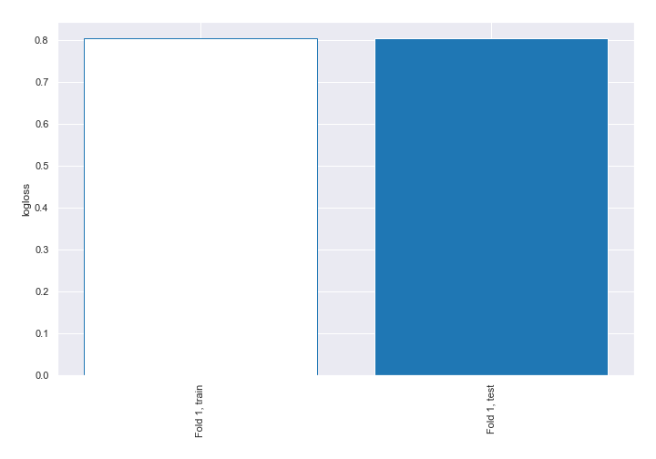

# Summary of 1_Baseline

[<< Go back](../README.md)

## Baseline Classifier (Baseline)
- **n_jobs**: -1
- **num_class**: 3
- **explain_level**: 2

## Validation
 - **validation_type**: split
 - **train_ratio**: 0.75
 - **shuffle**: True
 - **stratify**: True

## Optimized metric
logloss

## Training time

1.0 seconds

### Metric details
|           |            1 |    2 |    3 |   accuracy |    macro avg |   weighted avg |   logloss |
|:----------|-------------:|-----:|-----:|-----------:|-------------:|---------------:|----------:|
| precision |     0.691124 |    0 |    0 |   0.691124 |     0.230375 |       0.477652 |  0.803537 |
| recall    |     1        |    0 |    0 |   0.691124 |     0.333333 |       0.691124 |  0.803537 |
| f1-score  |     0.817354 |    0 |    0 |   0.691124 |     0.272451 |       0.564893 |  0.803537 |
| support   | 15448        | 4918 | 1986 |   0.691124 | 22352        |   22352        |  0.803537 |

## Confusion matrix
|              |   Predicted as 1 |   Predicted as 2 |   Predicted as 3 |
|:-------------|-----------------:|-----------------:|-----------------:|
| Labeled as 1 |            15448 |                0 |                0 |
| Labeled as 2 |             4918 |                0 |                0 |
| Labeled as 3 |             1986 |                0 |                0 |

## Learning curves

[<< Go back](../README.md)
