# Summary of 3_Default_Xgboost

[<< Go back](../README.md)

## Extreme Gradient Boosting (Xgboost)
- **n_jobs**: -1
- **objective**: multi:softprob
- **eta**: 0.075
- **max_depth**: 6
- **min_child_weight**: 1
- **subsample**: 1.0
- **colsample_bytree**: 1.0
- **eval_metric**: mlogloss
- **num_class**: 3
- **explain_level**: 2

## Validation
 - **validation_type**: split
 - **train_ratio**: 0.75
 - **shuffle**: True
 - **stratify**: True

## Optimized metric
logloss

## Training time

67.5 seconds

### Metric details
|           |            1 |           2 |           3 |   accuracy |    macro avg |   weighted avg |   logloss |
|:----------|-------------:|------------:|------------:|-----------:|-------------:|---------------:|----------:|
| precision |     0.749625 |    0.618265 |    0.869836 |   0.750089 |     0.745909 |       0.731403 |  0.574455 |
| recall    |     0.969252 |    0.137658 |    0.561934 |   0.750089 |     0.556281 |       0.750089 |  0.574455 |
| f1-score  |     0.845407 |    0.225179 |    0.682778 |   0.750089 |     0.584454 |       0.694491 |  0.574455 |
| support   | 15448        | 4918        | 1986        |   0.750089 | 22352        |   22352        |  0.574455 |

## Confusion matrix
|              |   Predicted as 1 |   Predicted as 2 |   Predicted as 3 |
|:-------------|-----------------:|-----------------:|-----------------:|
| Labeled as 1 |            14973 |              371 |              104 |
| Labeled as 2 |             4178 |              677 |               63 |
| Labeled as 3 |              823 |               47 |             1116 |

## Learning curves
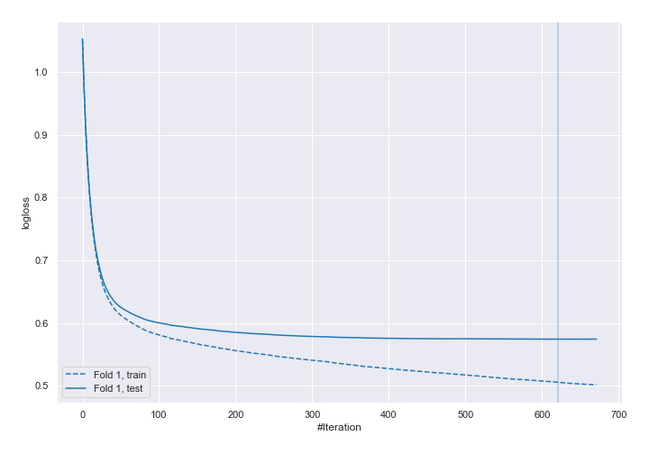

## Permutation-based Importance
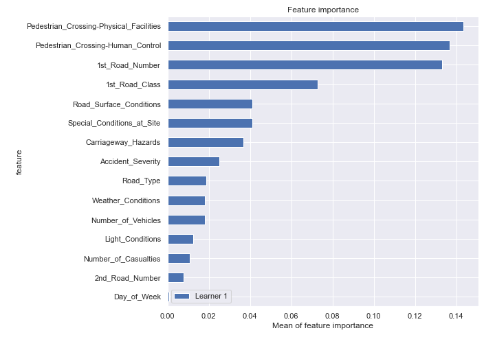

## SHAP Importance
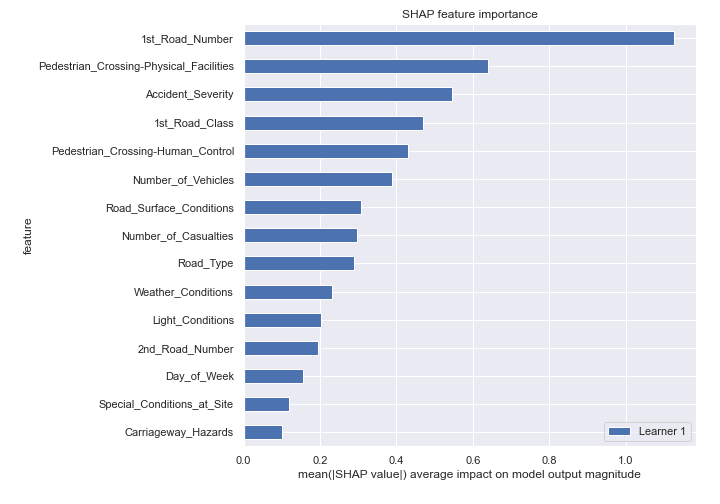

## SHAP Dependence plots

### Dependence 1 (Fold 1)
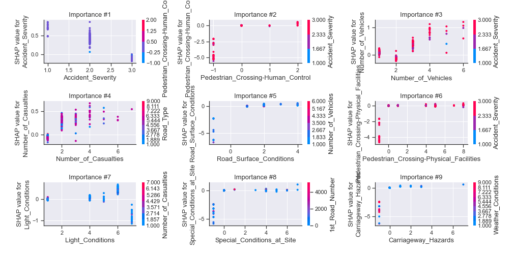
### Dependence 2 (Fold 1)
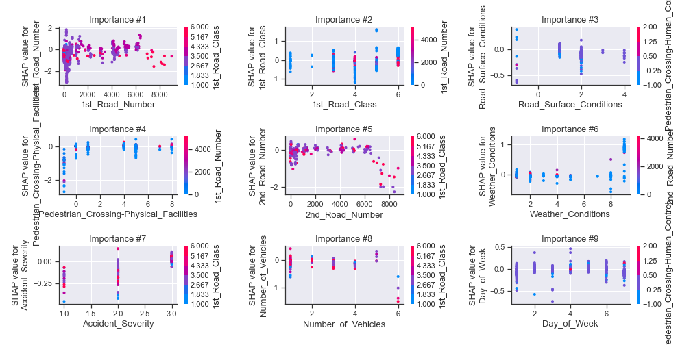
### Dependence 3 (Fold 1)
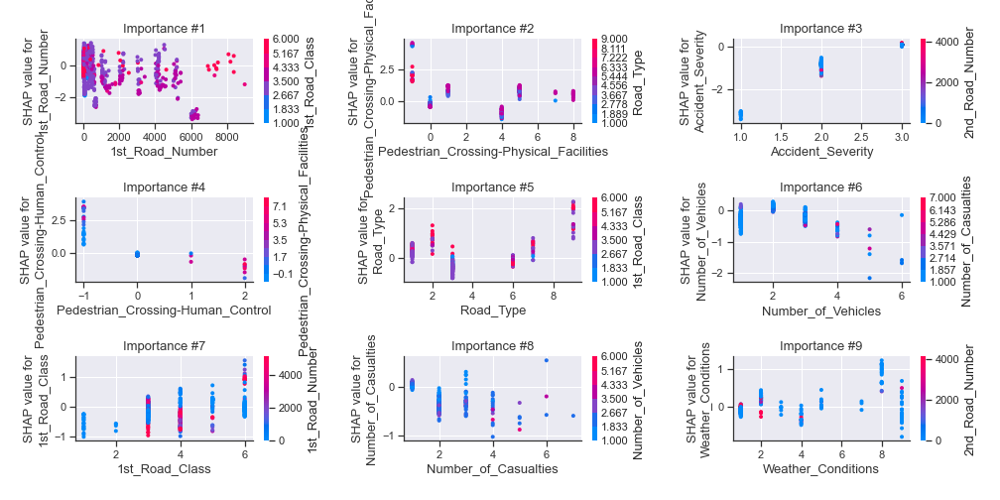

## SHAP Decision plots

### Worst decisions for selected sample 1 (Fold 1)

### Worst decisions for selected sample 2 (Fold 1)
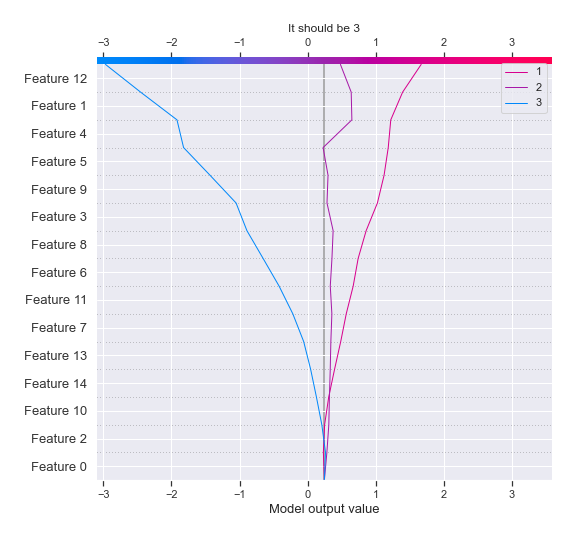
### Worst decisions for selected sample 3 (Fold 1)
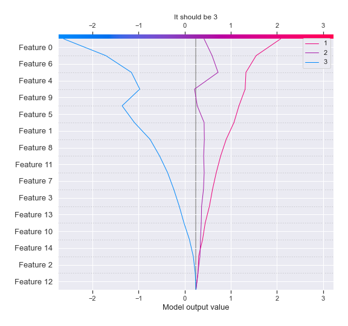
### Worst decisions for selected sample 4 (Fold 1)
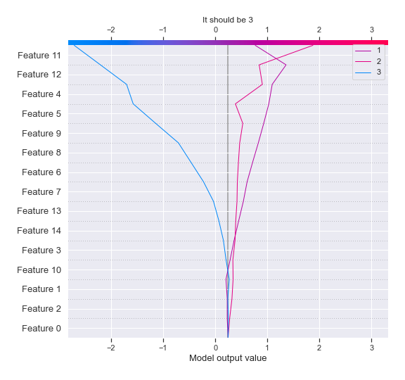
### Best decisions for selected sample 1 (Fold 1)
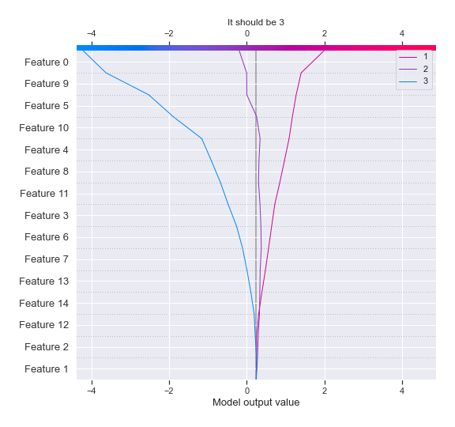
### Best decisions for selected sample 2 (Fold 1)
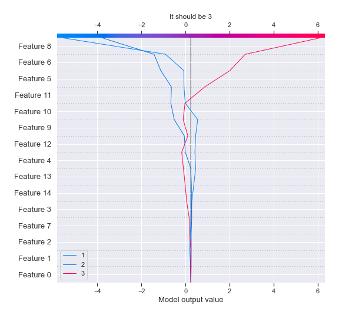
### Best decisions for selected sample 3 (Fold 1)
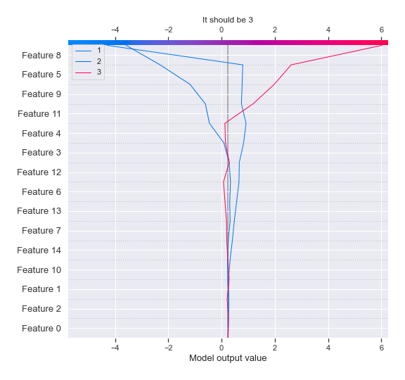
### Best decisions for selected sample 4 (Fold 1)
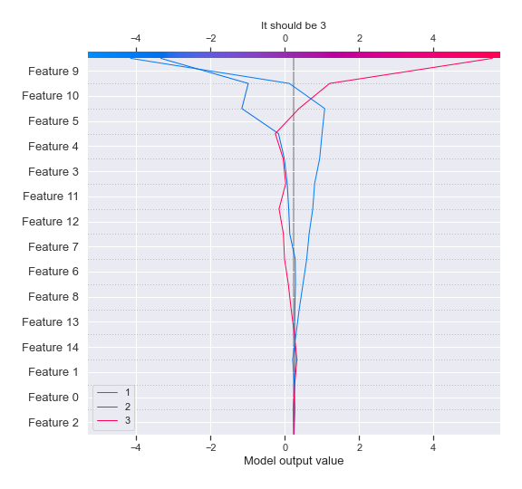

[<< Go back](../README.md)
