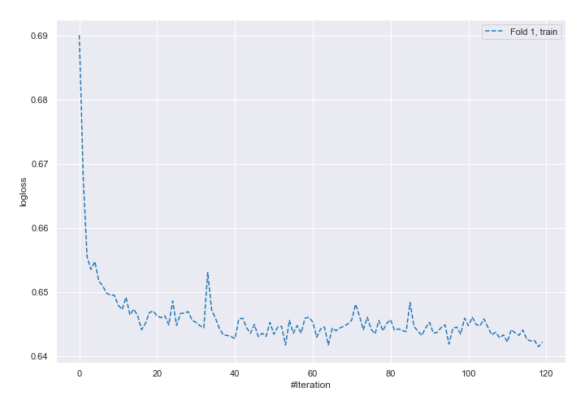
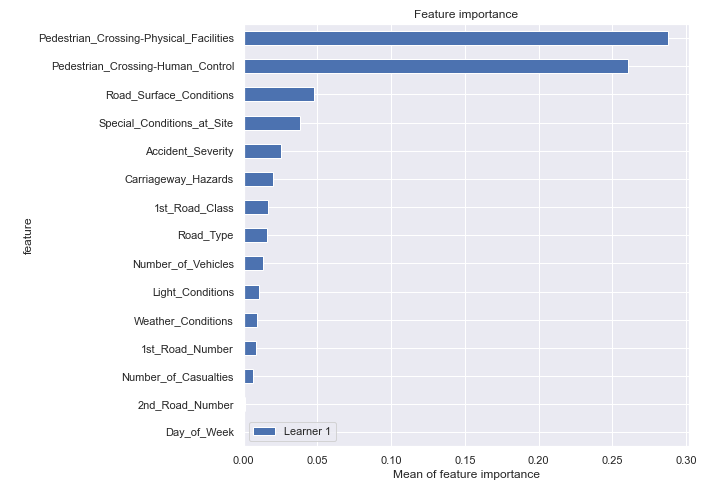

# Summary of 4_Default_NeuralNetwork

[<< Go back](../README.md)

## Neural Network
- **n_jobs**: -1
- **dense_1_size**: 32
- **dense_2_size**: 16
- **learning_rate**: 0.05
- **num_class**: 3
- **explain_level**: 2

## Validation
 - **validation_type**: split
 - **train_ratio**: 0.75
 - **shuffle**: True
 - **stratify**: True

## Optimized metric
logloss

## Training time

38.6 seconds

### Metric details
|           |            1 |            2 |           3 |   accuracy |    macro avg |   weighted avg |   logloss |
|:----------|-------------:|-------------:|------------:|-----------:|-------------:|---------------:|----------:|
| precision |     0.736507 |    0.593923  |    0.836026 |    0.73971 |     0.722152 |       0.713977 |  0.647174 |
| recall    |     0.989384 |    0.043717  |    0.521148 |    0.73971 |     0.518083 |       0.73971  |  0.647174 |
| f1-score  |     0.84442  |    0.0814394 |    0.64206  |    0.73971 |     0.52264  |       0.658565 |  0.647174 |
| support   | 15448        | 4918         | 1986        |    0.73971 | 22352        |   22352        |  0.647174 |

## Confusion matrix
|              |   Predicted as 1 |   Predicted as 2 |   Predicted as 3 |
|:-------------|-----------------:|-----------------:|-----------------:|
| Labeled as 1 |            15284 |              108 |               56 |
| Labeled as 2 |             4556 |              215 |              147 |
| Labeled as 3 |              912 |               39 |             1035 |

## Learning curves

## Permutation-based Importance

[<< Go back](../README.md)
