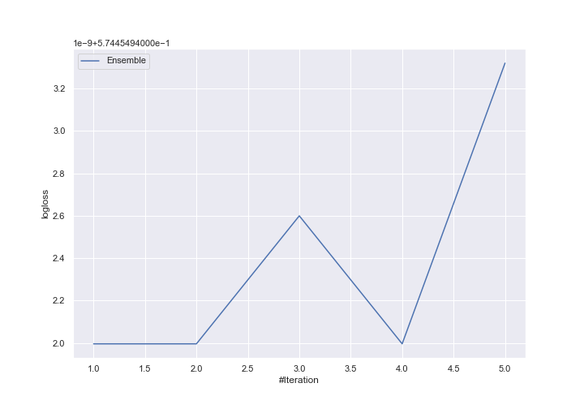

# Summary of Ensemble

[<< Go back](../README.md)

## Ensemble structure
| Model             |   Weight |
|:------------------|---------:|
| 3_Default_Xgboost |        1 |

### Metric details
|           |            1 |           2 |           3 |   accuracy |    macro avg |   weighted avg |   logloss |
|:----------|-------------:|------------:|------------:|-----------:|-------------:|---------------:|----------:|
| precision |     0.749625 |    0.618265 |    0.869836 |   0.750089 |     0.745909 |       0.731403 |  0.574455 |
| recall    |     0.969252 |    0.137658 |    0.561934 |   0.750089 |     0.556281 |       0.750089 |  0.574455 |
| f1-score  |     0.845407 |    0.225179 |    0.682778 |   0.750089 |     0.584454 |       0.694491 |  0.574455 |
| support   | 15448        | 4918        | 1986        |   0.750089 | 22352        |   22352        |  0.574455 |

## Confusion matrix
|              |   Predicted as 1 |   Predicted as 2 |   Predicted as 3 |
|:-------------|-----------------:|-----------------:|-----------------:|
| Labeled as 1 |            14973 |              371 |              104 |
| Labeled as 2 |             4178 |              677 |               63 |
| Labeled as 3 |              823 |               47 |             1116 |

## Learning curves

[<< Go back](../README.md)
