# Exploratory Data Analysis

[<< Go back](../README.md)
## Feature : target
- **Feature type** : discrete
- **Missing** : 0.0%
- **Unique** : 3
- **Count** :185376.0
- **Mean** :2.0
- **Std** :0.816498783208184
- **Min** :1.0
- **25%th Percentile** : 1.0
- **50%th Percentile** : 2.0
- **75%th Percentile** : 3.0
- **Max** :3.0

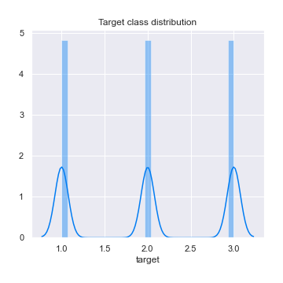
## Feature : Accident_Severity
- **Feature type** : discrete
- **Missing** : 0.0%
- **Unique** : 3
- **Count** :185376.0
- **Mean** :2.818617296737442
- **Std** :0.4049936971479936
- **Min** :1.0
- **25%th Percentile** : 3.0
- **50%th Percentile** : 3.0
- **75%th Percentile** : 3.0
- **Max** :3.0

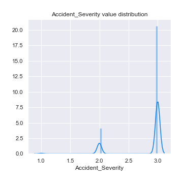
## Feature : Number_of_Vehicles
- **Feature type** : discrete
- **Missing** : 0.0%
- **Unique** : 15
- **Count** :185376.0
- **Mean** :1.7519851544968066
- **Std** :0.6144989876883177
- **Min** :1.0
- **25%th Percentile** : 1.0
- **50%th Percentile** : 2.0
- **75%th Percentile** : 2.0
- **Max** :17.0

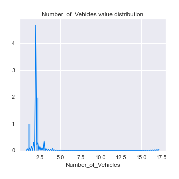
## Feature : Number_of_Casualties
- **Feature type** : discrete
- **Missing** : 0.0%
- **Unique** : 18
- **Count** :185376.0
- **Mean** :1.1787825824270672
- **Std** :0.5835357970597691
- **Min** :1.0
- **25%th Percentile** : 1.0
- **50%th Percentile** : 1.0
- **75%th Percentile** : 1.0
- **Max** :52.0

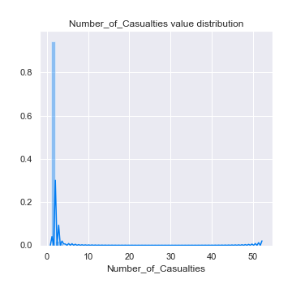
## Feature : Day_of_Week
- **Feature type** : discrete
- **Missing** : 0.0%
- **Unique** : 7
- **Count** :185376.0
- **Mean** :3.973739858449853
- **Std** :1.8273713706107362
- **Min** :1.0
- **25%th Percentile** : 2.0
- **50%th Percentile** : 4.0
- **75%th Percentile** : 5.0
- **Max** :7.0

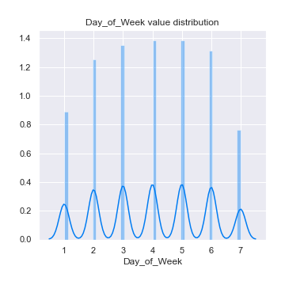
## Feature : 1st_Road_Class
- **Feature type** : discrete
- **Missing** : 0.0%
- **Unique** : 6
- **Count** :185376.0
- **Mean** :4.178572199205938
- **Std** :1.4318065478632358
- **Min** :1.0
- **25%th Percentile** : 3.0
- **50%th Percentile** : 4.0
- **75%th Percentile** : 6.0
- **Max** :6.0

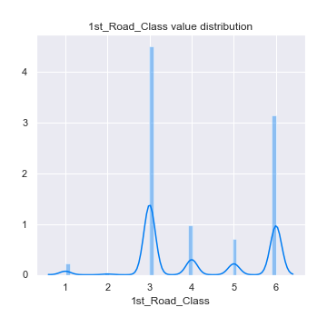
## Feature : 1st_Road_Number
- **Feature type** : discrete
- **Missing** : 0.0%
- **Unique** : 3998
- **Count** :185376.0
- **Mean** :807.2092773606076
- **Std** :1986.673214601763
- **Min** :0.0
- **25%th Percentile** : 0.0
- **50%th Percentile** : 40.0
- **75%th Percentile** : 503.0
- **Max** :498878.0

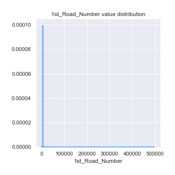
## Feature : Road_Type
- **Feature type** : discrete
- **Missing** : 0.0%
- **Unique** : 9
- **Count** :185376.0
- **Mean** :5.245285258070084
- **Std** :1.820128528084973
- **Min** :1.0
- **25%th Percentile** : 5.0
- **50%th Percentile** : 6.0
- **75%th Percentile** : 6.0
- **Max** :9.0

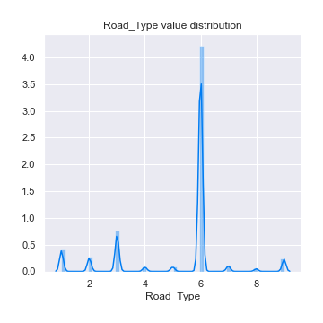
## Feature : 2nd_Road_Number
- **Feature type** : discrete
- **Missing** : 0.0%
- **Unique** : 3689
- **Count** :185376.0
- **Mean** :319.22610801829796
- **Std** :1165.871984722853
- **Min** :-1.0
- **25%th Percentile** : 0.0
- **50%th Percentile** : 0.0
- **75%th Percentile** : 0.0
- **Max** :9899.0

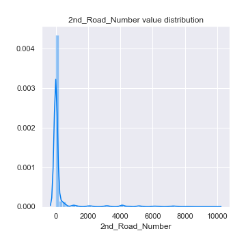
## Feature : Pedestrian_Crossing-Human_Control
- **Feature type** : discrete
- **Missing** : 0.0%
- **Unique** : 4
- **Count** :185376.0
- **Mean** :-0.052390816502675644
- **Std** :0.29923868687081107
- **Min** :-1.0
- **25%th Percentile** : 0.0
- **50%th Percentile** : 0.0
- **75%th Percentile** : 0.0
- **Max** :2.0

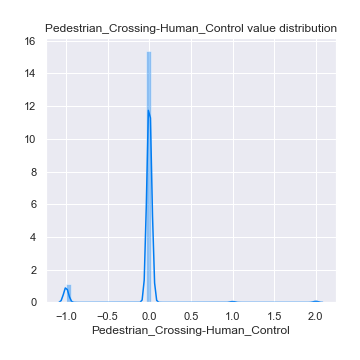
## Feature : Pedestrian_Crossing-Physical_Facilities
- **Feature type** : discrete
- **Missing** : 0.0%
- **Unique** : 10
- **Count** :185376.0
- **Mean** :0.8518848178836527
- **Std** :1.9957908525558699
- **Min** :-1.0
- **25%th Percentile** : 0.0
- **50%th Percentile** : 0.0
- **75%th Percentile** : 0.0
- **Max** :8.0

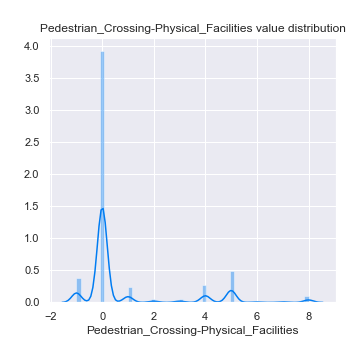
## Feature : Light_Conditions
- **Feature type** : discrete
- **Missing** : 0.0%
- **Unique** : 7
- **Count** :185376.0
- **Mean** :1.9536239858449853
- **Std** :1.6649304957863487
- **Min** :1.0
- **25%th Percentile** : 1.0
- **50%th Percentile** : 1.0
- **75%th Percentile** : 3.0
- **Max** :7.0

## Feature : Weather_Conditions
- **Feature type** : discrete
- **Missing** : 0.0%
- **Unique** : 9
- **Count** :185376.0
- **Mean** :1.8497324356982565
- **Std** :2.157419285376244
- **Min** :1.0
- **25%th Percentile** : 1.0
- **50%th Percentile** : 1.0
- **75%th Percentile** : 1.0
- **Max** :9.0

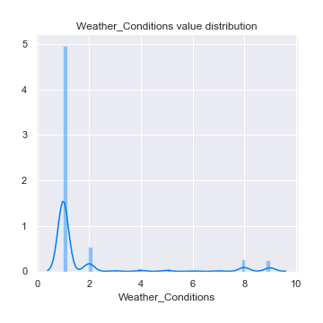
## Feature : Road_Surface_Conditions
- **Feature type** : discrete
- **Missing** : 0.0%
- **Unique** : 7
- **Count** :185376.0
- **Mean** :1.1288678146038322
- **Std** :0.5839132607091435
- **Min** :-1.0
- **25%th Percentile** : 1.0
- **50%th Percentile** : 1.0
- **75%th Percentile** : 1.0
- **Max** :5.0

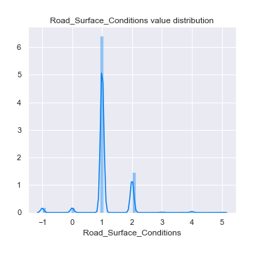
## Feature : Special_Conditions_at_Site
- **Feature type** : discrete
- **Missing** : 0.0%
- **Unique** : 9
- **Count** :185376.0
- **Mean** :0.04705031935094079
- **Std** :0.5737227550605674
- **Min** :-1.0
- **25%th Percentile** : 0.0
- **50%th Percentile** : 0.0
- **75%th Percentile** : 0.0
- **Max** :7.0

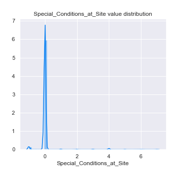
## Feature : Carriageway_Hazards
- **Feature type** : discrete
- **Missing** : 0.0%
- **Unique** : 9
- **Count** :185376.0
- **Mean** :0.013728853789055757
- **Std** :0.42411502445628857
- **Min** :-1.0
- **25%th Percentile** : 0.0
- **50%th Percentile** : 0.0
- **75%th Percentile** : 0.0
- **Max** :7.0

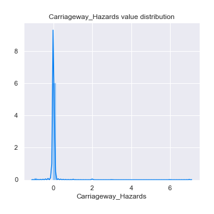

[<< Go back](../README.md)
