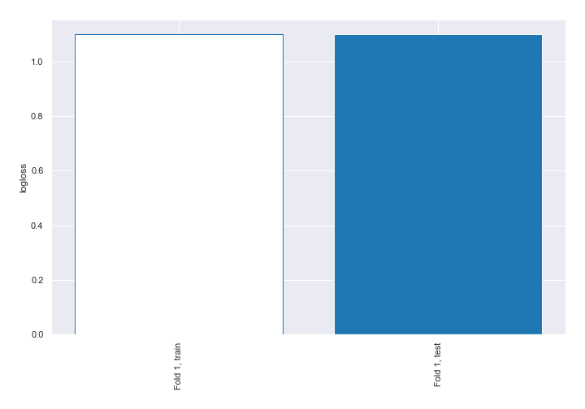

# Summary of 1_Baseline

[<< Go back](../README.md)

## Baseline Classifier (Baseline)
- **n_jobs**: -1
- **num_class**: 3
- **explain_level**: 2

## Validation
 - **validation_type**: split
 - **train_ratio**: 0.75
 - **shuffle**: True
 - **stratify**: True

## Optimized metric
logloss

## Training time

1.2 seconds

### Metric details
|           |            1 |     2 |     3 |   accuracy |    macro avg |   weighted avg |   logloss |
|:----------|-------------:|------:|------:|-----------:|-------------:|---------------:|----------:|
| precision |     0.334081 |     0 |     0 |   0.334081 |     0.11136  |       0.11161  |   1.09861 |
| recall    |     1        |     0 |     0 |   0.334081 |     0.333333 |       0.334081 |   1.09861 |
| f1-score  |     0.500841 |     0 |     0 |   0.334081 |     0.166947 |       0.167322 |   1.09861 |
| support   | 11612        | 11583 | 11563 |   0.334081 | 34758        |   34758        |   1.09861 |

## Confusion matrix
|              |   Predicted as 1 |   Predicted as 2 |   Predicted as 3 |
|:-------------|-----------------:|-----------------:|-----------------:|
| Labeled as 1 |            11612 |                0 |                0 |
| Labeled as 2 |            11583 |                0 |                0 |
| Labeled as 3 |            11563 |                0 |                0 |

## Learning curves

[<< Go back](../README.md)
