# Exploratory Data Analysis

[<< Go back](../README.md)
## Feature : target
- **Feature type** : discrete
- **Missing** : 0.0%
- **Unique** : 3
- **Count** :88152.0
- **Mean** :1.3917551501951175
- **Std** :0.63778474448972
- **Min** :1.0
- **25%th Percentile** : 1.0
- **50%th Percentile** : 1.0
- **75%th Percentile** : 2.0
- **Max** :3.0

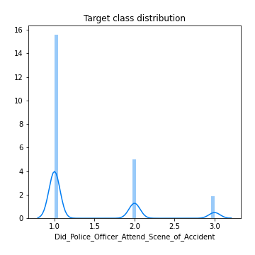
## Feature : 1st_Road_Class
- **Feature type** : discrete
- **Missing** : 0.0%
- **Unique** : 6
- **Count** :88152.0
- **Mean** :4.194436881749705
- **Std** :1.4602357231227663
- **Min** :1.0
- **25%th Percentile** : 3.0
- **50%th Percentile** : 4.0
- **75%th Percentile** : 6.0
- **Max** :6.0

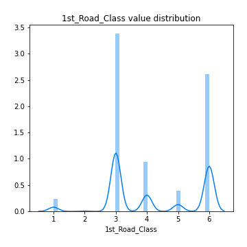
## Feature : 1st_Road_Number
- **Feature type** : discrete
- **Missing** : 0.0%
- **Unique** : 3433
- **Count** :88152.0
- **Mean** :867.1179440058081
- **Std** :2375.3861874733575
- **Min** :0.0
- **25%th Percentile** : 0.0
- **50%th Percentile** : 46.0
- **75%th Percentile** : 607.0
- **Max** :498878.0

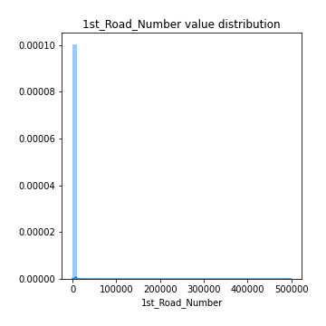
## Feature : 2nd_Road_Class
- **Feature type** : discrete
- **Missing** : 0.0%
- **Unique** : 7
- **Count** :88152.0
- **Mean** :2.6271099918322895
- **Std** :3.2091323071230877
- **Min** :-1.0
- **25%th Percentile** : -1.0
- **50%th Percentile** : 3.0
- **75%th Percentile** : 6.0
- **Max** :6.0

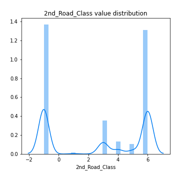
## Feature : 2nd_Road_Number
- **Feature type** : discrete
- **Missing** : 0.0%
- **Unique** : 2858
- **Count** :88152.0
- **Mean** :307.53693620110715
- **Std** :1162.1222738078284
- **Min** :-1.0
- **25%th Percentile** : 0.0
- **50%th Percentile** : 0.0
- **75%th Percentile** : 0.0
- **Max** :9899.0

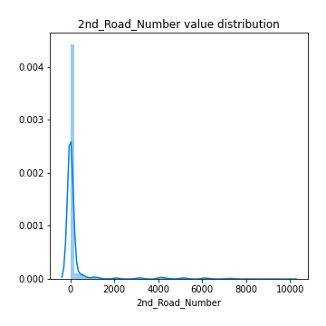
## Feature : Accident_Severity
- **Feature type** : discrete
- **Missing** : 0.0%
- **Unique** : 3
- **Count** :88152.0
- **Mean** :2.7726767401760597
- **Std** :0.45144835791177573
- **Min** :1.0
- **25%th Percentile** : 3.0
- **50%th Percentile** : 3.0
- **75%th Percentile** : 3.0
- **Max** :3.0

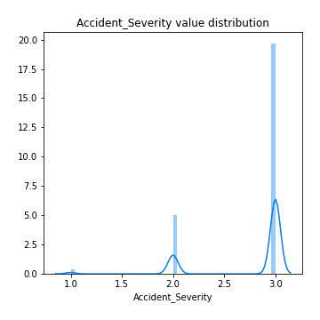
## Feature : Carriageway_Hazards
- **Feature type** : discrete
- **Missing** : 0.0%
- **Unique** : 7
- **Count** :88152.0
- **Mean** :0.04420773209910155
- **Std** :0.5277381821389858
- **Min** :-1.0
- **25%th Percentile** : 0.0
- **50%th Percentile** : 0.0
- **75%th Percentile** : 0.0
- **Max** :7.0

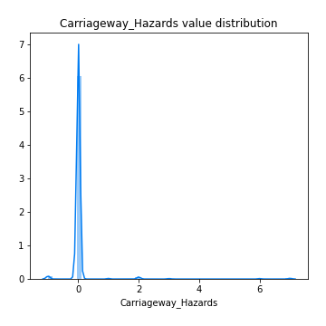
## Feature : Day_of_Week
- **Feature type** : discrete
- **Missing** : 0.0%
- **Unique** : 7
- **Count** :88152.0
- **Mean** :4.115799981849532
- **Std** :1.9172981490422671
- **Min** :1.0
- **25%th Percentile** : 2.0
- **50%th Percentile** : 4.0
- **75%th Percentile** : 6.0
- **Max** :7.0

## Feature : Did_Police_Officer_Attend_Scene_of_Accident
- **Feature type** : discrete
- **Missing** : 0.0%
- **Unique** : 3
- **Count** :88152.0
- **Mean** :1.3917551501951175
- **Std** :0.63778474448972
- **Min** :1.0
- **25%th Percentile** : 1.0
- **50%th Percentile** : 1.0
- **75%th Percentile** : 2.0
- **Max** :3.0

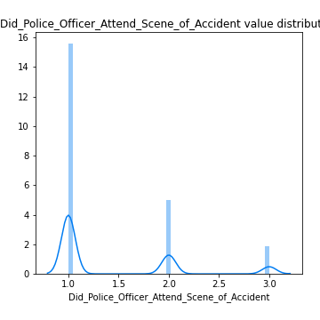
## Feature : Junction_Control
- **Feature type** : discrete
- **Missing** : 0.0%
- **Unique** : 6
- **Count** :88152.0
- **Mean** :1.5397722116344497
- **Std** :2.3514975836307017
- **Min** :-1.0
- **25%th Percentile** : -1.0
- **50%th Percentile** : 2.0
- **75%th Percentile** : 4.0
- **Max** :4.0

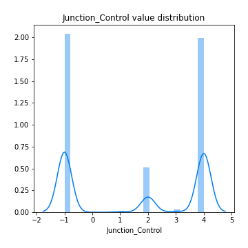
## Feature : Junction_Detail
- **Feature type** : discrete
- **Missing** : 0.0%
- **Unique** : 10
- **Count** :88152.0
- **Mean** :2.3018536164806243
- **Std** :2.6827694985345936
- **Min** :-1.0
- **25%th Percentile** : 0.0
- **50%th Percentile** : 1.0
- **75%th Percentile** : 3.0
- **Max** :9.0

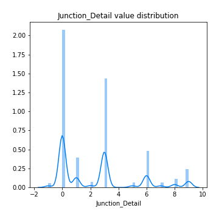
## Feature : Latitude
- **Feature type** : continous
- **Missing** : 0.0%
- **Unique** : 85838
- **Count** :88152.0
- **Mean** :52.39606359821105
- **Std** :1.3594267592443867
- **Min** :49.984153
- **25%th Percentile** : 51.465786
- **50%th Percentile** : 51.8511485
- **75%th Percentile** : 53.35653175
- **Max** :60.388637

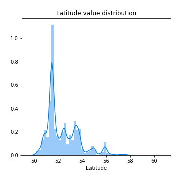
## Feature : Light_Conditions
- **Feature type** : discrete
- **Missing** : 0.0%
- **Unique** : 6
- **Count** :88152.0
- **Mean** :2.0486886287321897
- **Std** :1.731933004503324
- **Min** :-1.0
- **25%th Percentile** : 1.0
- **50%th Percentile** : 1.0
- **75%th Percentile** : 4.0
- **Max** :7.0

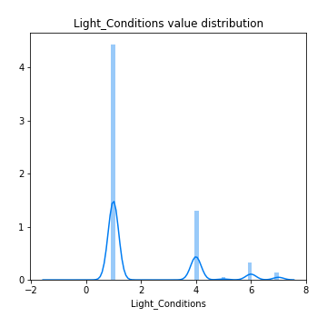
## Feature : Local_Authority_(District)
- **Feature type** : discrete
- **Missing** : 0.0%
- **Unique** : 380
- **Count** :88152.0
- **Mean** :326.1950381159815
- **Std** :256.4633777821985
- **Min** :1.0
- **25%th Percentile** : 84.0
- **50%th Percentile** : 305.0
- **75%th Percentile** : 514.0
- **Max** :941.0

.png)
## Feature : Location_Easting_OSGR
- **Feature type** : continous
- **Missing** : 0.0%
- **Unique** : 73704
- **Count** :88152.0
- **Mean** :452377.6637682639
- **Std** :94968.13403322542
- **Min** :75706.0
- **25%th Percentile** : 387997.5
- **50%th Percentile** : 459293.0
- **75%th Percentile** : 529376.5
- **Max** :655244.0

## Feature : Location_Northing_OSGR
- **Feature type** : continous
- **Missing** : 0.0%
- **Unique** : 73920
- **Count** :88152.0
- **Mean** :278754.9984969144
- **Std** :150923.61374777646
- **Min** :14270.0
- **25%th Percentile** : 175507.0
- **50%th Percentile** : 218376.0
- **75%th Percentile** : 384745.25
- **Max** :1167366.0

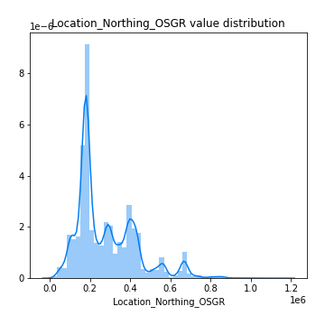
## Feature : Longitude
- **Feature type** : continous
- **Missing** : 0.0%
- **Unique** : 86689
- **Count** :88152.0
- **Mean** :-1.2499013498956348
- **Std** :1.3914065552646244
- **Min** :-7.394615
- **25%th Percentile** : -2.18104925
- **50%th Percentile** : -1.124322
- **75%th Percentile** : -0.13544375
- **Max** :1.757476

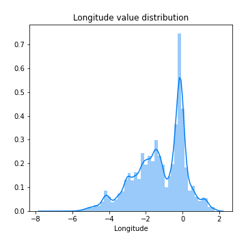
## Feature : Number_of_Casualties
- **Feature type** : discrete
- **Missing** : 0.0%
- **Unique** : 18
- **Count** :88152.0
- **Mean** :1.3019897449859335
- **Std** :0.758907438235884
- **Min** :1.0
- **25%th Percentile** : 1.0
- **50%th Percentile** : 1.0
- **75%th Percentile** : 1.0
- **Max** :52.0

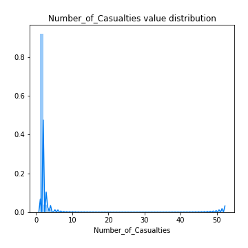
## Feature : Number_of_Vehicles
- **Feature type** : discrete
- **Missing** : 0.0%
- **Unique** : 16
- **Count** :88152.0
- **Mean** :1.8411493783464925
- **Std** :0.7113384342482653
- **Min** :1.0
- **25%th Percentile** : 1.0
- **50%th Percentile** : 2.0
- **75%th Percentile** : 2.0
- **Max** :17.0

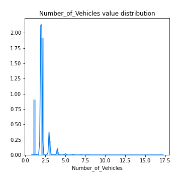
## Feature : Pedestrian_Crossing-Human_Control
- **Feature type** : discrete
- **Missing** : 0.0%
- **Unique** : 4
- **Count** :88152.0
- **Mean** :-0.005808149559851167
- **Std** :0.27857812181933045
- **Min** :-1.0
- **25%th Percentile** : 0.0
- **50%th Percentile** : 0.0
- **75%th Percentile** : 0.0
- **Max** :2.0

## Feature : Pedestrian_Crossing-Physical_Facilities
- **Feature type** : discrete
- **Missing** : 0.0%
- **Unique** : 7
- **Count** :88152.0
- **Mean** :0.866662129049823
- **Std** :2.0014082989258672
- **Min** :-1.0
- **25%th Percentile** : 0.0
- **50%th Percentile** : 0.0
- **75%th Percentile** : 0.0
- **Max** :8.0

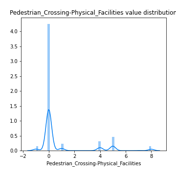
## Feature : Police_Force
- **Feature type** : discrete
- **Missing** : 0.0%
- **Unique** : 51
- **Count** :88152.0
- **Mean** :28.184159179598876
- **Std** :24.620368465189824
- **Min** :1.0
- **25%th Percentile** : 5.0
- **50%th Percentile** : 23.0
- **75%th Percentile** : 45.0
- **Max** :98.0

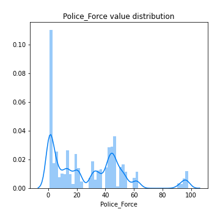
## Feature : Road_Surface_Conditions
- **Feature type** : discrete
- **Missing** : 0.0%
- **Unique** : 6
- **Count** :88152.0
- **Mean** :1.2922679008984481
- **Std** :0.5989369584156886
- **Min** :-1.0
- **25%th Percentile** : 1.0
- **50%th Percentile** : 1.0
- **75%th Percentile** : 2.0
- **Max** :5.0

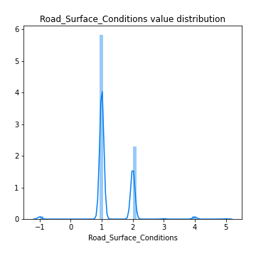
## Feature : Road_Type
- **Feature type** : discrete
- **Missing** : 0.0%
- **Unique** : 6
- **Count** :88152.0
- **Mean** :5.214720029040747
- **Std** :1.677852678206319
- **Min** :1.0
- **25%th Percentile** : 6.0
- **50%th Percentile** : 6.0
- **75%th Percentile** : 6.0
- **Max** :9.0

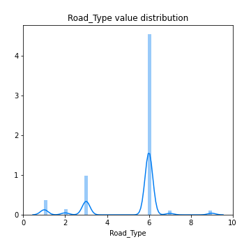
## Feature : Special_Conditions_at_Site
- **Feature type** : discrete
- **Missing** : 0.0%
- **Unique** : 9
- **Count** :88152.0
- **Mean** :0.07513159088846538
- **Std** :0.6614321763350661
- **Min** :-1.0
- **25%th Percentile** : 0.0
- **50%th Percentile** : 0.0
- **75%th Percentile** : 0.0
- **Max** :7.0

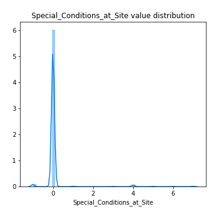
## Feature : Speed_limit
- **Feature type** : discrete
- **Missing** : 0.0%
- **Unique** : 7
- **Count** :88152.0
- **Mean** :36.7378845630275
- **Std** :14.030294874517056
- **Min** :-1.0
- **25%th Percentile** : 30.0
- **50%th Percentile** : 30.0
- **75%th Percentile** : 40.0
- **Max** :70.0

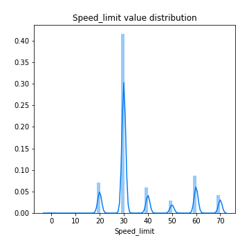
## Feature : Urban_or_Rural_Area
- **Feature type** : discrete
- **Missing** : 0.0%
- **Unique** : 3
- **Count** :88152.0
- **Mean** :1.3232371358562482
- **Std** :0.4681998913759426
- **Min** :1.0
- **25%th Percentile** : 1.0
- **50%th Percentile** : 1.0
- **75%th Percentile** : 2.0
- **Max** :3.0

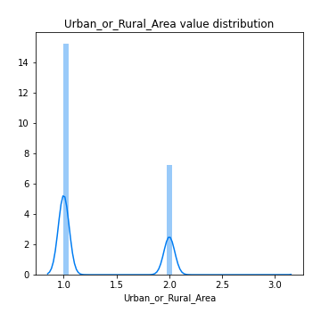
## Feature : Weather_Conditions
- **Feature type** : discrete
- **Missing** : 0.0%
- **Unique** : 9
- **Count** :88152.0
- **Mean** :1.6560146111262366
- **Std** :1.8145908858367972
- **Min** :1.0
- **25%th Percentile** : 1.0
- **50%th Percentile** : 1.0
- **75%th Percentile** : 1.0
- **Max** :9.0

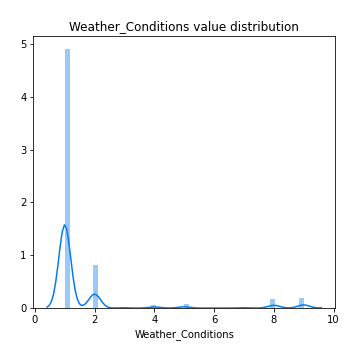

[<< Go back](../README.md)
