# Exploratory Data Analysis

[<< Go back](../README.md)
## Feature : target
- **Feature type** : discrete
- **Missing** : 0.0%
- **Unique** : 3
- **Count** :89408.0
- **Mean** :1.3977160880458124
- **Std** :0.6459276410978135
- **Min** :1.0
- **25%th Percentile** : 1.0
- **50%th Percentile** : 1.0
- **75%th Percentile** : 2.0
- **Max** :3.0

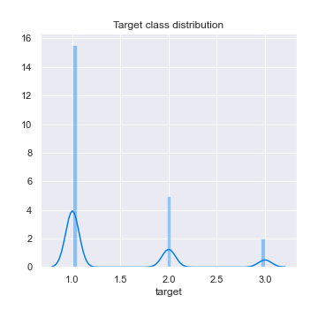
## Feature : Accident_Severity
- **Feature type** : discrete
- **Missing** : 0.0%
- **Unique** : 3
- **Count** :89408.0
- **Mean** :2.778028811739442
- **Std** :0.44708052003686516
- **Min** :1.0
- **25%th Percentile** : 3.0
- **50%th Percentile** : 3.0
- **75%th Percentile** : 3.0
- **Max** :3.0

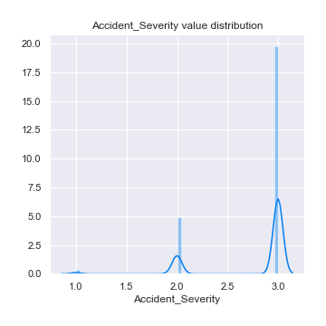
## Feature : Number_of_Vehicles
- **Feature type** : discrete
- **Missing** : 0.0%
- **Unique** : 15
- **Count** :89408.0
- **Mean** :1.844119094488189
- **Std** :0.7036579232231169
- **Min** :1.0
- **25%th Percentile** : 1.0
- **50%th Percentile** : 2.0
- **75%th Percentile** : 2.0
- **Max** :17.0

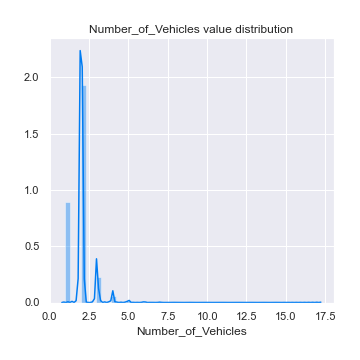
## Feature : Number_of_Casualties
- **Feature type** : discrete
- **Missing** : 0.0%
- **Unique** : 18
- **Count** :89408.0
- **Mean** :1.301684413027917
- **Std** :0.7569488346838188
- **Min** :1.0
- **25%th Percentile** : 1.0
- **50%th Percentile** : 1.0
- **75%th Percentile** : 1.0
- **Max** :52.0

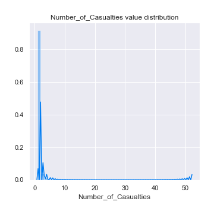
## Feature : Day_of_Week
- **Feature type** : discrete
- **Missing** : 0.0%
- **Unique** : 7
- **Count** :89408.0
- **Mean** :4.107920991410165
- **Std** :1.9210590767242262
- **Min** :1.0
- **25%th Percentile** : 2.0
- **50%th Percentile** : 4.0
- **75%th Percentile** : 6.0
- **Max** :7.0

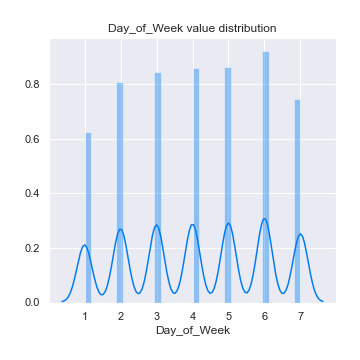
## Feature : 1st_Road_Class
- **Feature type** : discrete
- **Missing** : 0.0%
- **Unique** : 6
- **Count** :89408.0
- **Mean** :4.197543843951324
- **Std** :1.461275045254645
- **Min** :1.0
- **25%th Percentile** : 3.0
- **50%th Percentile** : 4.0
- **75%th Percentile** : 6.0
- **Max** :6.0

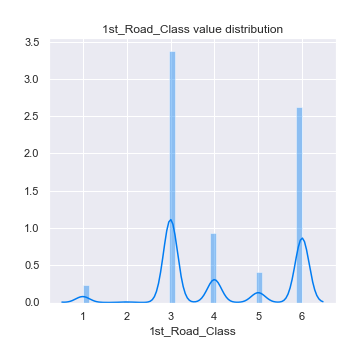
## Feature : 1st_Road_Number
- **Feature type** : discrete
- **Missing** : 0.0%
- **Unique** : 3141
- **Count** :89408.0
- **Mean** :869.6513846635647
- **Std** :2360.0611814614076
- **Min** :0.0
- **25%th Percentile** : 0.0
- **50%th Percentile** : 41.0
- **75%th Percentile** : 583.0
- **Max** :498878.0

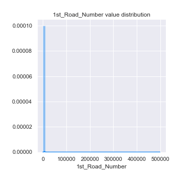
## Feature : Road_Type
- **Feature type** : discrete
- **Missing** : 0.0%
- **Unique** : 6
- **Count** :89408.0
- **Mean** :5.207934413027917
- **Std** :1.6833154687202774
- **Min** :1.0
- **25%th Percentile** : 6.0
- **50%th Percentile** : 6.0
- **75%th Percentile** : 6.0
- **Max** :9.0

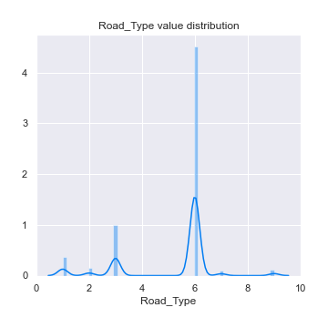
## Feature : 2nd_Road_Number
- **Feature type** : discrete
- **Missing** : 0.0%
- **Unique** : 2723
- **Count** :89408.0
- **Mean** :308.7635893879742
- **Std** :1156.6081621677681
- **Min** :-1.0
- **25%th Percentile** : 0.0
- **50%th Percentile** : 0.0
- **75%th Percentile** : 0.0
- **Max** :9899.0

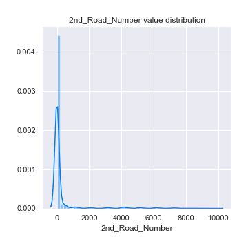
## Feature : Pedestrian_Crossing-Human_Control
- **Feature type** : discrete
- **Missing** : 0.0%
- **Unique** : 4
- **Count** :89408.0
- **Mean** :-0.00744899785254116
- **Std** :0.27786535501634996
- **Min** :-1.0
- **25%th Percentile** : 0.0
- **50%th Percentile** : 0.0
- **75%th Percentile** : 0.0
- **Max** :2.0

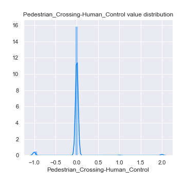
## Feature : Pedestrian_Crossing-Physical_Facilities
- **Feature type** : discrete
- **Missing** : 0.0%
- **Unique** : 7
- **Count** :89408.0
- **Mean** :0.86060531496063
- **Std** :1.997777809726868
- **Min** :-1.0
- **25%th Percentile** : 0.0
- **50%th Percentile** : 0.0
- **75%th Percentile** : 0.0
- **Max** :8.0

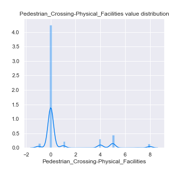
## Feature : Light_Conditions
- **Feature type** : discrete
- **Missing** : 0.0%
- **Unique** : 5
- **Count** :89408.0
- **Mean** :2.047769774516822
- **Std** :1.7296209842405421
- **Min** :1.0
- **25%th Percentile** : 1.0
- **50%th Percentile** : 1.0
- **75%th Percentile** : 4.0
- **Max** :7.0

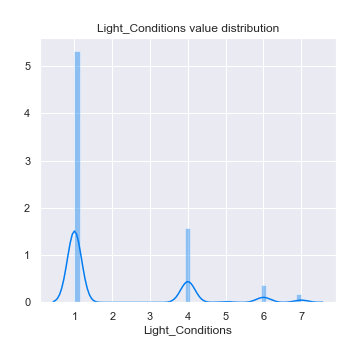
## Feature : Weather_Conditions
- **Feature type** : discrete
- **Missing** : 0.0%
- **Unique** : 9
- **Count** :89408.0
- **Mean** :1.6581625805297064
- **Std** :1.8226580645491572
- **Min** :1.0
- **25%th Percentile** : 1.0
- **50%th Percentile** : 1.0
- **75%th Percentile** : 1.0
- **Max** :9.0

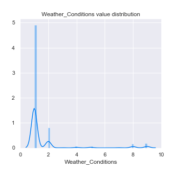
## Feature : Road_Surface_Conditions
- **Feature type** : discrete
- **Missing** : 0.0%
- **Unique** : 6
- **Count** :89408.0
- **Mean** :1.2857686113099498
- **Std** :0.592969159291576
- **Min** :-1.0
- **25%th Percentile** : 1.0
- **50%th Percentile** : 1.0
- **75%th Percentile** : 2.0
- **Max** :5.0

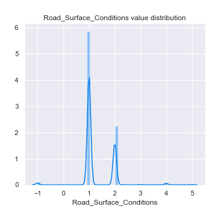
## Feature : Special_Conditions_at_Site
- **Feature type** : discrete
- **Missing** : 0.0%
- **Unique** : 9
- **Count** :89408.0
- **Mean** :0.07475841088045812
- **Std** :0.6645314539775546
- **Min** :-1.0
- **25%th Percentile** : 0.0
- **50%th Percentile** : 0.0
- **75%th Percentile** : 0.0
- **Max** :7.0

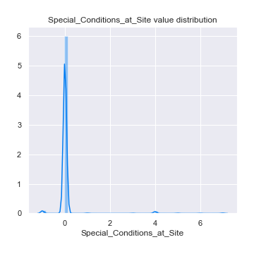
## Feature : Carriageway_Hazards
- **Feature type** : discrete
- **Missing** : 0.0%
- **Unique** : 7
- **Count** :89408.0
- **Mean** :0.043441302791696494
- **Std** :0.525005002300553
- **Min** :-1.0
- **25%th Percentile** : 0.0
- **50%th Percentile** : 0.0
- **75%th Percentile** : 0.0
- **Max** :7.0

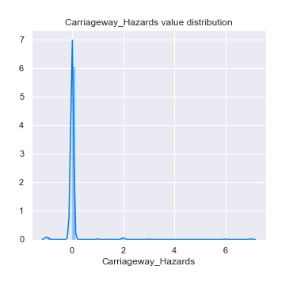

[<< Go back](../README.md)
