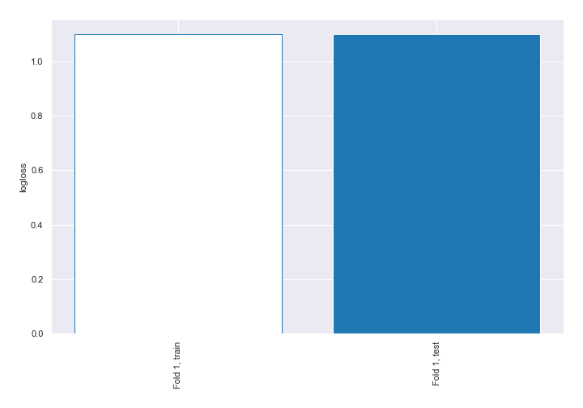

# Summary of 1_Baseline

[<< Go back](../README.md)

## Baseline Classifier (Baseline)
- **n_jobs**: -1
- **num_class**: 3
- **explain_level**: 2

## Validation
 - **validation_type**: split
 - **train_ratio**: 0.75
 - **shuffle**: True
 - **stratify**: True

## Optimized metric
logloss

## Training time

1.7 seconds

### Metric details
|           |            1 |     2 |     3 |   accuracy |    macro avg |   weighted avg |   logloss |
|:----------|-------------:|------:|------:|-----------:|-------------:|---------------:|----------:|
| precision |     0.333333 |     0 |     0 |   0.333333 |     0.111111 |       0.111111 |   1.09861 |
| recall    |     1        |     0 |     0 |   0.333333 |     0.333333 |       0.333333 |   1.09861 |
| f1-score  |     0.5      |     0 |     0 |   0.333333 |     0.166667 |       0.166667 |   1.09861 |
| support   | 15448        | 15448 | 15448 |   0.333333 | 46344        |   46344        |   1.09861 |

## Confusion matrix
|              |   Predicted as 1 |   Predicted as 2 |   Predicted as 3 |
|:-------------|-----------------:|-----------------:|-----------------:|
| Labeled as 1 |            15448 |                0 |                0 |
| Labeled as 2 |            15448 |                0 |                0 |
| Labeled as 3 |            15448 |                0 |                0 |

## Learning curves

[<< Go back](../README.md)
