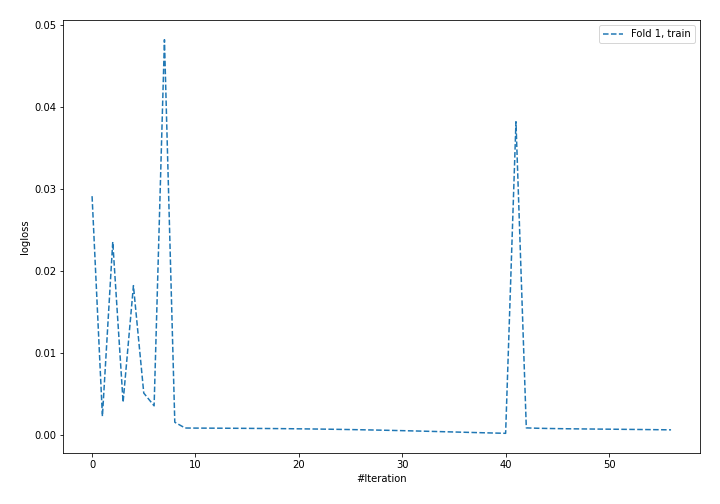
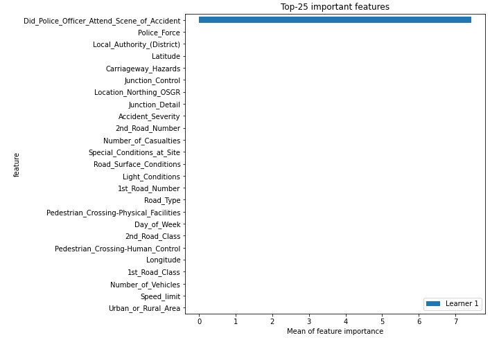

# Summary of 4_Default_NeuralNetwork

[<< Go back](../README.md)

## Neural Network
- **n_jobs**: -1
- **dense_1_size**: 32
- **dense_2_size**: 16
- **learning_rate**: 0.05
- **num_class**: 3
- **explain_level**: 2

## Validation
 - **validation_type**: split
 - **train_ratio**: 0.75
 - **shuffle**: True
 - **stratify**: True

## Optimized metric
logloss

## Training time

16.4 seconds

### Metric details
|           |     1 |           2 |           3 |   accuracy |    macro avg |   weighted avg |    logloss |
|:----------|------:|------------:|------------:|-----------:|-------------:|---------------:|-----------:|
| precision |     1 |    0.999798 |    1        |   0.999955 |     0.999933 |       0.999955 | 0.00041165 |
| recall    |     1 |    1        |    0.999467 |   0.999955 |     0.999822 |       0.999955 | 0.00041165 |
| f1-score  |     1 |    0.999899 |    0.999733 |   0.999955 |     0.999877 |       0.999955 | 0.00041165 |
| support   | 15221 | 4942        | 1875        |   0.999955 | 22038        |   22038        | 0.00041165 |

## Confusion matrix
|              |   Predicted as 1 |   Predicted as 2 |   Predicted as 3 |
|:-------------|-----------------:|-----------------:|-----------------:|
| Labeled as 1 |            15221 |                0 |                0 |
| Labeled as 2 |                0 |             4942 |                0 |
| Labeled as 3 |                0 |                1 |             1874 |

## Learning curves

## Permutation-based Importance

[<< Go back](../README.md)
