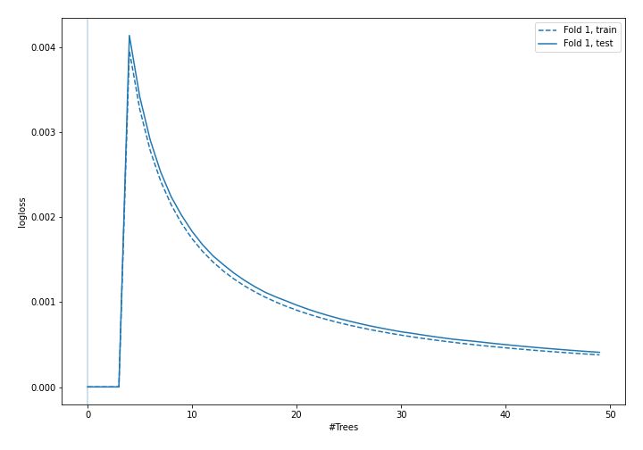
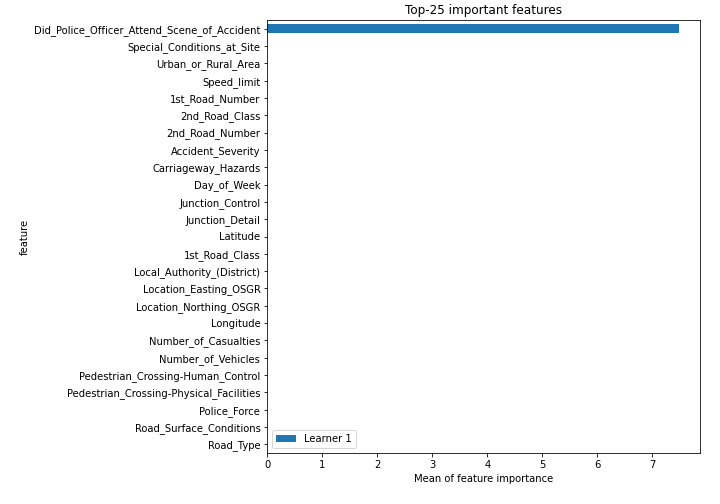
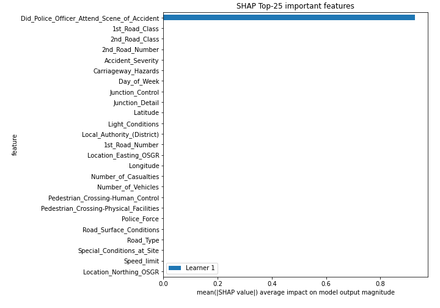
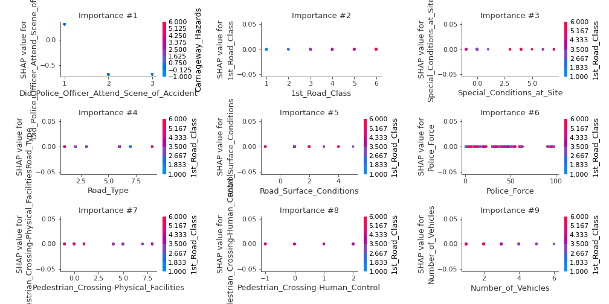
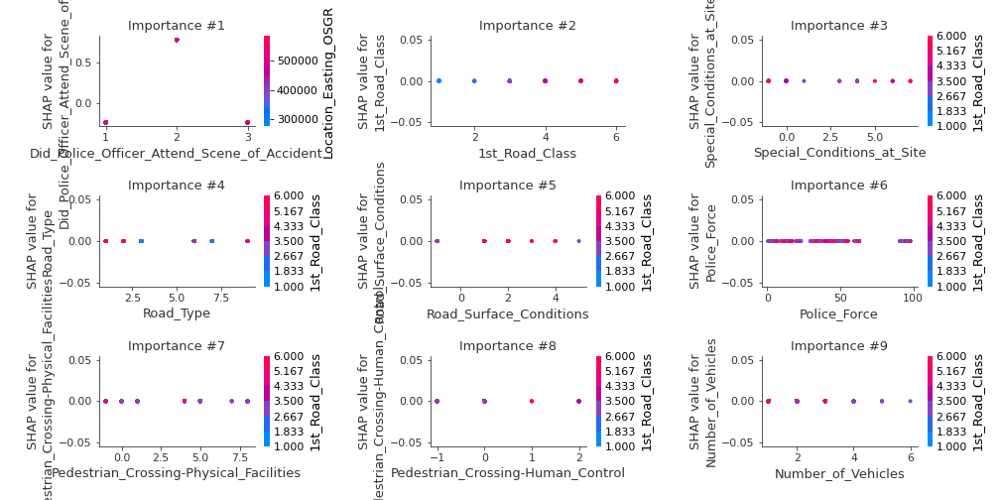
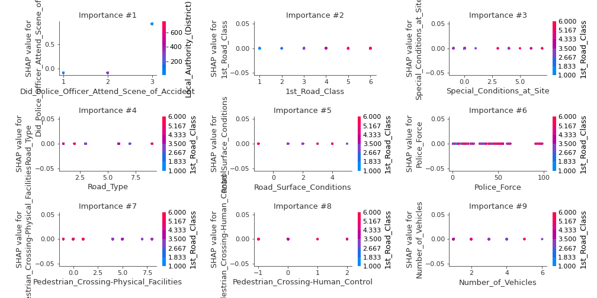
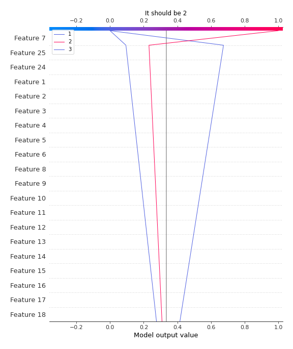
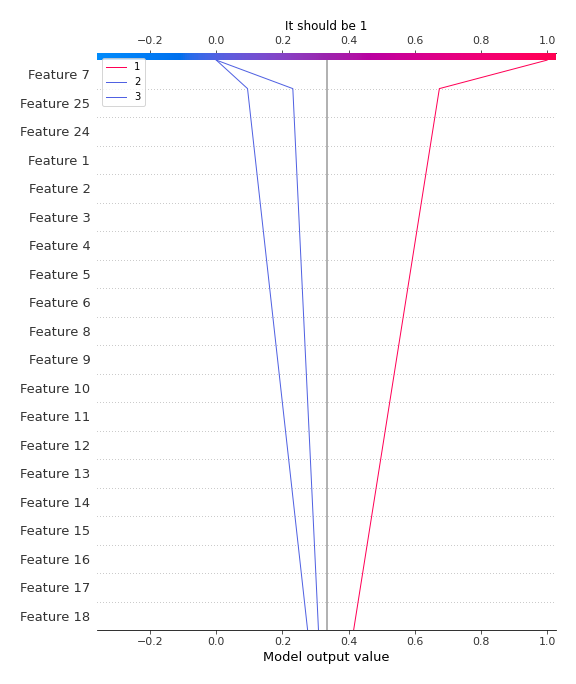

# Summary of 5_Default_RandomForest

[<< Go back](../README.md)

## Random Forest
- **n_jobs**: -1
- **criterion**: gini
- **max_features**: 0.9
- **min_samples_split**: 30
- **max_depth**: 4
- **eval_metric_name**: logloss
- **num_class**: 3
- **explain_level**: 2

## Validation
 - **validation_type**: split
 - **train_ratio**: 0.75
 - **shuffle**: True
 - **stratify**: True

## Optimized metric
logloss

## Training time

16.1 seconds

### Metric details
|           |     1 |    2 |    3 |   accuracy |   macro avg |   weighted avg |   logloss |
|:----------|------:|-----:|-----:|-----------:|------------:|---------------:|----------:|
| precision |     1 |    1 |    1 |          1 |           1 |              1 |     2e-06 |
| recall    |     1 |    1 |    1 |          1 |           1 |              1 |     2e-06 |
| f1-score  |     1 |    1 |    1 |          1 |           1 |              1 |     2e-06 |
| support   | 15221 | 4942 | 1875 |          1 |       22038 |          22038 |     2e-06 |

## Confusion matrix
|              |   Predicted as 1 |   Predicted as 2 |   Predicted as 3 |
|:-------------|-----------------:|-----------------:|-----------------:|
| Labeled as 1 |            15221 |                0 |                0 |
| Labeled as 2 |                0 |             4942 |                0 |
| Labeled as 3 |                0 |                0 |             1875 |

## Learning curves

## Permutation-based Importance

## SHAP Importance

## SHAP Dependence plots

### Dependence 1 (Fold 1)

### Dependence 2 (Fold 1)

### Dependence 3 (Fold 1)

## SHAP Decision plots

### Worst decisions for selected sample 1 (Fold 1)

### Worst decisions for selected sample 2 (Fold 1)

### Worst decisions for selected sample 3 (Fold 1)

### Worst decisions for selected sample 4 (Fold 1)

### Best decisions for selected sample 1 (Fold 1)

### Best decisions for selected sample 2 (Fold 1)

### Best decisions for selected sample 3 (Fold 1)

### Best decisions for selected sample 4 (Fold 1)

[<< Go back](../README.md)
