# Exploratory Data Analysis

[<< Go back](../README.md)
## Feature : target
- **Feature type** : discrete
- **Missing** : 0.0%
- **Unique** : 3
- **Count** :88152.0
- **Mean** :1.3944210000907524
- **Std** :0.6395454216361586
- **Min** :1.0
- **25%th Percentile** : 1.0
- **50%th Percentile** : 1.0
- **75%th Percentile** : 2.0
- **Max** :3.0

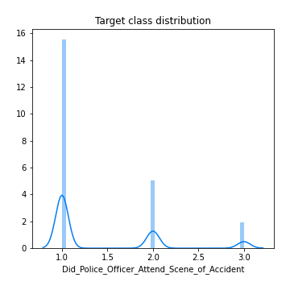
## Feature : 1st_Road_Class
- **Feature type** : discrete
- **Missing** : 0.0%
- **Unique** : 6
- **Count** :88152.0
- **Mean** :4.194323441328614
- **Std** :1.462021002107263
- **Min** :1.0
- **25%th Percentile** : 3.0
- **50%th Percentile** : 4.0
- **75%th Percentile** : 6.0
- **Max** :6.0

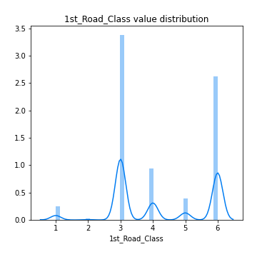
## Feature : 1st_Road_Number
- **Feature type** : discrete
- **Missing** : 0.0%
- **Unique** : 3433
- **Count** :88152.0
- **Mean** :861.0761071785098
- **Std** :1682.7959457502525
- **Min** :0.0
- **25%th Percentile** : 0.0
- **50%th Percentile** : 45.0
- **75%th Percentile** : 606.0
- **Max** :9786.0

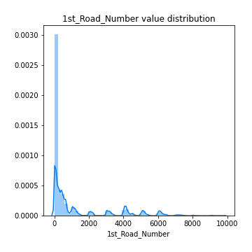
## Feature : 2nd_Road_Class
- **Feature type** : discrete
- **Missing** : 0.0%
- **Unique** : 7
- **Count** :88152.0
- **Mean** :2.619634268082403
- **Std** :3.2103421055437344
- **Min** :-1.0
- **25%th Percentile** : -1.0
- **50%th Percentile** : 3.0
- **75%th Percentile** : 6.0
- **Max** :6.0

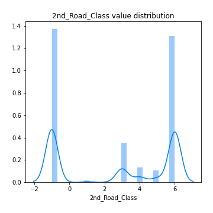
## Feature : 2nd_Road_Number
- **Feature type** : discrete
- **Missing** : 0.0%
- **Unique** : 2831
- **Count** :88152.0
- **Mean** :307.9085103003902
- **Std** :1164.054079198786
- **Min** :-1.0
- **25%th Percentile** : 0.0
- **50%th Percentile** : 0.0
- **75%th Percentile** : 0.0
- **Max** :9899.0

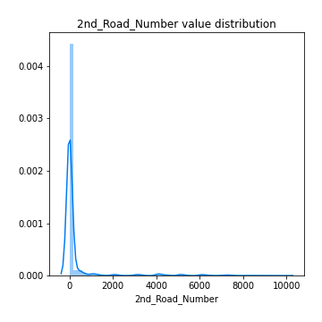
## Feature : Accident_Severity
- **Feature type** : discrete
- **Missing** : 0.0%
- **Unique** : 3
- **Count** :88152.0
- **Mean** :2.7731872220709683
- **Std** :0.45116477186492443
- **Min** :1.0
- **25%th Percentile** : 3.0
- **50%th Percentile** : 3.0
- **75%th Percentile** : 3.0
- **Max** :3.0

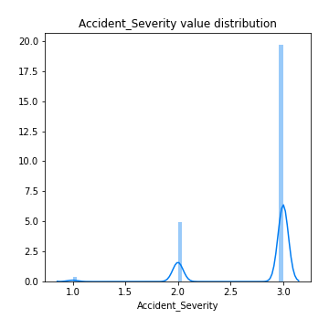
## Feature : Carriageway_Hazards
- **Feature type** : discrete
- **Missing** : 0.0%
- **Unique** : 7
- **Count** :88152.0
- **Mean** :0.04336827298302931
- **Std** :0.5249414793716877
- **Min** :-1.0
- **25%th Percentile** : 0.0
- **50%th Percentile** : 0.0
- **75%th Percentile** : 0.0
- **Max** :7.0

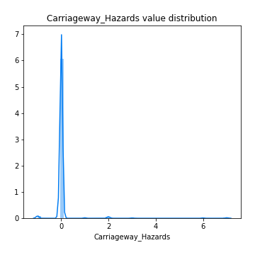
## Feature : Day_of_Week
- **Feature type** : discrete
- **Missing** : 0.0%
- **Unique** : 7
- **Count** :88152.0
- **Mean** :4.1125555858063345
- **Std** :1.9199686173878616
- **Min** :1.0
- **25%th Percentile** : 2.0
- **50%th Percentile** : 4.0
- **75%th Percentile** : 6.0
- **Max** :7.0

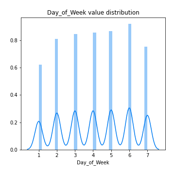
## Feature : Did_Police_Officer_Attend_Scene_of_Accident
- **Feature type** : discrete
- **Missing** : 0.0%
- **Unique** : 3
- **Count** :88152.0
- **Mean** :1.3944210000907524
- **Std** :0.6395454216361586
- **Min** :1.0
- **25%th Percentile** : 1.0
- **50%th Percentile** : 1.0
- **75%th Percentile** : 2.0
- **Max** :3.0

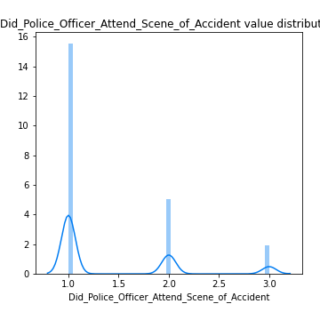
## Feature : Junction_Control
- **Feature type** : discrete
- **Missing** : 0.0%
- **Unique** : 6
- **Count** :88152.0
- **Mean** :1.5347014248116888
- **Std** :2.3532223130260133
- **Min** :-1.0
- **25%th Percentile** : -1.0
- **50%th Percentile** : 2.0
- **75%th Percentile** : 4.0
- **Max** :4.0

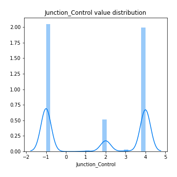
## Feature : Junction_Detail
- **Feature type** : discrete
- **Missing** : 0.0%
- **Unique** : 10
- **Count** :88152.0
- **Mean** :2.3020124330701517
- **Std** :2.6866433034257997
- **Min** :-1.0
- **25%th Percentile** : 0.0
- **50%th Percentile** : 1.0
- **75%th Percentile** : 3.0
- **Max** :9.0

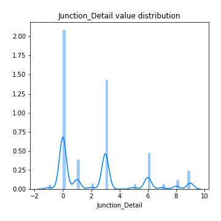
## Feature : Latitude
- **Feature type** : continous
- **Missing** : 0.0%
- **Unique** : 85910
- **Count** :88152.0
- **Mean** :52.396893577468475
- **Std** :1.3593294662896098
- **Min** :49.91776
- **25%th Percentile** : 51.466924750000004
- **50%th Percentile** : 51.8609235
- **75%th Percentile** : 53.35755075
- **Max** :60.388637

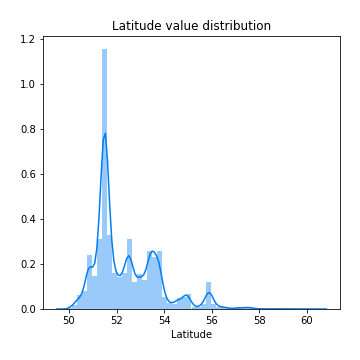
## Feature : Light_Conditions
- **Feature type** : discrete
- **Missing** : 0.0%
- **Unique** : 6
- **Count** :88152.0
- **Mean** :2.0485525002268807
- **Std** :1.732349426371061
- **Min** :-1.0
- **25%th Percentile** : 1.0
- **50%th Percentile** : 1.0
- **75%th Percentile** : 4.0
- **Max** :7.0

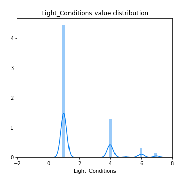
## Feature : Local_Authority_(District)
- **Feature type** : discrete
- **Missing** : 0.0%
- **Unique** : 380
- **Count** :88152.0
- **Mean** :326.5670206007805
- **Std** :256.3202638992114
- **Min** :1.0
- **25%th Percentile** : 84.0
- **50%th Percentile** : 305.0
- **75%th Percentile** : 513.0
- **Max** :941.0

.png)
## Feature : Location_Easting_OSGR
- **Feature type** : continous
- **Missing** : 0.0%
- **Unique** : 73772
- **Count** :88152.0
- **Mean** :452359.3588687721
- **Std** :95115.7354871169
- **Min** :64084.0
- **25%th Percentile** : 387837.25
- **50%th Percentile** : 459355.0
- **75%th Percentile** : 529329.25
- **Max** :655244.0

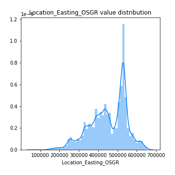
## Feature : Location_Northing_OSGR
- **Feature type** : continous
- **Missing** : 0.0%
- **Unique** : 73897
- **Count** :88152.0
- **Mean** :278850.20737476175
- **Std** :150917.2107985905
- **Min** :10814.0
- **25%th Percentile** : 175593.0
- **50%th Percentile** : 219591.0
- **75%th Percentile** : 384827.75
- **Max** :1167366.0

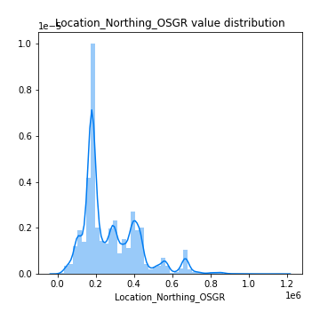
## Feature : Longitude
- **Feature type** : continous
- **Missing** : 0.0%
- **Unique** : 86707
- **Count** :88152.0
- **Mean** :-1.2500731529233595
- **Std** :1.3937652336681938
- **Min** :-7.525273
- **25%th Percentile** : -2.1831110000000002
- **50%th Percentile** : -1.1236915
- **75%th Percentile** : -0.13610275
- **Max** :1.757476

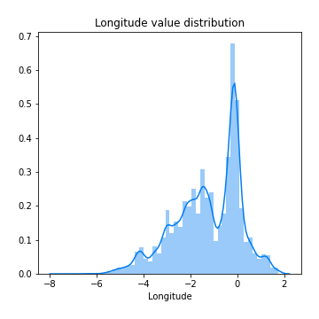
## Feature : Number_of_Casualties
- **Feature type** : discrete
- **Missing** : 0.0%
- **Unique** : 17
- **Count** :88152.0
- **Mean** :1.305041292313277
- **Std** :0.7632427543716971
- **Min** :1.0
- **25%th Percentile** : 1.0
- **50%th Percentile** : 1.0
- **75%th Percentile** : 1.0
- **Max** :52.0

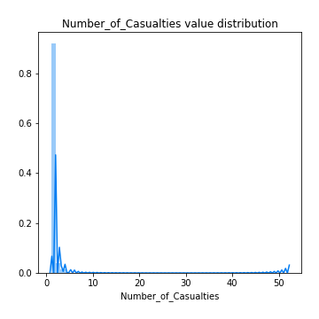
## Feature : Number_of_Vehicles
- **Feature type** : discrete
- **Missing** : 0.0%
- **Unique** : 15
- **Count** :88152.0
- **Mean** :1.840400671567293
- **Std** :0.708726056691462
- **Min** :1.0
- **25%th Percentile** : 1.0
- **50%th Percentile** : 2.0
- **75%th Percentile** : 2.0
- **Max** :17.0

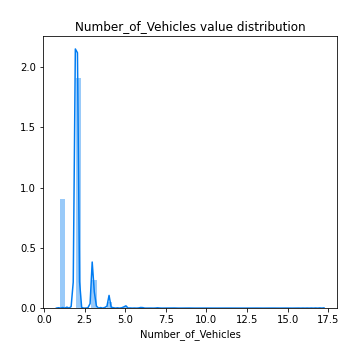
## Feature : Pedestrian_Crossing-Human_Control
- **Feature type** : discrete
- **Missing** : 0.0%
- **Unique** : 4
- **Count** :88152.0
- **Mean** :-0.006148470823123696
- **Std** :0.27832637454703785
- **Min** :-1.0
- **25%th Percentile** : 0.0
- **50%th Percentile** : 0.0
- **75%th Percentile** : 0.0
- **Max** :2.0

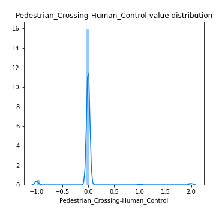
## Feature : Pedestrian_Crossing-Physical_Facilities
- **Feature type** : discrete
- **Missing** : 0.0%
- **Unique** : 7
- **Count** :88152.0
- **Mean** :0.8643933206280062
- **Std** :1.9986352780358227
- **Min** :-1.0
- **25%th Percentile** : 0.0
- **50%th Percentile** : 0.0
- **75%th Percentile** : 0.0
- **Max** :8.0

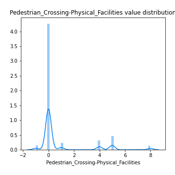
## Feature : Police_Force
- **Feature type** : discrete
- **Missing** : 0.0%
- **Unique** : 51
- **Count** :88152.0
- **Mean** :28.213631000998276
- **Std** :24.612211261192723
- **Min** :1.0
- **25%th Percentile** : 5.0
- **50%th Percentile** : 23.0
- **75%th Percentile** : 45.0
- **Max** :98.0

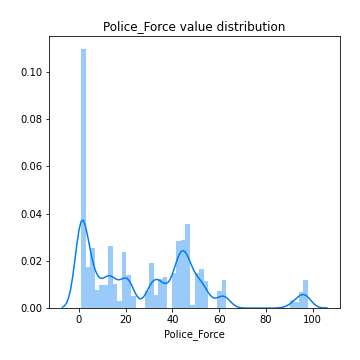
## Feature : Road_Surface_Conditions
- **Feature type** : discrete
- **Missing** : 0.0%
- **Unique** : 6
- **Count** :88152.0
- **Mean** :1.289817587802886
- **Std** :0.5977779133375297
- **Min** :-1.0
- **25%th Percentile** : 1.0
- **50%th Percentile** : 1.0
- **75%th Percentile** : 2.0
- **Max** :5.0

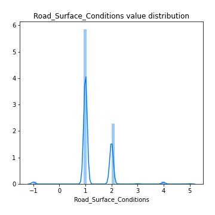
## Feature : Road_Type
- **Feature type** : discrete
- **Missing** : 0.0%
- **Unique** : 6
- **Count** :88152.0
- **Mean** :5.215820401125329
- **Std** :1.6747438645743484
- **Min** :1.0
- **25%th Percentile** : 6.0
- **50%th Percentile** : 6.0
- **75%th Percentile** : 6.0
- **Max** :9.0

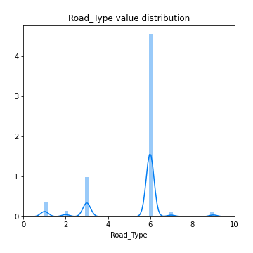
## Feature : Special_Conditions_at_Site
- **Feature type** : discrete
- **Missing** : 0.0%
- **Unique** : 9
- **Count** :88152.0
- **Mean** :0.07449632453035665
- **Std** :0.6642080521362728
- **Min** :-1.0
- **25%th Percentile** : 0.0
- **50%th Percentile** : 0.0
- **75%th Percentile** : 0.0
- **Max** :7.0

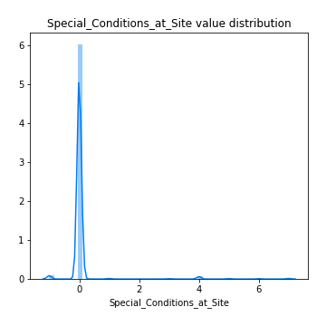
## Feature : Speed_limit
- **Feature type** : discrete
- **Missing** : 0.0%
- **Unique** : 7
- **Count** :88152.0
- **Mean** :36.75230284054815
- **Std** :14.046053917016554
- **Min** :-1.0
- **25%th Percentile** : 30.0
- **50%th Percentile** : 30.0
- **75%th Percentile** : 40.0
- **Max** :70.0

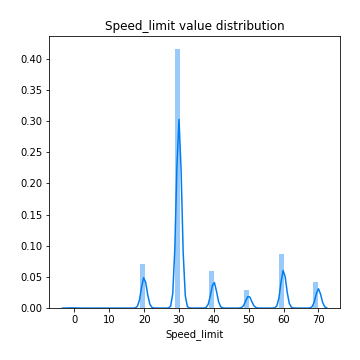
## Feature : Urban_or_Rural_Area
- **Feature type** : discrete
- **Missing** : 0.0%
- **Unique** : 3
- **Count** :88152.0
- **Mean** :1.3232598239404665
- **Std** :0.4682569117112603
- **Min** :1.0
- **25%th Percentile** : 1.0
- **50%th Percentile** : 1.0
- **75%th Percentile** : 2.0
- **Max** :3.0

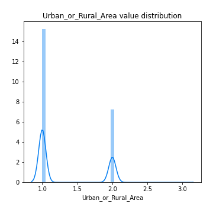

[<< Go back](../README.md)
