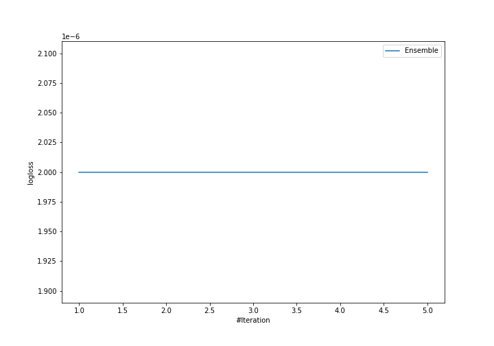

# Summary of Ensemble

[<< Go back](../README.md)

## Ensemble structure
| Model          |   Weight |
|:---------------|---------:|
| 2_DecisionTree |        1 |

### Metric details
|           |     1 |    2 |    3 |   accuracy |   macro avg |   weighted avg |   logloss |
|:----------|------:|-----:|-----:|-----------:|------------:|---------------:|----------:|
| precision |     1 |    1 |    1 |          1 |           1 |              1 |     2e-06 |
| recall    |     1 |    1 |    1 |          1 |           1 |              1 |     2e-06 |
| f1-score  |     1 |    1 |    1 |          1 |           1 |              1 |     2e-06 |
| support   | 15221 | 4942 | 1875 |          1 |       22038 |          22038 |     2e-06 |

## Confusion matrix
|              |   Predicted as 1 |   Predicted as 2 |   Predicted as 3 |
|:-------------|-----------------:|-----------------:|-----------------:|
| Labeled as 1 |            15221 |                0 |                0 |
| Labeled as 2 |                0 |             4942 |                0 |
| Labeled as 3 |                0 |                0 |             1875 |

## Learning curves

[<< Go back](../README.md)
