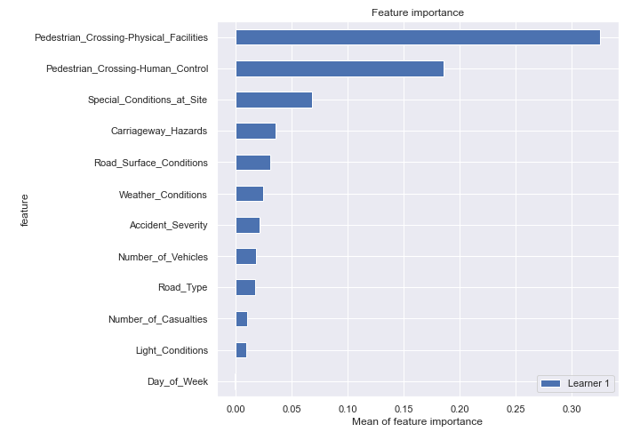

# Summary of 4_Default_NeuralNetwork

[<< Go back](../README.md)

## Neural Network
- **n_jobs**: -1
- **dense_1_size**: 32
- **dense_2_size**: 16
- **learning_rate**: 0.05
- **num_class**: 3
- **explain_level**: 2

## Validation
 - **validation_type**: split
 - **train_ratio**: 0.75
 - **shuffle**: True
 - **stratify**: True

## Optimized metric
logloss

## Training time

36.3 seconds

### Metric details
|           |            1 |            2 |           3 |   accuracy |    macro avg |   weighted avg |   logloss |
|:----------|-------------:|-------------:|------------:|-----------:|-------------:|---------------:|----------:|
| precision |     0.74091  |    0.575718  |    0.91573  |   0.743602 |     0.74412  |       0.720097 |  0.649007 |
| recall    |     0.984076 |    0.0896706 |    0.492447 |   0.743602 |     0.522064 |       0.743602 |  0.649007 |
| f1-score  |     0.845354 |    0.155172  |    0.640472 |   0.743602 |     0.546999 |       0.675293 |  0.649007 |
| support   | 15448        | 4918         | 1986        |   0.743602 | 22352        |   22352        |  0.649007 |

## Confusion matrix
|              |   Predicted as 1 |   Predicted as 2 |   Predicted as 3 |
|:-------------|-----------------:|-----------------:|-----------------:|
| Labeled as 1 |            15202 |              217 |               29 |
| Labeled as 2 |             4416 |              441 |               61 |
| Labeled as 3 |              900 |              108 |              978 |

## Learning curves

## Permutation-based Importance

[<< Go back](../README.md)
