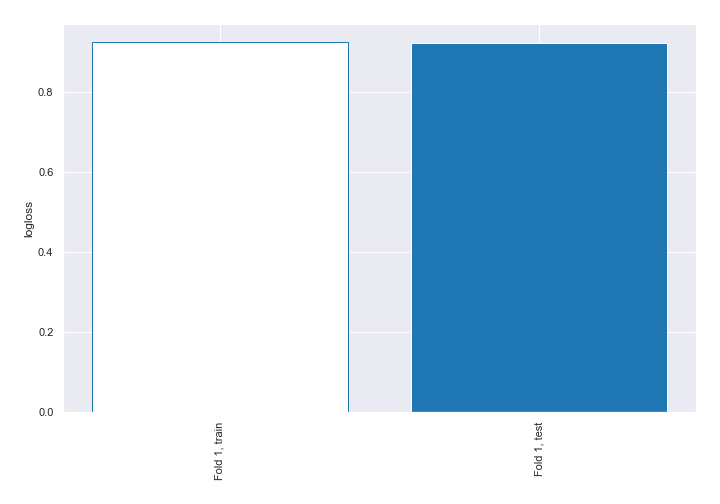
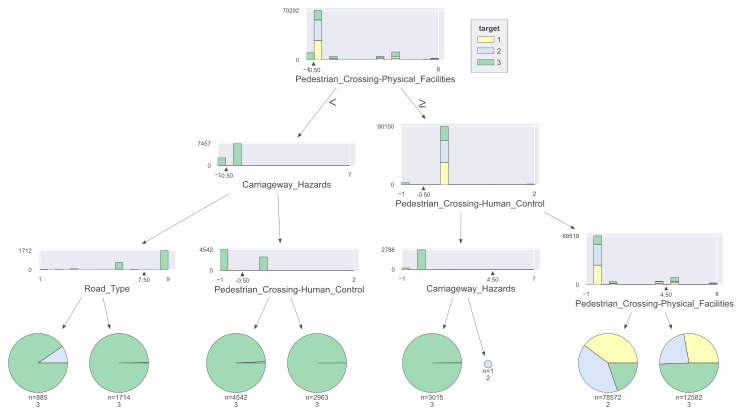
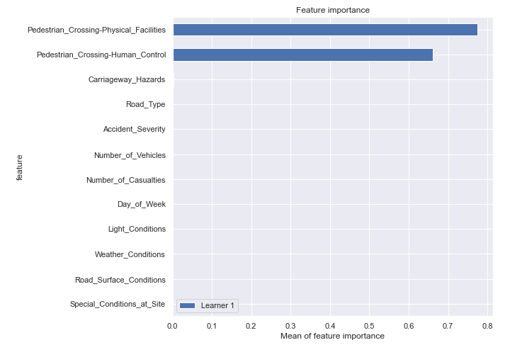
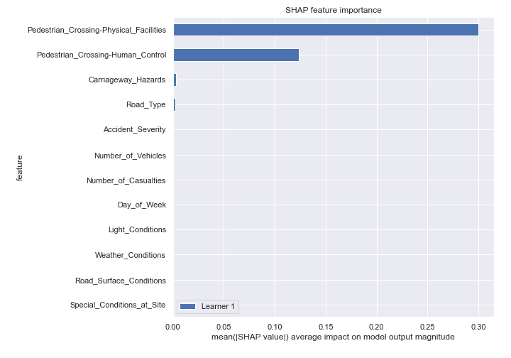
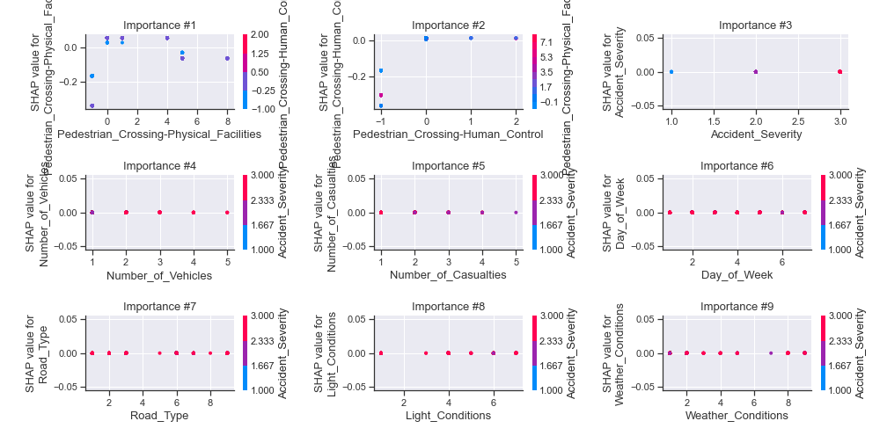
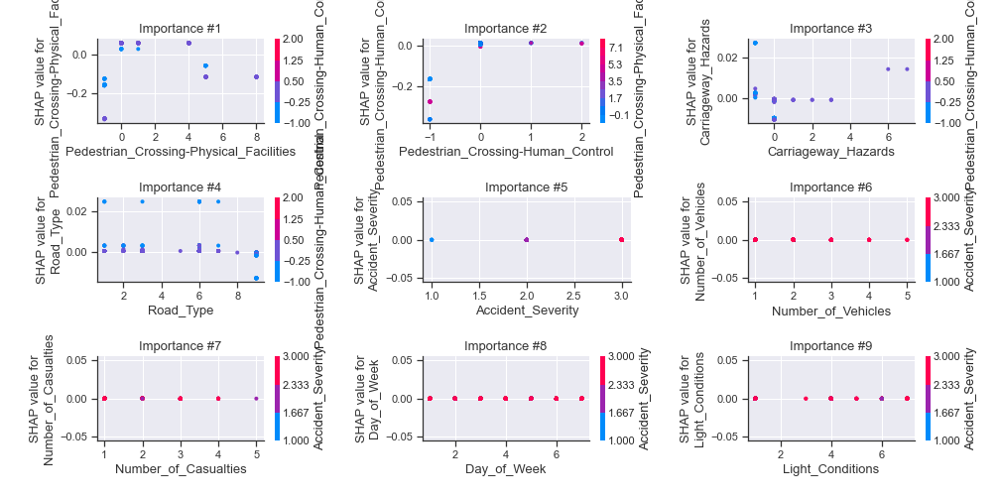
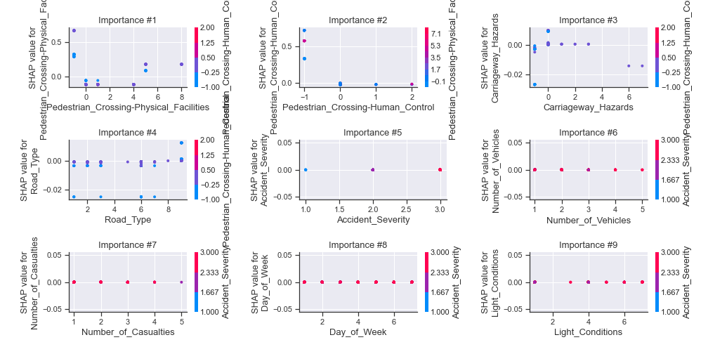
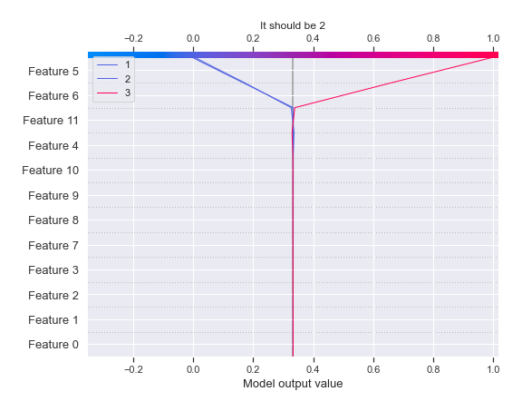
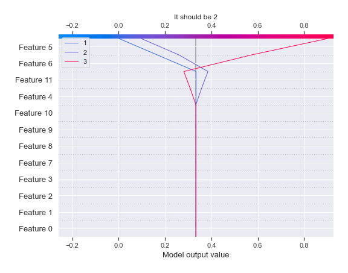
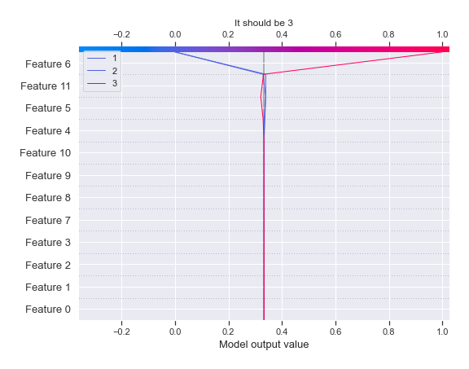

# Summary of 2_DecisionTree

[<< Go back](../README.md)

## Decision Tree
- **n_jobs**: -1
- **criterion**: gini
- **max_depth**: 3
- **num_class**: 3
- **explain_level**: 2

## Validation
 - **validation_type**: split
 - **train_ratio**: 0.75
 - **shuffle**: True
 - **stratify**: True

## Optimized metric
logloss

## Training time

28.5 seconds

### Metric details
|           |     1 |            2 |            3 |   accuracy |    macro avg |   weighted avg |   logloss |
|:----------|------:|-------------:|-------------:|-----------:|-------------:|---------------:|----------:|
| precision |     0 |     0.403202 |     0.745751 |   0.487859 |     0.382984 |       0.382456 |  0.923744 |
| recall    |     0 |     0.910904 |     0.554008 |   0.487859 |     0.488304 |       0.487859 |  0.923744 |
| f1-score  |     0 |     0.558979 |     0.635737 |   0.487859 |     0.398238 |       0.397769 |  0.923744 |
| support   | 11612 | 11583        | 11563        |   0.487859 | 34758        |   34758        |  0.923744 |

## Confusion matrix
|              |   Predicted as 1 |   Predicted as 2 |   Predicted as 3 |
|:-------------|-----------------:|-----------------:|-----------------:|
| Labeled as 1 |                0 |            10460 |             1152 |
| Labeled as 2 |                0 |            10551 |             1032 |
| Labeled as 3 |                0 |             5157 |             6406 |

## Learning curves

## Decision Tree 

### Tree #1

### Rules

if (Pedestrian_Crossing-Physical_Facilities > -0.5) and (Pedestrian_Crossing-Human_Control > -0.5) and (Pedestrian_Crossing-Physical_Facilities <= 4.5) then class: 2 (proba: 40.42%) | based on 78,572 samples

if (Pedestrian_Crossing-Physical_Facilities > -0.5) and (Pedestrian_Crossing-Human_Control > -0.5) and (Pedestrian_Crossing-Physical_Facilities > 4.5) then class: 3 (proba: 49.36%) | based on 12,582 samples

if (Pedestrian_Crossing-Physical_Facilities <= -0.5) and (Carriageway_Hazards > -0.5) and (Pedestrian_Crossing-Human_Control <= -0.5) then class: 3 (proba: 99.19%) | based on 4,542 samples

if (Pedestrian_Crossing-Physical_Facilities > -0.5) and (Pedestrian_Crossing-Human_Control <= -0.5) and (Carriageway_Hazards <= 4.5) then class: 3 (proba: 99.83%) | based on 3,015 samples

if (Pedestrian_Crossing-Physical_Facilities <= -0.5) and (Carriageway_Hazards > -0.5) and (Pedestrian_Crossing-Human_Control > -0.5) then class: 3 (proba: 99.97%) | based on 2,963 samples

if (Pedestrian_Crossing-Physical_Facilities <= -0.5) and (Carriageway_Hazards <= -0.5) and (Road_Type > 7.5) then class: 3 (proba: 99.77%) | based on 1,714 samples

if (Pedestrian_Crossing-Physical_Facilities <= -0.5) and (Carriageway_Hazards <= -0.5) and (Road_Type <= 7.5) then class: 3 (proba: 90.4%) | based on 885 samples

if (Pedestrian_Crossing-Physical_Facilities > -0.5) and (Pedestrian_Crossing-Human_Control <= -0.5) and (Carriageway_Hazards > 4.5) then class: 2 (proba: 100.0%) | based on 1 samples

## Permutation-based Importance

## SHAP Importance

## SHAP Dependence plots

### Dependence 1 (Fold 1)

### Dependence 2 (Fold 1)

### Dependence 3 (Fold 1)

## SHAP Decision plots

### Worst decisions for selected sample 1 (Fold 1)

### Worst decisions for selected sample 2 (Fold 1)

### Worst decisions for selected sample 3 (Fold 1)

### Worst decisions for selected sample 4 (Fold 1)

### Best decisions for selected sample 1 (Fold 1)

### Best decisions for selected sample 2 (Fold 1)

### Best decisions for selected sample 3 (Fold 1)

### Best decisions for selected sample 4 (Fold 1)

[<< Go back](../README.md)
