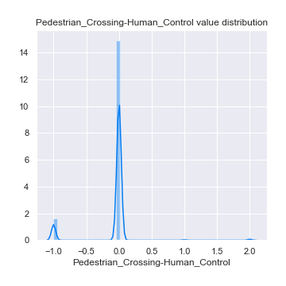

# Exploratory Data Analysis

[<< Go back](../README.md)
## Feature : target
- **Feature type** : discrete
- **Missing** : 0.0%
- **Unique** : 3
- **Count** :139032.0
- **Mean** :1.9986046377812303
- **Std** :0.8165511780632515
- **Min** :1.0
- **25%th Percentile** : 1.0
- **50%th Percentile** : 2.0
- **75%th Percentile** : 3.0
- **Max** :3.0

## Feature : Accident_Severity
- **Feature type** : categorical
- **Missing** : 0.0%
- **Unique** : 3
- **Count** :139032
- **Unique** :3
- **Top** :3
- **Freq** :117703

## Feature : Number_of_Vehicles
- **Feature type** : discrete
- **Missing** : 0.0%
- **Unique** : 15
- **Count** :139032.0
- **Mean** :1.7954211979975834
- **Std** :0.607653338641062
- **Min** :1.0
- **25%th Percentile** : 1.0
- **50%th Percentile** : 2.0
- **75%th Percentile** : 2.0
- **Max** :17.0

## Feature : Number_of_Casualties
- **Feature type** : discrete
- **Missing** : 0.0%
- **Unique** : 18
- **Count** :139032.0
- **Mean** :1.2005006041774555
- **Std** :0.619241575423933
- **Min** :1.0
- **25%th Percentile** : 1.0
- **50%th Percentile** : 1.0
- **75%th Percentile** : 1.0
- **Max** :52.0

## Feature : Day_of_Week
- **Feature type** : discrete
- **Missing** : 0.0%
- **Unique** : 7
- **Count** :139032.0
- **Mean** :4.078701306174118
- **Std** :1.9031752452254374
- **Min** :1.0
- **25%th Percentile** : 2.0
- **50%th Percentile** : 4.0
- **75%th Percentile** : 6.0
- **Max** :7.0

## Feature : Road_Type
- **Feature type** : discrete
- **Missing** : 0.0%
- **Unique** : 9
- **Count** :139032.0
- **Mean** :5.281057598250762
- **Std** :1.8862377357546363
- **Min** :1.0
- **25%th Percentile** : 6.0
- **50%th Percentile** : 6.0
- **75%th Percentile** : 6.0
- **Max** :9.0

## Feature : Pedestrian_Crossing-Human_Control
- **Feature type** : discrete
- **Missing** : 0.0%
- **Unique** : 4
- **Count** :139032.0
- **Mean** :-0.08043472006444559
- **Std** :0.342398062298002
- **Min** :-1.0
- **25%th Percentile** : 0.0
- **50%th Percentile** : 0.0
- **75%th Percentile** : 0.0
- **Max** :2.0

## Feature : Pedestrian_Crossing-Physical_Facilities
- **Feature type** : discrete
- **Missing** : 0.0%
- **Unique** : 10
- **Count** :139032.0
- **Mean** :0.889140629495368
- **Std** :2.1175853550999437
- **Min** :-1.0
- **25%th Percentile** : 0.0
- **50%th Percentile** : 0.0
- **75%th Percentile** : 0.0
- **Max** :8.0

## Feature : Light_Conditions
- **Feature type** : discrete
- **Missing** : 0.0%
- **Unique** : 7
- **Count** :139032.0
- **Mean** :2.036631854537085
- **Std** :1.7776883957630156
- **Min** :1.0
- **25%th Percentile** : 1.0
- **50%th Percentile** : 1.0
- **75%th Percentile** : 4.0
- **Max** :7.0

## Feature : Weather_Conditions
- **Feature type** : discrete
- **Missing** : 0.0%
- **Unique** : 9
- **Count** :139032.0
- **Mean** :1.9258516025087749
- **Std** :2.2623854701196535
- **Min** :1.0
- **25%th Percentile** : 1.0
- **50%th Percentile** : 1.0
- **75%th Percentile** : 1.0
- **Max** :9.0

## Feature : Road_Surface_Conditions
- **Feature type** : discrete
- **Missing** : 0.0%
- **Unique** : 7
- **Count** :139032.0
- **Mean** :1.1681123770067323
- **Std** :0.6345180485918699
- **Min** :-1.0
- **25%th Percentile** : 1.0
- **50%th Percentile** : 1.0
- **75%th Percentile** : 1.0
- **Max** :5.0

## Feature : Special_Conditions_at_Site
- **Feature type** : discrete
- **Missing** : 0.0%
- **Unique** : 9
- **Count** :139032.0
- **Mean** :0.04560101271649692
- **Std** :0.635023302619712
- **Min** :-1.0
- **25%th Percentile** : 0.0
- **50%th Percentile** : 0.0
- **75%th Percentile** : 0.0
- **Max** :7.0

## Feature : Carriageway_Hazards
- **Feature type** : discrete
- **Missing** : 0.0%
- **Unique** : 9
- **Count** :139032.0
- **Mean** :0.006372633638299097
- **Std** :0.4533487117658671
- **Min** :-1.0
- **25%th Percentile** : 0.0
- **50%th Percentile** : 0.0
- **75%th Percentile** : 0.0
- **Max** :7.0

[<< Go back](../README.md)
