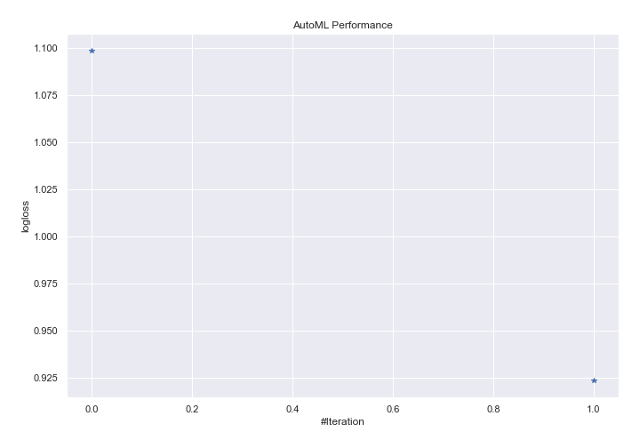
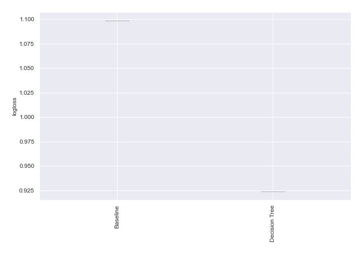

# AutoML Leaderboard

| Best model   | name                                       | model_type    | metric_type   |   metric_value |   train_time |
|:-------------|:-------------------------------------------|:--------------|:--------------|---------------:|-------------:|
|              | [1_Baseline](1_Baseline/README.md)         | Baseline      | logloss       |       1.09861  |         1.5  |
| **the best** | [2_DecisionTree](2_DecisionTree/README.md) | Decision Tree | logloss       |       0.923744 |        29.16 |

### AutoML Performance

### AutoML Performance Boxplot
