# Summary of 2_DecisionTree

[<< Go back](../README.md)

## Decision Tree
- **n_jobs**: -1
- **criterion**: gini
- **max_depth**: 3
- **num_class**: 3
- **explain_level**: 2

## Validation
 - **validation_type**: split
 - **train_ratio**: 0.75
 - **shuffle**: True
 - **stratify**: True

## Optimized metric
logloss

## Training time

37.5 seconds

### Metric details
|           |     1 |            2 |            3 |   accuracy |    macro avg |   weighted avg |   logloss |
|:----------|------:|-------------:|-------------:|-----------:|-------------:|---------------:|----------:|
| precision |     0 |     0.414517 |     0.636457 |   0.488866 |     0.350325 |       0.350325 |  0.923114 |
| recall    |     0 |     0.826968 |     0.63963  |   0.488866 |     0.488866 |       0.488866 |  0.923114 |
| f1-score  |     0 |     0.552229 |     0.63804  |   0.488866 |     0.396756 |       0.396756 |  0.923114 |
| support   | 15448 | 15448        | 15448        |   0.488866 | 46344        |   46344        |  0.923114 |

## Confusion matrix
|              |   Predicted as 1 |   Predicted as 2 |   Predicted as 3 |
|:-------------|-----------------:|-----------------:|-----------------:|
| Labeled as 1 |                0 |            12477 |             2971 |
| Labeled as 2 |                0 |            12775 |             2673 |
| Labeled as 3 |                0 |             5567 |             9881 |

## Learning curves
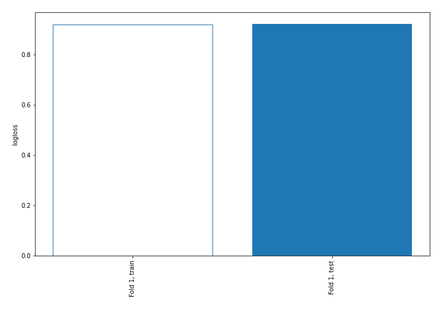

## Decision Tree 

### Tree #1
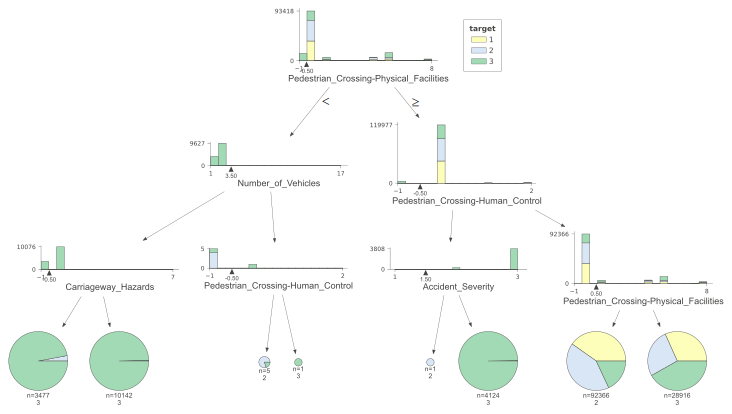

### Rules

if (Pedestrian_Crossing-Physical_Facilities > -0.5) and (Pedestrian_Crossing-Human_Control > -0.5) and (Pedestrian_Crossing-Physical_Facilities <= 0.5) then class: 2 (proba: 41.71%) | based on 92,366 samples

if (Pedestrian_Crossing-Physical_Facilities > -0.5) and (Pedestrian_Crossing-Human_Control > -0.5) and (Pedestrian_Crossing-Physical_Facilities > 0.5) then class: 3 (proba: 41.82%) | based on 28,916 samples

if (Pedestrian_Crossing-Physical_Facilities <= -0.5) and (Number_of_Vehicles <= 3.5) and (Carriageway_Hazards > -0.5) then class: 3 (proba: 99.56%) | based on 10,142 samples

if (Pedestrian_Crossing-Physical_Facilities > -0.5) and (Pedestrian_Crossing-Human_Control <= -0.5) and (Accident_Severity > 1.5) then class: 3 (proba: 99.73%) | based on 4,124 samples

if (Pedestrian_Crossing-Physical_Facilities <= -0.5) and (Number_of_Vehicles <= 3.5) and (Carriageway_Hazards <= -0.5) then class: 3 (proba: 97.01%) | based on 3,477 samples

if (Pedestrian_Crossing-Physical_Facilities <= -0.5) and (Number_of_Vehicles > 3.5) and (Pedestrian_Crossing-Human_Control <= -0.5) then class: 2 (proba: 80.0%) | based on 5 samples

if (Pedestrian_Crossing-Physical_Facilities > -0.5) and (Pedestrian_Crossing-Human_Control <= -0.5) and (Accident_Severity <= 1.5) then class: 2 (proba: 100.0%) | based on 1 samples

if (Pedestrian_Crossing-Physical_Facilities <= -0.5) and (Number_of_Vehicles > 3.5) and (Pedestrian_Crossing-Human_Control > -0.5) then class: 3 (proba: 100.0%) | based on 1 samples

## Permutation-based Importance
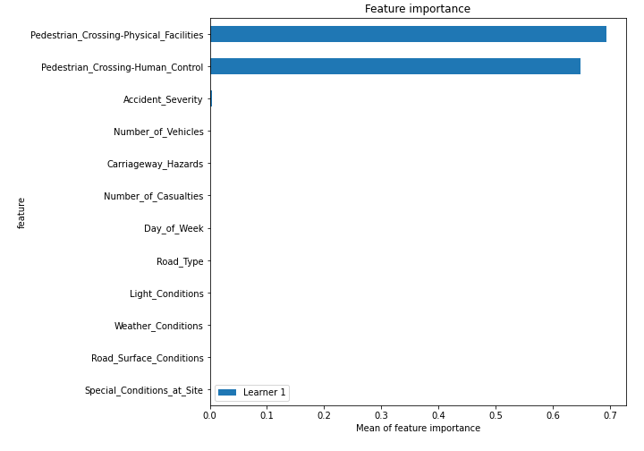

## SHAP Importance
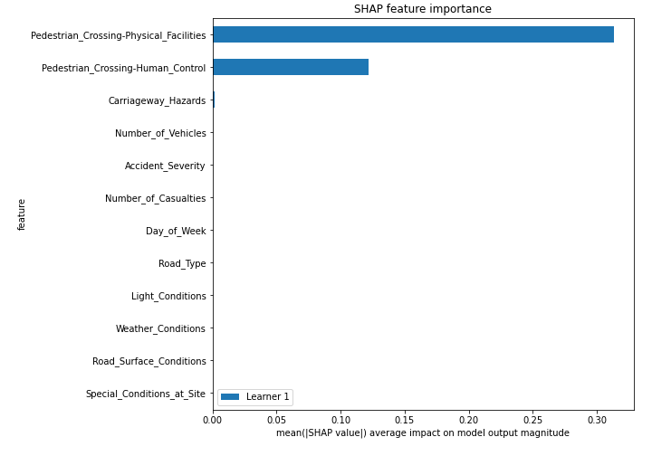

## SHAP Dependence plots

### Dependence 1 (Fold 1)
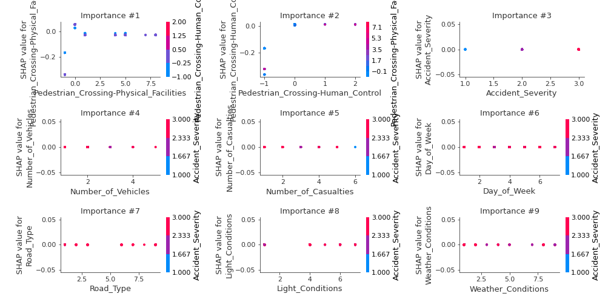
### Dependence 2 (Fold 1)
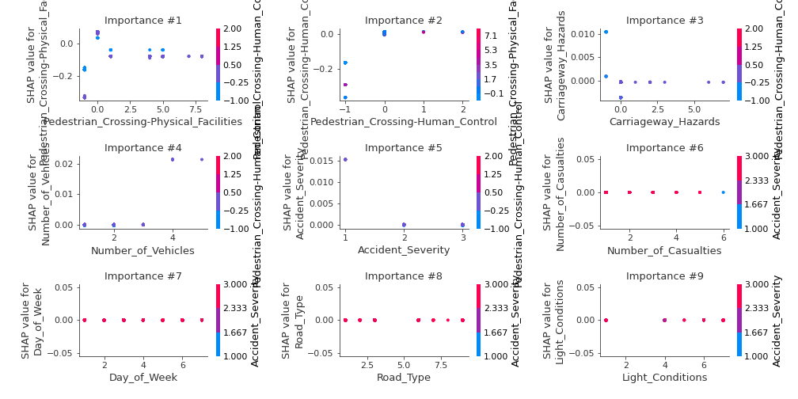
### Dependence 3 (Fold 1)
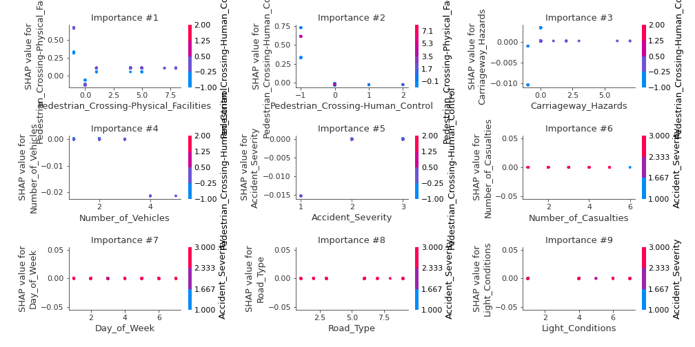

## SHAP Decision plots

### Worst decisions for selected sample 1 (Fold 1)
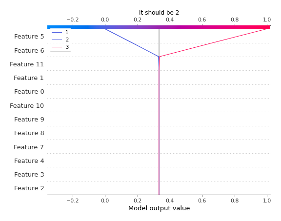
### Worst decisions for selected sample 2 (Fold 1)
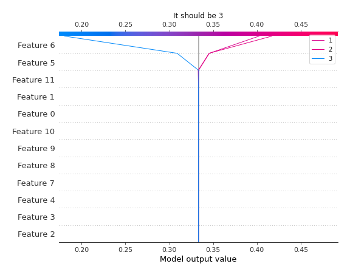
### Worst decisions for selected sample 3 (Fold 1)

### Worst decisions for selected sample 4 (Fold 1)

### Best decisions for selected sample 1 (Fold 1)

### Best decisions for selected sample 2 (Fold 1)
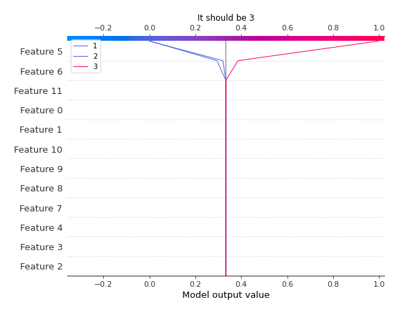
### Best decisions for selected sample 3 (Fold 1)

### Best decisions for selected sample 4 (Fold 1)
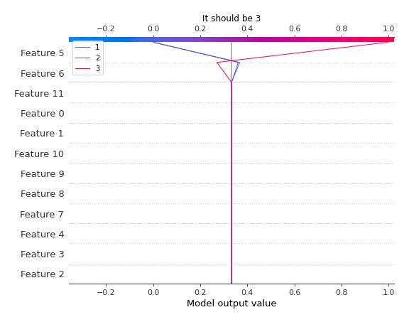

[<< Go back](../README.md)
