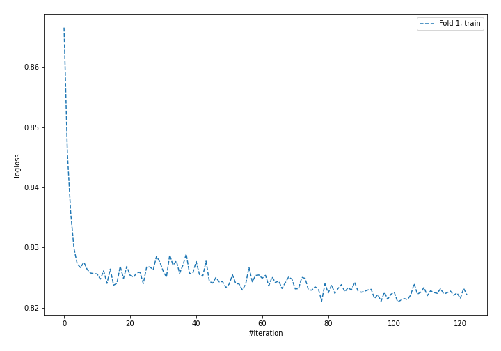
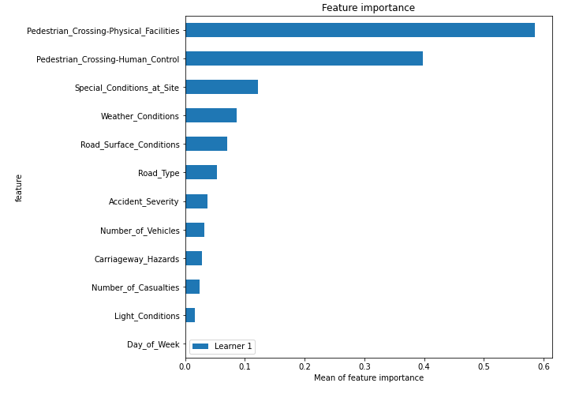

# Summary of 4_Default_NeuralNetwork

[<< Go back](../README.md)

## Neural Network
- **n_jobs**: -1
- **dense_1_size**: 32
- **dense_2_size**: 16
- **learning_rate**: 0.05
- **num_class**: 3
- **explain_level**: 2

## Validation
 - **validation_type**: split
 - **train_ratio**: 0.75
 - **shuffle**: True
 - **stratify**: True

## Optimized metric
logloss

## Training time

93.3 seconds

### Metric details
|           |            1 |            2 |            3 |   accuracy |    macro avg |   weighted avg |   logloss |
|:----------|-------------:|-------------:|-------------:|-----------:|-------------:|---------------:|----------:|
| precision |     0.556219 |     0.505506 |     0.729769 |   0.596064 |     0.597165 |       0.597165 |  0.817091 |
| recall    |     0.596906 |     0.484335 |     0.706952 |   0.596064 |     0.596064 |       0.596064 |  0.817091 |
| f1-score  |     0.575845 |     0.494694 |     0.71818  |   0.596064 |     0.596239 |       0.596239 |  0.817091 |
| support   | 15448        | 15448        | 15448        |   0.596064 | 46344        |   46344        |  0.817091 |

## Confusion matrix
|              |   Predicted as 1 |   Predicted as 2 |   Predicted as 3 |
|:-------------|-----------------:|-----------------:|-----------------:|
| Labeled as 1 |             9221 |             4676 |             1551 |
| Labeled as 2 |             5473 |             7482 |             2493 |
| Labeled as 3 |             1884 |             2643 |            10921 |

## Learning curves

## Permutation-based Importance

[<< Go back](../README.md)
