# Summary of 5_Default_RandomForest

[<< Go back](../README.md)

## Random Forest
- **n_jobs**: -1
- **criterion**: gini
- **max_features**: 0.9
- **min_samples_split**: 30
- **max_depth**: 4
- **eval_metric_name**: logloss
- **num_class**: 3
- **explain_level**: 2

## Validation
 - **validation_type**: split
 - **train_ratio**: 0.75
 - **shuffle**: True
 - **stratify**: True

## Optimized metric
logloss

## Training time

26.3 seconds

### Metric details
|           |            1 |            2 |            3 |   accuracy |    macro avg |   weighted avg |   logloss |
|:----------|-------------:|-------------:|-------------:|-----------:|-------------:|---------------:|----------:|
| precision |     0.574383 |     0.444661 |     0.673892 |   0.544774 |     0.564312 |       0.564312 |  0.893892 |
| recall    |     0.390148 |     0.620274 |     0.6239   |   0.544774 |     0.544774 |       0.544774 |  0.893892 |
| f1-score  |     0.46467  |     0.517988 |     0.647933 |   0.544774 |     0.54353  |       0.54353  |  0.893892 |
| support   | 15448        | 15448        | 15448        |   0.544774 | 46344        |   46344        |  0.893892 |

## Confusion matrix
|              |   Predicted as 1 |   Predicted as 2 |   Predicted as 3 |
|:-------------|-----------------:|-----------------:|-----------------:|
| Labeled as 1 |             6027 |             7124 |             2297 |
| Labeled as 2 |             3499 |             9582 |             2367 |
| Labeled as 3 |              967 |             4843 |             9638 |

## Learning curves
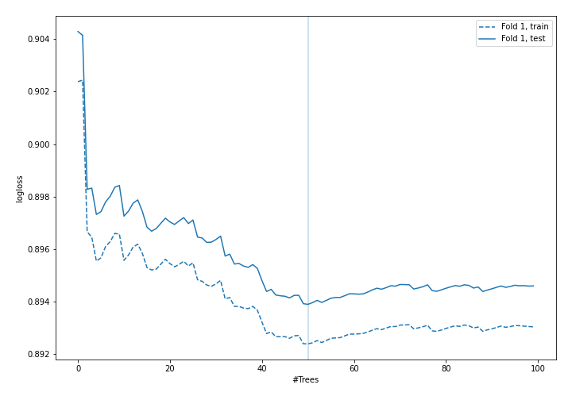

## Permutation-based Importance
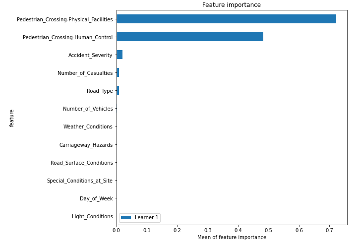

## SHAP Importance
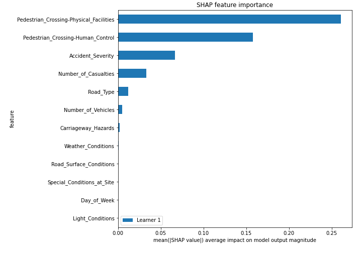

## SHAP Dependence plots

### Dependence 1 (Fold 1)
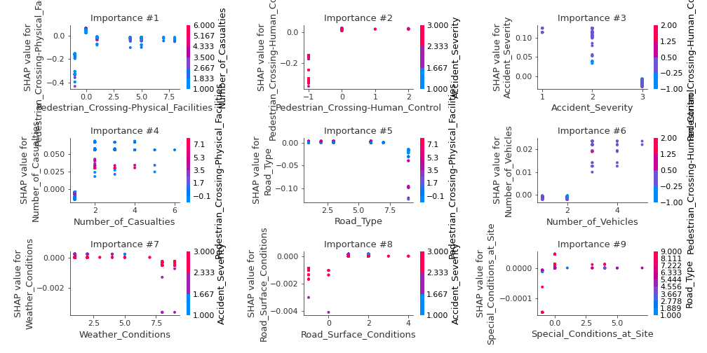
### Dependence 2 (Fold 1)
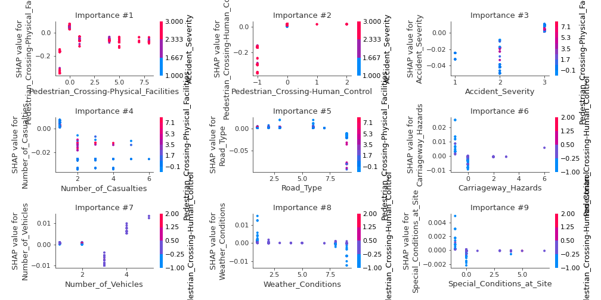
### Dependence 3 (Fold 1)
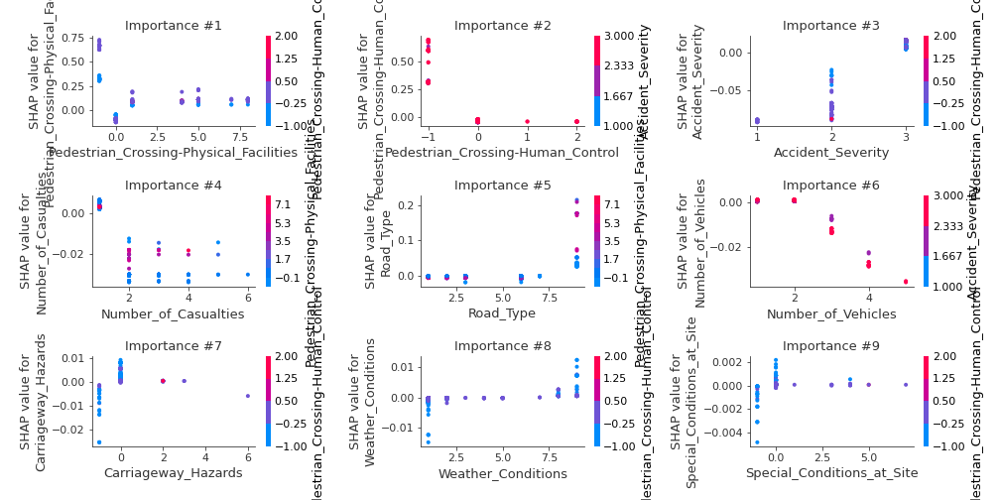

## SHAP Decision plots

### Worst decisions for selected sample 1 (Fold 1)
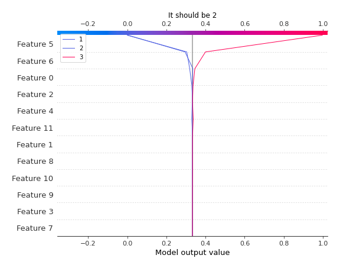
### Worst decisions for selected sample 2 (Fold 1)
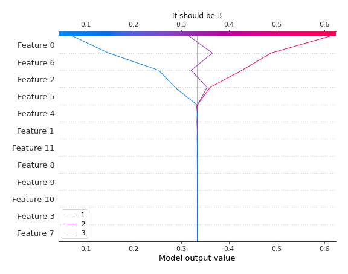
### Worst decisions for selected sample 3 (Fold 1)
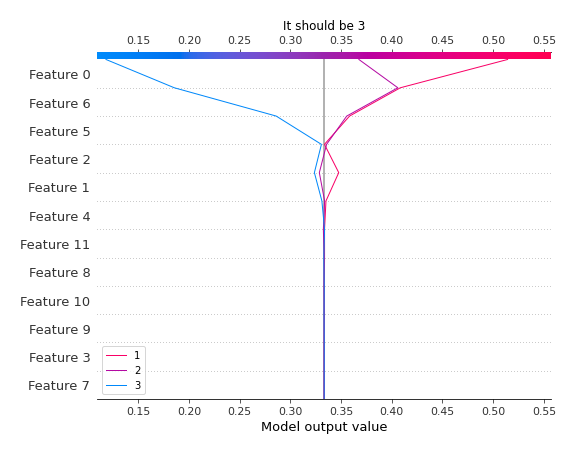
### Worst decisions for selected sample 4 (Fold 1)
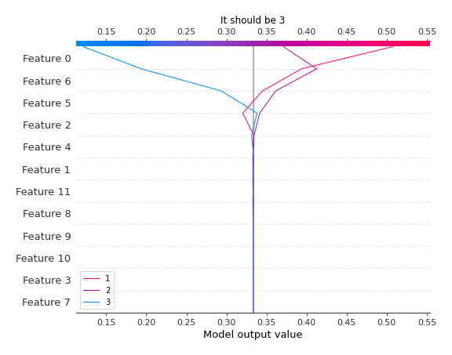
### Best decisions for selected sample 1 (Fold 1)

### Best decisions for selected sample 2 (Fold 1)

### Best decisions for selected sample 3 (Fold 1)
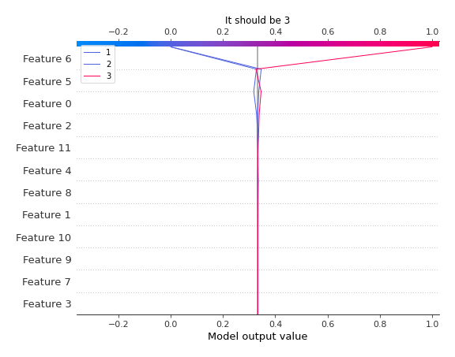
### Best decisions for selected sample 4 (Fold 1)
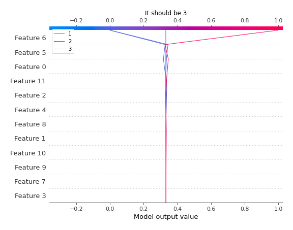

[<< Go back](../README.md)
