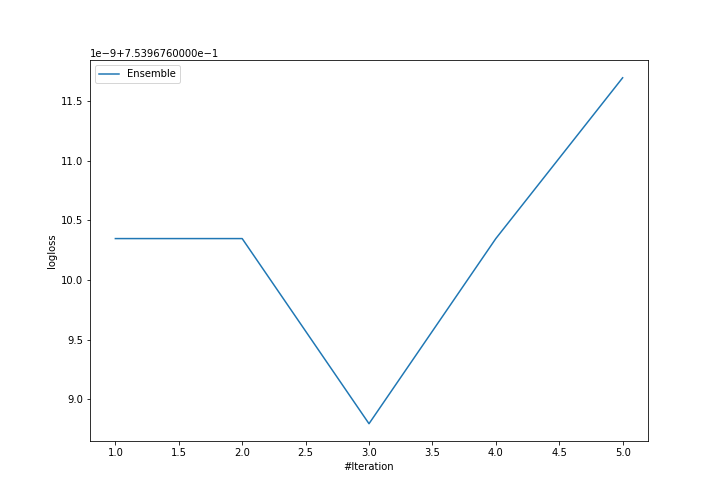

# Summary of Ensemble

[<< Go back](../README.md)

## Ensemble structure
| Model             |   Weight |
|:------------------|---------:|
| 3_Default_Xgboost |        3 |

### Metric details
|           |            1 |            2 |            3 |   accuracy |    macro avg |   weighted avg |   logloss |
|:----------|-------------:|-------------:|-------------:|-----------:|-------------:|---------------:|----------:|
| precision |     0.608755 |     0.516968 |     0.813503 |    0.63307 |     0.646409 |       0.646409 |  0.753968 |
| recall    |     0.573408 |     0.607457 |     0.718345 |    0.63307 |     0.63307  |       0.63307  |  0.753968 |
| f1-score  |     0.590553 |     0.558571 |     0.762969 |    0.63307 |     0.637364 |       0.637364 |  0.753968 |
| support   | 15448        | 15448        | 15448        |    0.63307 | 46344        |   46344        |  0.753968 |

## Confusion matrix
|              |   Predicted as 1 |   Predicted as 2 |   Predicted as 3 |
|:-------------|-----------------:|-----------------:|-----------------:|
| Labeled as 1 |             8858 |             5536 |             1054 |
| Labeled as 2 |             4574 |             9384 |             1490 |
| Labeled as 3 |             1119 |             3232 |            11097 |

## Learning curves

[<< Go back](../README.md)
