# Exploratory Data Analysis

[<< Go back](../README.md)
## Feature : target
- **Feature type** : discrete
- **Missing** : 0.0%
- **Unique** : 3
- **Count** :88152.0
- **Mean** :1.3932071875850802
- **Std** :0.6388823576906297
- **Min** :1.0
- **25%th Percentile** : 1.0
- **50%th Percentile** : 1.0
- **75%th Percentile** : 2.0
- **Max** :3.0

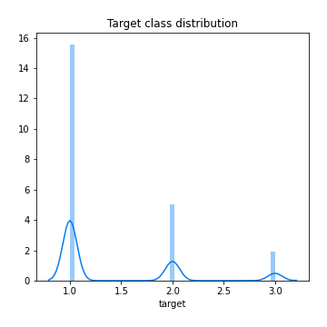
## Feature : Location_Easting_OSGR
- **Feature type** : continous
- **Missing** : 0.0%
- **Unique** : 73503
- **Count** :88152.0
- **Mean** :452691.45841841365
- **Std** :94895.58456448418
- **Min** :64084.0
- **25%th Percentile** : 388332.0
- **50%th Percentile** : 459721.0
- **75%th Percentile** : 529428.0
- **Max** :655138.0

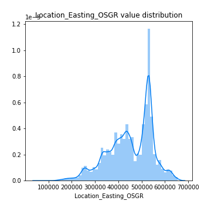
## Feature : Location_Northing_OSGR
- **Feature type** : continous
- **Missing** : 0.0%
- **Unique** : 73880
- **Count** :88152.0
- **Mean** :278515.3629072511
- **Std** :150853.19842012235
- **Min** :10814.0
- **25%th Percentile** : 175526.0
- **50%th Percentile** : 217607.0
- **75%th Percentile** : 384635.25
- **Max** :1167366.0

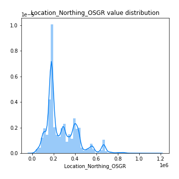
## Feature : Accident_Severity
- **Feature type** : discrete
- **Missing** : 0.0%
- **Unique** : 3
- **Count** :88152.0
- **Mean** :2.771689808512569
- **Std** :0.4521935521311019
- **Min** :1.0
- **25%th Percentile** : 3.0
- **50%th Percentile** : 3.0
- **75%th Percentile** : 3.0
- **Max** :3.0

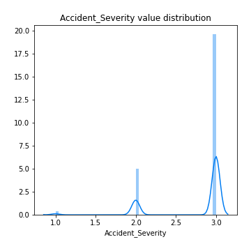
## Feature : Number_of_Vehicles
- **Feature type** : discrete
- **Missing** : 0.0%
- **Unique** : 16
- **Count** :88152.0
- **Mean** :1.8379276703875125
- **Std** :0.7084208731290238
- **Min** :1.0
- **25%th Percentile** : 1.0
- **50%th Percentile** : 2.0
- **75%th Percentile** : 2.0
- **Max** :17.0

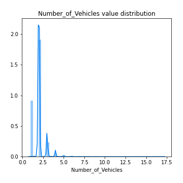
## Feature : Number_of_Casualties
- **Feature type** : discrete
- **Missing** : 0.0%
- **Unique** : 17
- **Count** :88152.0
- **Mean** :1.3036800072601868
- **Std** :0.755196900344712
- **Min** :1.0
- **25%th Percentile** : 1.0
- **50%th Percentile** : 1.0
- **75%th Percentile** : 1.0
- **Max** :52.0

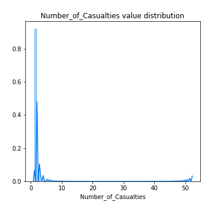
## Feature : Day_of_Week
- **Feature type** : discrete
- **Missing** : 0.0%
- **Unique** : 7
- **Count** :88152.0
- **Mean** :4.111761502858698
- **Std** :1.9211077438147826
- **Min** :1.0
- **25%th Percentile** : 2.0
- **50%th Percentile** : 4.0
- **75%th Percentile** : 6.0
- **Max** :7.0

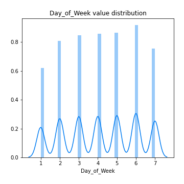
## Feature : 1st_Road_Class
- **Feature type** : discrete
- **Missing** : 0.0%
- **Unique** : 6
- **Count** :88152.0
- **Mean** :4.184113803430439
- **Std** :1.4635898293581149
- **Min** :1.0
- **25%th Percentile** : 3.0
- **50%th Percentile** : 4.0
- **75%th Percentile** : 6.0
- **Max** :6.0

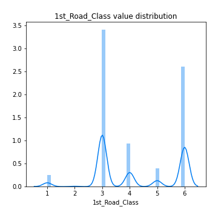
## Feature : 1st_Road_Number
- **Feature type** : discrete
- **Missing** : 0.0%
- **Unique** : 3436
- **Count** :88152.0
- **Mean** :864.7149469098829
- **Std** :2374.083581784621
- **Min** :0.0
- **25%th Percentile** : 0.0
- **50%th Percentile** : 46.0
- **75%th Percentile** : 605.0
- **Max** :498878.0

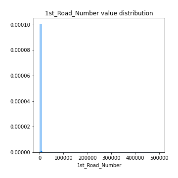
## Feature : Road_Type
- **Feature type** : discrete
- **Missing** : 0.0%
- **Unique** : 6
- **Count** :88152.0
- **Mean** :5.21271213358744
- **Std** :1.6770704213482308
- **Min** :1.0
- **25%th Percentile** : 6.0
- **50%th Percentile** : 6.0
- **75%th Percentile** : 6.0
- **Max** :9.0

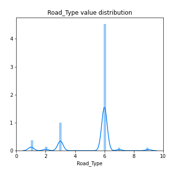
## Feature : 2nd_Road_Number
- **Feature type** : discrete
- **Missing** : 0.0%
- **Unique** : 2815
- **Count** :88152.0
- **Mean** :306.5747799255831
- **Std** :1162.188678039799
- **Min** :-1.0
- **25%th Percentile** : 0.0
- **50%th Percentile** : 0.0
- **75%th Percentile** : 0.0
- **Max** :9899.0

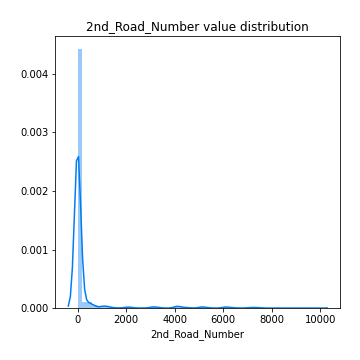
## Feature : Pedestrian_Crossing-Human_Control
- **Feature type** : discrete
- **Missing** : 0.0%
- **Unique** : 4
- **Count** :88152.0
- **Mean** :-0.0059442780651601775
- **Std** :0.27681866159855734
- **Min** :-1.0
- **25%th Percentile** : 0.0
- **50%th Percentile** : 0.0
- **75%th Percentile** : 0.0
- **Max** :2.0

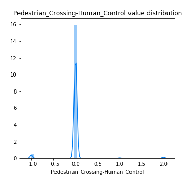
## Feature : Pedestrian_Crossing-Physical_Facilities
- **Feature type** : discrete
- **Missing** : 0.0%
- **Unique** : 7
- **Count** :88152.0
- **Mean** :0.8628618749432798
- **Std** :1.9958639982819468
- **Min** :-1.0
- **25%th Percentile** : 0.0
- **50%th Percentile** : 0.0
- **75%th Percentile** : 0.0
- **Max** :8.0

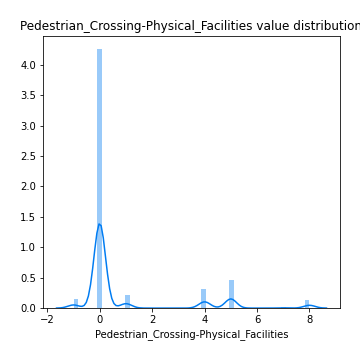
## Feature : Light_Conditions
- **Feature type** : discrete
- **Missing** : 0.0%
- **Unique** : 5
- **Count** :88152.0
- **Mean** :2.0414851619929215
- **Std** :1.7281897588437192
- **Min** :1.0
- **25%th Percentile** : 1.0
- **50%th Percentile** : 1.0
- **75%th Percentile** : 4.0
- **Max** :7.0

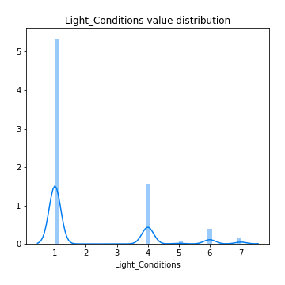
## Feature : Weather_Conditions
- **Feature type** : discrete
- **Missing** : 0.0%
- **Unique** : 9
- **Count** :88152.0
- **Mean** :1.6519534440511843
- **Std** :1.8080469106527226
- **Min** :1.0
- **25%th Percentile** : 1.0
- **50%th Percentile** : 1.0
- **75%th Percentile** : 1.0
- **Max** :9.0

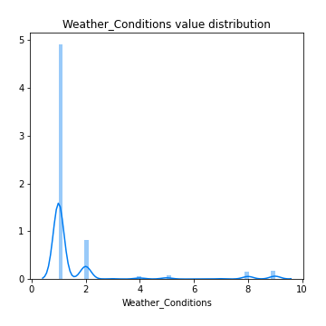
## Feature : Road_Surface_Conditions
- **Feature type** : discrete
- **Missing** : 0.0%
- **Unique** : 6
- **Count** :88152.0
- **Mean** :1.2915532262455758
- **Std** :0.5993703567812344
- **Min** :-1.0
- **25%th Percentile** : 1.0
- **50%th Percentile** : 1.0
- **75%th Percentile** : 2.0
- **Max** :5.0

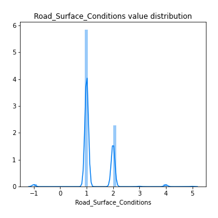
## Feature : Special_Conditions_at_Site
- **Feature type** : discrete
- **Missing** : 0.0%
- **Unique** : 9
- **Count** :88152.0
- **Mean** :0.07599373808875579
- **Std** :0.665045562544608
- **Min** :-1.0
- **25%th Percentile** : 0.0
- **50%th Percentile** : 0.0
- **75%th Percentile** : 0.0
- **Max** :7.0

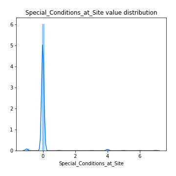
## Feature : Carriageway_Hazards
- **Feature type** : discrete
- **Missing** : 0.0%
- **Unique** : 7
- **Count** :88152.0
- **Mean** :0.044219076141210636
- **Std** :0.5286070975622351
- **Min** :-1.0
- **25%th Percentile** : 0.0
- **50%th Percentile** : 0.0
- **75%th Percentile** : 0.0
- **Max** :7.0

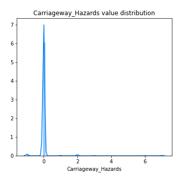

[<< Go back](../README.md)
