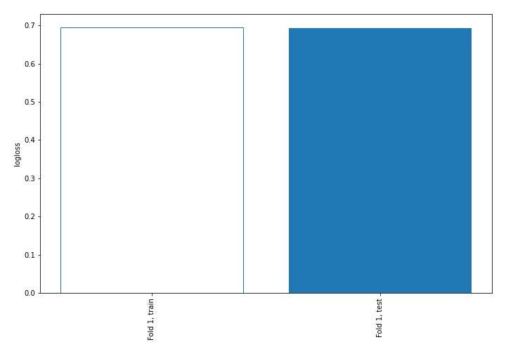
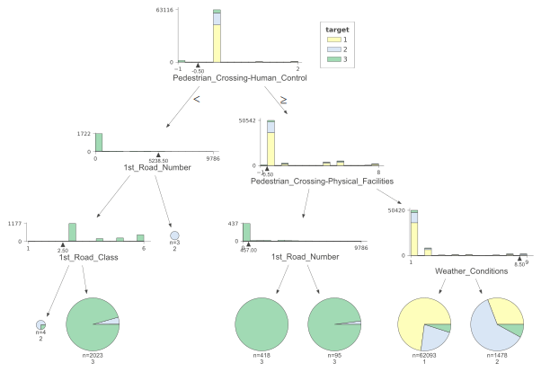
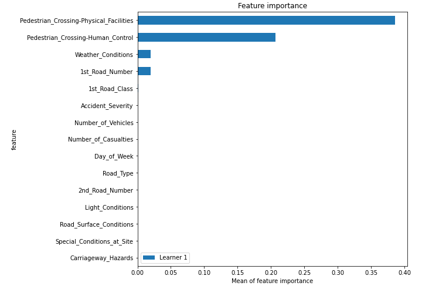
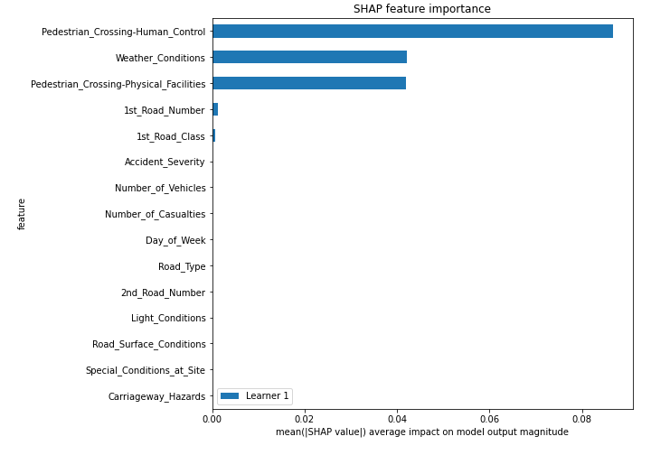
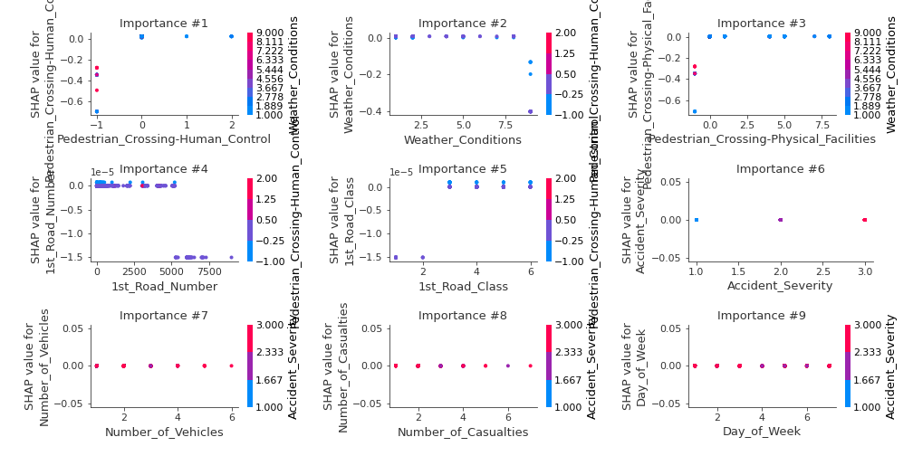
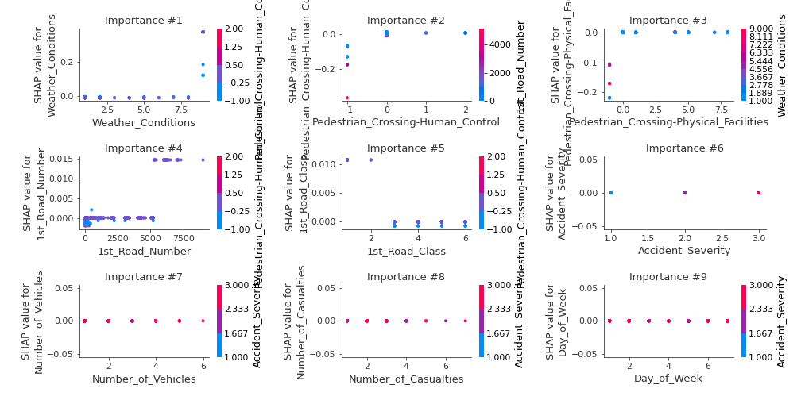
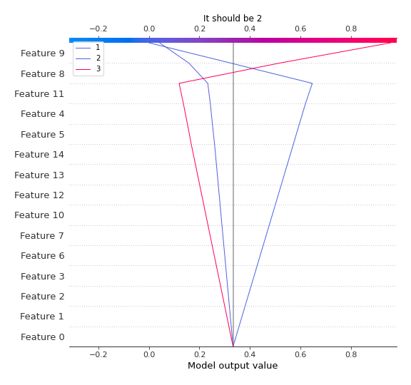
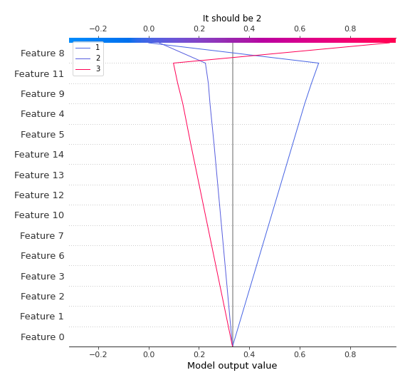
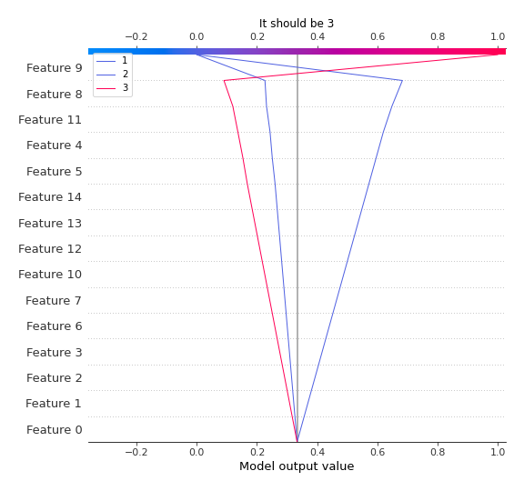

# Summary of 2_DecisionTree

[<< Go back](../README.md)

## Decision Tree
- **n_jobs**: -1
- **criterion**: gini
- **max_depth**: 3
- **num_class**: 3
- **explain_level**: 2

## Validation
 - **validation_type**: split
 - **train_ratio**: 0.75
 - **shuffle**: True
 - **stratify**: True

## Optimized metric
logloss

## Training time

23.1 seconds

### Metric details
|           |            1 |            2 |           3 |   accuracy |    macro avg |   weighted avg |   logloss |
|:----------|-------------:|-------------:|------------:|-----------:|-------------:|---------------:|----------:|
| precision |     0.730114 |    0.63189   |    0.962877 |   0.736954 |     0.77496  |       0.727952 |  0.692741 |
| recall    |     0.990287 |    0.0651644 |    0.442903 |   0.736954 |     0.499452 |       0.736954 |  0.692741 |
| f1-score  |     0.840528 |    0.118145  |    0.606725 |   0.736954 |     0.521799 |       0.659177 |  0.692741 |
| support   | 15238        | 4926         | 1874        |   0.736954 | 22038        |   22038        |  0.692741 |

## Confusion matrix
|              |   Predicted as 1 |   Predicted as 2 |   Predicted as 3 |
|:-------------|-----------------:|-----------------:|-----------------:|
| Labeled as 1 |            15090 |              147 |                1 |
| Labeled as 2 |             4574 |              321 |               31 |
| Labeled as 3 |             1004 |               40 |              830 |

## Learning curves

## Decision Tree 

### Tree #1

### Rules

if (Pedestrian_Crossing-Human_Control > -0.5) and (Pedestrian_Crossing-Physical_Facilities > -0.5) and (Weather_Conditions <= 8.5) then class: 1 (proba: 72.88%) | based on 62,093 samples

if (Pedestrian_Crossing-Human_Control <= -0.5) and (1st_Road_Number <= 5238.5) and (1st_Road_Class > 2.5) then class: 3 (proba: 95.6%) | based on 2,023 samples

if (Pedestrian_Crossing-Human_Control > -0.5) and (Pedestrian_Crossing-Physical_Facilities > -0.5) and (Weather_Conditions > 8.5) then class: 2 (proba: 61.16%) | based on 1,478 samples

if (Pedestrian_Crossing-Human_Control > -0.5) and (Pedestrian_Crossing-Physical_Facilities <= -0.5) and (1st_Road_Number <= 457.0) then class: 3 (proba: 100.0%) | based on 418 samples

if (Pedestrian_Crossing-Human_Control > -0.5) and (Pedestrian_Crossing-Physical_Facilities <= -0.5) and (1st_Road_Number > 457.0) then class: 3 (proba: 97.89%) | based on 95 samples

if (Pedestrian_Crossing-Human_Control <= -0.5) and (1st_Road_Number <= 5238.5) and (1st_Road_Class <= 2.5) then class: 2 (proba: 75.0%) | based on 4 samples

if (Pedestrian_Crossing-Human_Control <= -0.5) and (1st_Road_Number > 5238.5) then class: 2 (proba: 100.0%) | based on 3 samples

## Permutation-based Importance

## SHAP Importance

## SHAP Dependence plots

### Dependence 1 (Fold 1)

### Dependence 2 (Fold 1)

### Dependence 3 (Fold 1)

## SHAP Decision plots

### Worst decisions for selected sample 1 (Fold 1)

### Worst decisions for selected sample 2 (Fold 1)

### Worst decisions for selected sample 3 (Fold 1)

### Worst decisions for selected sample 4 (Fold 1)

### Best decisions for selected sample 1 (Fold 1)

### Best decisions for selected sample 2 (Fold 1)

### Best decisions for selected sample 3 (Fold 1)

### Best decisions for selected sample 4 (Fold 1)

[<< Go back](../README.md)
