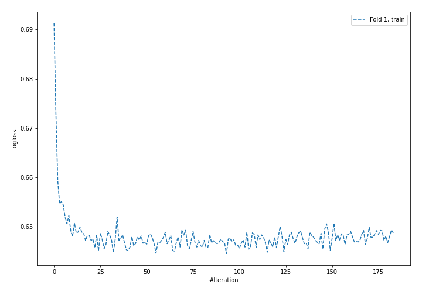
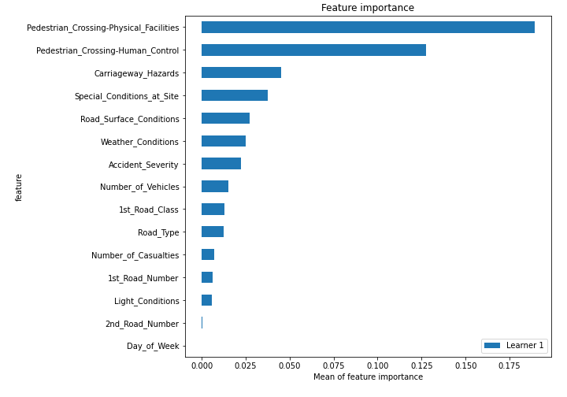

# Summary of 4_Default_NeuralNetwork

[<< Go back](../README.md)

## Neural Network
- **n_jobs**: -1
- **dense_1_size**: 32
- **dense_2_size**: 16
- **learning_rate**: 0.05
- **num_class**: 3
- **explain_level**: 2

## Validation
 - **validation_type**: split
 - **train_ratio**: 0.75
 - **shuffle**: True
 - **stratify**: True

## Optimized metric
logloss

## Training time

54.6 seconds

### Metric details
|           |            1 |           2 |           3 |   accuracy |    macro avg |   weighted avg |   logloss |
|:----------|-------------:|------------:|------------:|-----------:|-------------:|---------------:|----------:|
| precision |     0.741613 |    0.53556  |    0.927451 |   0.741537 |     0.734875 |       0.711358 |  0.643351 |
| recall    |     0.977753 |    0.100893 |    0.504803 |   0.741537 |     0.527816 |       0.741537 |  0.643351 |
| f1-score  |     0.843467 |    0.169798 |    0.653766 |   0.741537 |     0.555677 |       0.676755 |  0.643351 |
| support   | 15238        | 4926        | 1874        |   0.741537 | 22038        |   22038        |  0.643351 |

## Confusion matrix
|              |   Predicted as 1 |   Predicted as 2 |   Predicted as 3 |
|:-------------|-----------------:|-----------------:|-----------------:|
| Labeled as 1 |            14899 |              317 |               22 |
| Labeled as 2 |             4377 |              497 |               52 |
| Labeled as 3 |              814 |              114 |              946 |

## Learning curves

## Permutation-based Importance

[<< Go back](../README.md)
