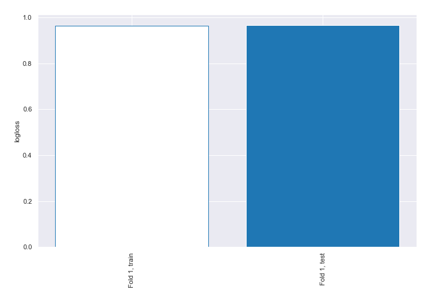
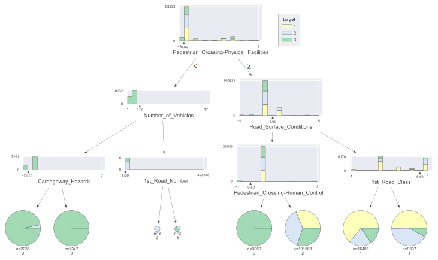
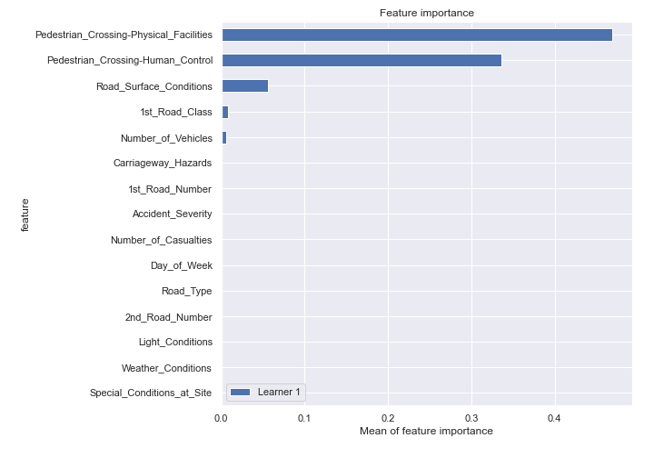
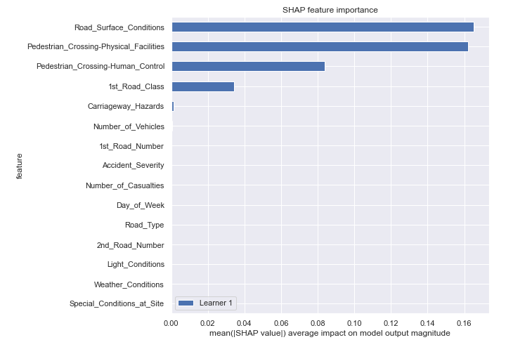
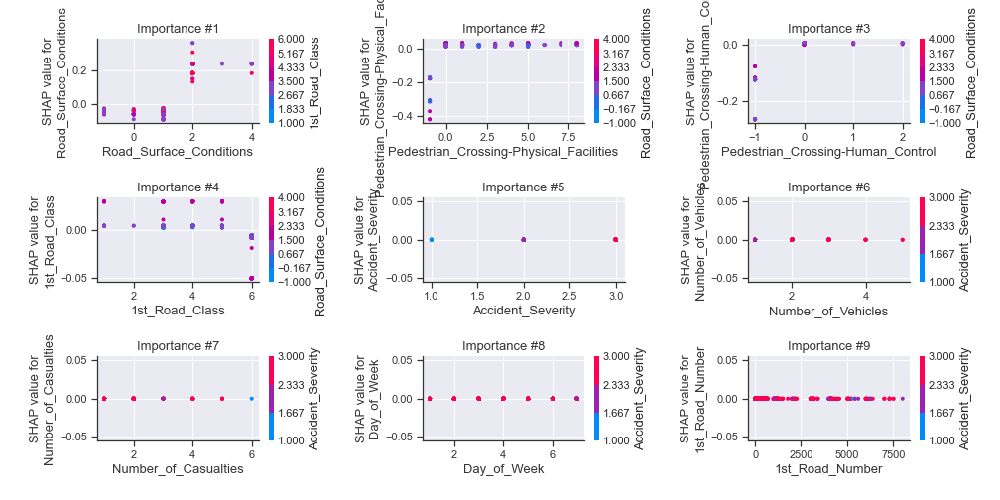
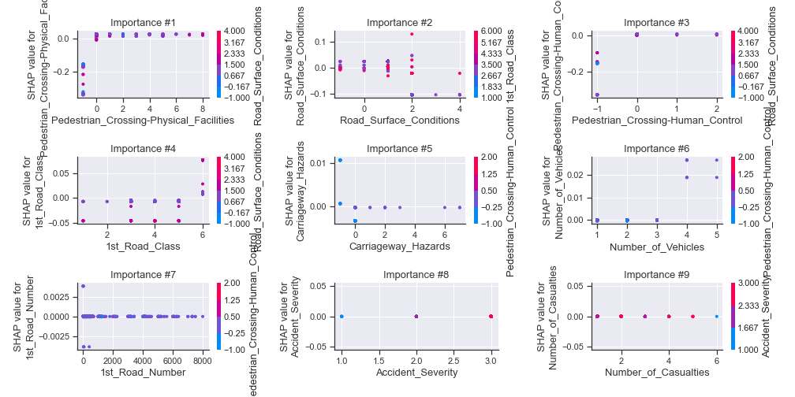
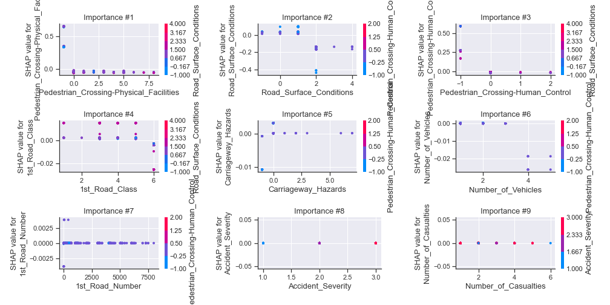
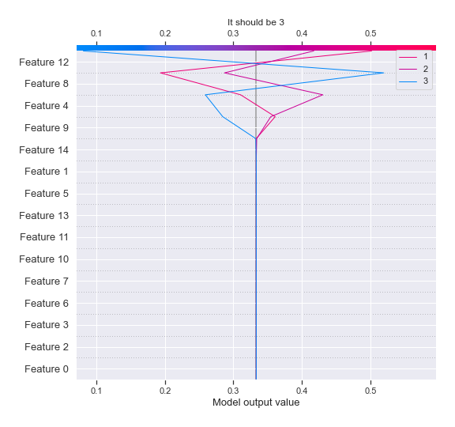
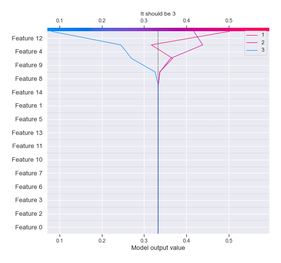
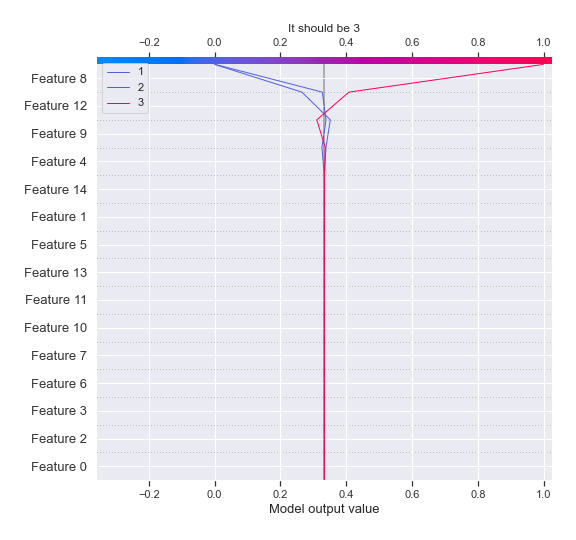

# Summary of 2_DecisionTree

[<< Go back](../README.md)

## Decision Tree
- **n_jobs**: -1
- **criterion**: gini
- **max_depth**: 3
- **num_class**: 3
- **explain_level**: 2

## Validation
 - **validation_type**: split
 - **train_ratio**: 0.75
 - **shuffle**: True
 - **stratify**: True

## Optimized metric
logloss

## Training time

38.5 seconds

### Metric details
|           |            1 |            2 |            3 |   accuracy |    macro avg |   weighted avg |   logloss |
|:----------|-------------:|-------------:|-------------:|-----------:|-------------:|---------------:|----------:|
| precision |     0.584473 |     0.384371 |     0.992884 |   0.475099 |     0.653909 |       0.653909 |  0.965113 |
| recall    |     0.309943 |     0.844381 |     0.270974 |   0.475099 |     0.475099 |       0.475099 |  0.965113 |
| f1-score  |     0.405076 |     0.528268 |     0.425753 |   0.475099 |     0.453032 |       0.453032 |  0.965113 |
| support   | 15448        | 15448        | 15448        |   0.475099 | 46344        |   46344        |  0.965113 |

## Confusion matrix
|              |   Predicted as 1 |   Predicted as 2 |   Predicted as 3 |
|:-------------|-----------------:|-----------------:|-----------------:|
| Labeled as 1 |             4788 |            10660 |                0 |
| Labeled as 2 |             2374 |            13044 |               30 |
| Labeled as 3 |             1030 |            10232 |             4186 |

## Learning curves

## Decision Tree 

### Tree #1

### Rules

if (Pedestrian_Crossing-Physical_Facilities > -0.5) and (Road_Surface_Conditions <= 1.5) and (Pedestrian_Crossing-Human_Control > -0.5) then class: 2 (proba: 38.51%) | based on 101,568 samples

if (Pedestrian_Crossing-Physical_Facilities > -0.5) and (Road_Surface_Conditions > 1.5) and (1st_Road_Class <= 5.5) then class: 1 (proba: 64.12%) | based on 15,488 samples

if (Pedestrian_Crossing-Physical_Facilities > -0.5) and (Road_Surface_Conditions > 1.5) and (1st_Road_Class > 5.5) then class: 1 (proba: 50.17%) | based on 9,337 samples

if (Pedestrian_Crossing-Physical_Facilities <= -0.5) and (Number_of_Vehicles <= 3.5) and (Carriageway_Hazards > -0.5) then class: 3 (proba: 99.48%) | based on 7,347 samples

if (Pedestrian_Crossing-Physical_Facilities > -0.5) and (Road_Surface_Conditions <= 1.5) and (Pedestrian_Crossing-Human_Control <= -0.5) then class: 3 (proba: 99.8%) | based on 3,050 samples

if (Pedestrian_Crossing-Physical_Facilities <= -0.5) and (Number_of_Vehicles <= 3.5) and (Carriageway_Hazards <= -0.5) then class: 3 (proba: 96.87%) | based on 2,236 samples

if (Pedestrian_Crossing-Physical_Facilities <= -0.5) and (Number_of_Vehicles > 3.5) and (1st_Road_Number > 6.0) then class: 3 (proba: 66.67%) | based on 3 samples

if (Pedestrian_Crossing-Physical_Facilities <= -0.5) and (Number_of_Vehicles > 3.5) and (1st_Road_Number <= 6.0) then class: 2 (proba: 100.0%) | based on 3 samples

## Permutation-based Importance

## SHAP Importance

## SHAP Dependence plots

### Dependence 1 (Fold 1)

### Dependence 2 (Fold 1)

### Dependence 3 (Fold 1)

## SHAP Decision plots

### Worst decisions for selected sample 1 (Fold 1)

### Worst decisions for selected sample 2 (Fold 1)

### Worst decisions for selected sample 3 (Fold 1)

### Worst decisions for selected sample 4 (Fold 1)

### Best decisions for selected sample 1 (Fold 1)

### Best decisions for selected sample 2 (Fold 1)

### Best decisions for selected sample 3 (Fold 1)

### Best decisions for selected sample 4 (Fold 1)

[<< Go back](../README.md)
